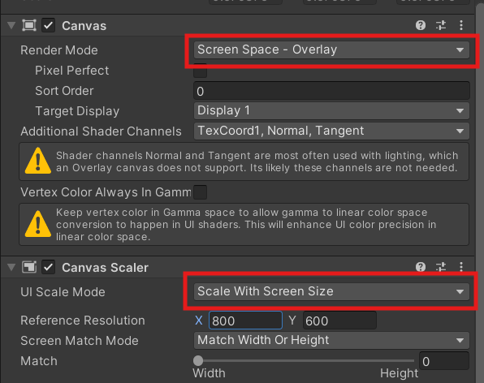
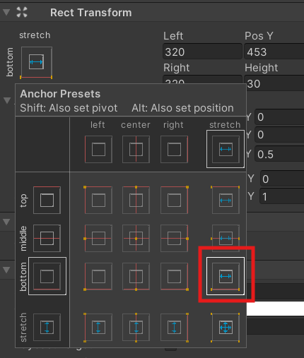
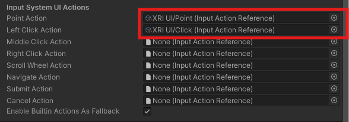

# Unity AR -  Mobile interaction

This Worksheet will guide you through creating a Augmented reality(AR) face tracking Unity project and deploying it to an Android devices.

The screen shot were created on a PC using Unity version 2022.3.20f1, they may look slightly different on a Mac but as long as you have a similar version of Unity the functionality is the same.

if you get stuck please ask for help.

## 1. Create a new AR project

- Create a new Unity Project in Unity Hub

- Choose the **AR Mobile core** template (you may need to download it first)

The project has a lot of dependencies so may take a while to load the first time.

### Convert to Android

We will be deploying our project to an Android tablet, so need to change the target platform, it is best to do this now before we start.

- In the top menu go to **File > Build settings**

- Choose **Android** and **Switch settings**

AR core is only supported on more recent versions of Android, so we need to set the minimum version.

- In the top menu, go to  **Edit > Project Settings**
- In the **Player** Section find the **Other settings** section
- Change the**Minimum API Level** to **27**.

### New Scene

First we are going to create a brand new scene

- In the top menu go to **File > New Scene**

- Choose **AR** and press **Create**

#### Save the scene

- In the top menu, go to **File > Save as** and save your scene in the **Scenes** folder. Call it "Mobile_interaction scene".

## 2. UI

We can add a button to the screen and use it to interact with our AR object.

For this simple example, the button will hide and show a cube, but this will give you a good starting point to create more complex functionality.

### Create UI

#### Create an XR Canvas

You need to use a spectial UI canvas when working in VR

- In the **Hierarchy**, **Right Click** and create a **XR > UI Canvas**

The canvas is set to **World space** by default, this can be useful if you want the canvas to appear within the environment.

We want the canvas to just stick to the screen and scale to different screen sizes. 

- With the Canvas selected, in the **Inspector** find the **Canvas** component and change the **Render Mode** to **Screen Space - Overlay**

- In the **Canvas Scaler** component change the **UI Scale Mode to **Scale With Screen Size**

#### Create a button

We can add normal UI components in the canvas.

- **Right click** in the new canvas and create a **UI > Button - Text Mesh Pro**

We want the Button to stick to the bottom of the screen

- Move the button to the bottom of the canvas

We want the button to stick to the bottom and stretch horizontally

- On the button, click the **Anchor presets** button and choose the correct option.

### add input module

The default scene will not recognise touch screen inputs on it own. However, when you added your Canvas, an Event System object was also created in your Hierarchy.

- Find the **XR UI Input Module** component in the EventSystem

We need to assign the input actions, helpfully these have already been defined for you in the template.

- Click the little circle to the right of the inputs and assign the correct reference, You may need to search for it. We only need the top two for touch controls.

### create script

- Create a new c# script and call it "UIController".
- Open the script and add 2 new variables at the top.

'''
public GameObject cube;
private bool visibleToggle = true;
'''

The first will hold a reference to our cube, the second will store the current visability of the cube.

- Add a new function to the script, I have called mine "ButtonPressed".

'''
public void ButtonPressed()
{

}
'''

- Inside the function, add a log message, toggle the boolean variable and set the visibility of the cube. Please ask if you don't understand any of these lines.

'''
Debug.Log("button pressed");
// swap toggle, because its a boolean 
// !visibleToggle is the opposite of its current value (true/false)
visibleToggle = !visibleToggle;
//hide or show cube
cube.SetActive(visibleToggle);
'''

- Save the script

### Add the script

We an now connect the script up. 

- Drag the Script on to the **Canvas**, we could put it anywhere but this seems most appropriate.

- Drag the cube from your **Hierarchy** onto the Cube Slot on your script.

### hook up the button

- On the Button, find the **On Click** input and press the plus

Here we can add the function we want to run when the button is clicked.

- Drag the canvas onto the Object slot, and choose the script name and function you want to run.

## 3. Test

- Press play to test the button, clicking it should hide and show the cube. you may need to move the camera around to see the cube.

### 4. Test on the device

The project seems to be working as expected, however, we will only know for sure that it works on a small touch screen by building to an actual device. 

As this process with be the same every time you build to android I have made a separate guide showing you how to do it.

[Build to an android device](./build_to_android.html)

## 5. Interacting with objects

We Can also interact directly with 3D object in the scene. We will change the colour of the cube when it is touched

- On the Cube, add an **XR Simple Interactable** component.

- Create a new script and drag it onto the cube.

'''
using UnityEngine;

public class CubeBehaviour : MonoBehaviour
{
    // private reference to a material
    Material cubeMaterial;

    // Start is called before the first frame update
    void Start()
    {
        // get the material of the object this script is attached to
        cubeMaterial = GetComponent<Renderer>().material;
        //change the colour to green
        cubeMaterial.color = Color.green;
    }

    //Change the colour of the material
    public void ChangeColour()
    {
        cubeMaterial.color = Color.red;
    }
}
'''

- Before you run the code, predict what colour you think it will be.
- Press play and check the colour of the cube

Next we need to hook it up so the **ChangeColour** function so it runs when we press the cube.

- On the **XR Simple Interactable** component on the cube open the **Interactable Events** section and find the **Focus entered** Event

- Add the **ChangeColour** function from the cube.

- Now press play to test the project, the cube should change colour when clicked.

- Try building to a device to make sure it still works on a touch screen.

Althought this example is very simple it gives you a good foundation to add your own functionality, 

## 6. Challenges

### Challenge 1
Make the cube change to a random colour when touched.

Documentation:
[colour](https://docs.unity3d.com/ScriptReference/Color-operator_Vector4.html)

[random range](https://docs.unity3d.com/ScriptReference/Random.Range.html)

### Challenge 2
Add a text box to the ui and display the new colour values.

Documentation:
[text mesh pro](https://learn.unity.com/tutorial/working-with-textmesh-pro#5f86410eedbc2a00249a4928) - look at section 3 for scripting.

## References

[Unity AR Foundation samples](https://github.com/Unity-Technologies/arfoundation-samples)

[Unity XR Interaction toolkit 3.0.5](https://docs.unity3d.com/Packages/com.unity.xr.interaction.toolkit@3.0/manual/xr-simple-interactable.html)