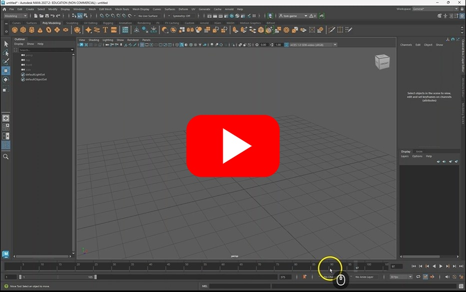
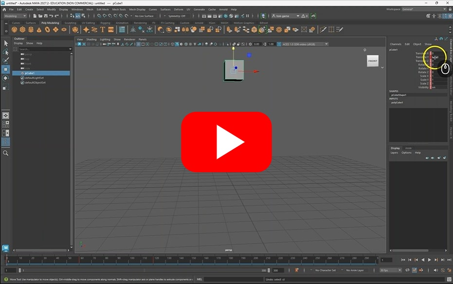
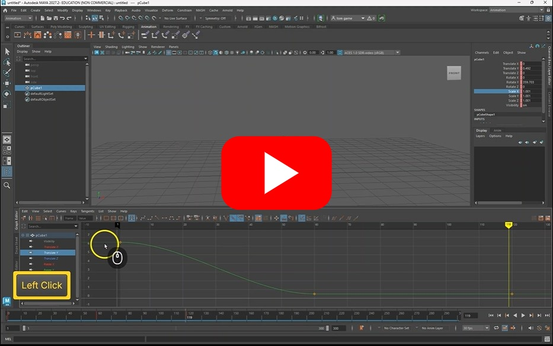
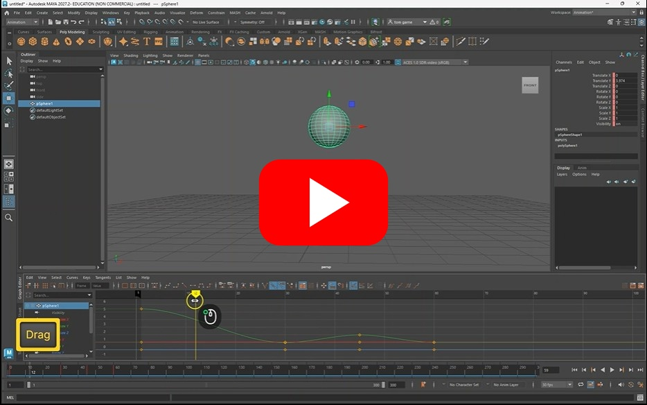
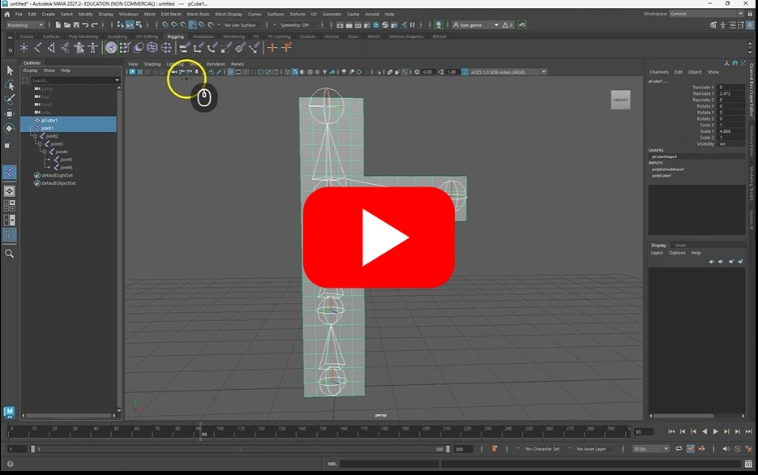
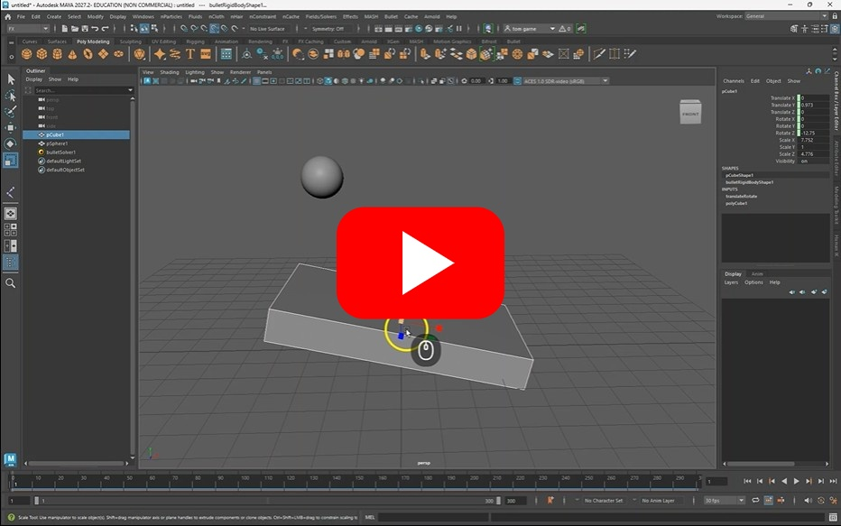

# Animation

Maya is a very power tool for animating 3D objects,
this worksheet will guide you through the basics of key frame animation, rigging simple objects and using physics.

## 1. Basic Animation

### Setup

Before we can start animating our object we need to setup our timeline.

We will set the frame rate, the range and playback speed

### 2. Keyframing

You can keyframe and animate most object properties.

### 3. Graph editor

To change the easing between keyframes you need to use the graph editor

### Challenge - Animate a ball

Create a simple sphere and try to animate it bouncing on the ground. Think carefully how objects move in the real world, particularly how they bounce.

Here is my solution, try to do it yourself before looking at it.

## 4. Basic rigging

So far we have looked at how to animate complete objects, but we can also animate the vertexes to warp and bend object.

One way to do this is by creating a rig. You can use a complex rig to control character, but in this next video I will show you how to create a simple rig.

### Challenge

Try to rig a different object, maybe a ball cylinder. Animate it so it jumps in the air.

## 5. Physics

Physics can be a very quick and powerful way to animate objects in a realistic way.

### Challenge

Try to add physics to a new scene, maybe duplicate lots of spheres and see how they interact.

## Extra

If you are interested in doing more rigging, this is a great video showing you the basics of controllers which you can use to more easily control your rig:

https://www.youtube.com/watch?v=1wvdQy2Fdhw&t=798s

