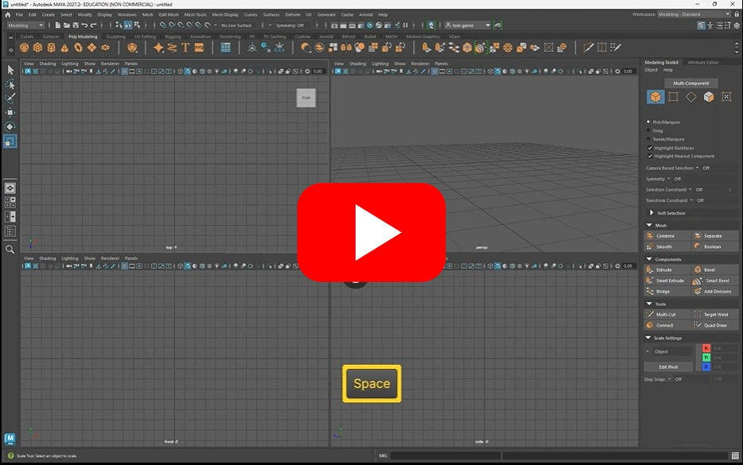
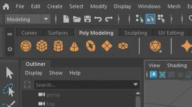
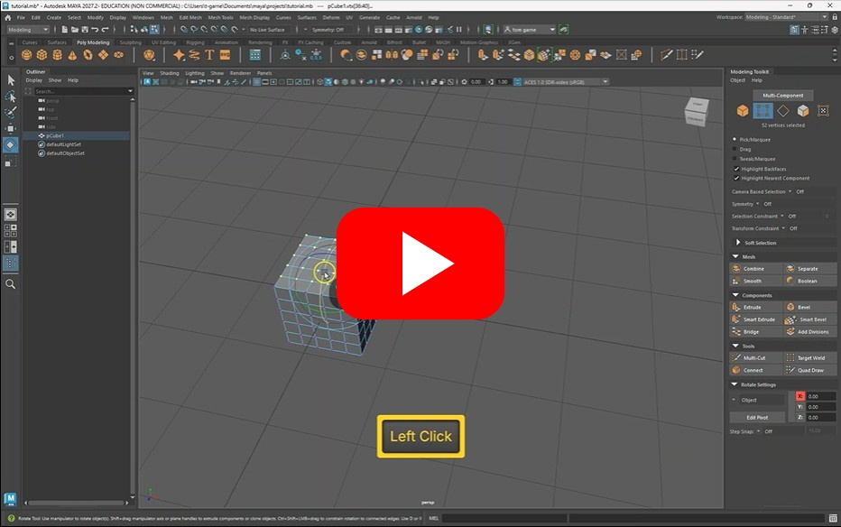
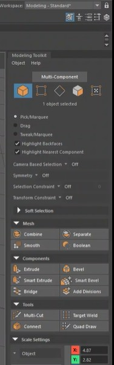
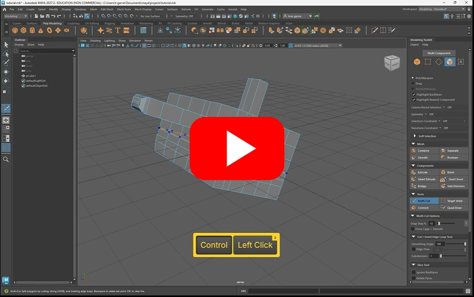
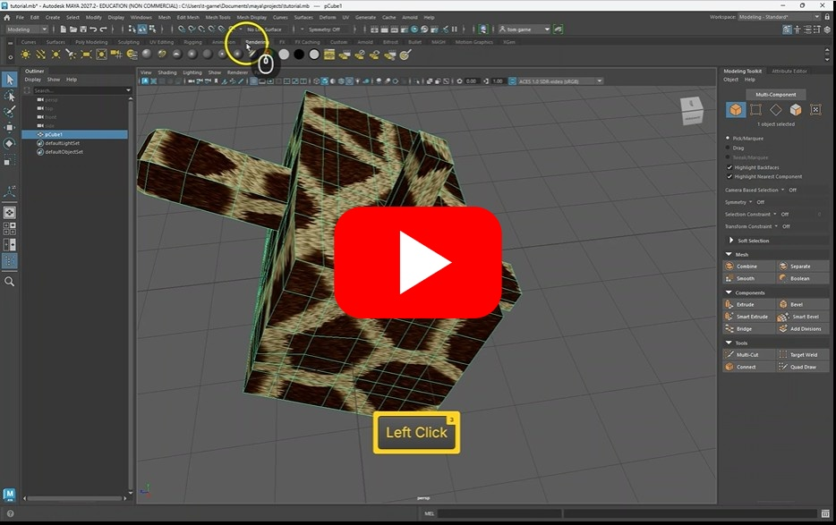

# Maya Refresher

You may be a little rusty with Maya, this worksheet will remind you of the basic of modeling and common shortcuts.

## Navigation

To move around your viewport:

- **Orbit** - Alt + left mouse button
- **Pan** - Alt + middle mouse button
- **zoom** - scroll mouse wheel

Tap the space bar to move between scenes.

## Modelling

### Primitives and Manipulation

You can create primitive shapes from the top menu, double click to open the options.

Manipulate objects and components

- **Move** - w
- **Rotate** - e
- **Scale** - r

### Tools

To change between object, vertex, edge and face mode, you can use the toolkit

The toolkit also contains some useful ways to manipulate and add more detail to your object

- Extrude
- Multi-cut
- Bevel

## Texturing

We can apply colours and PBR materials to our objects.

I recomend the standard surface material for rendering as it will give the most realistic renders.

## Next steps

In the next worksheet we will cover animation and rendering.

## More resources

### Free textures

- [https://ambientcg.com/](https://ambientcg.com/)
- [https://polyhaven.com/](https://polyhaven.com/)

### Learn Maya

login to linked in learning with your students email
- [linked in learning](https://www.linkedin.com/learning/maya-2026-essentials-training/welcome?u=56744785)

