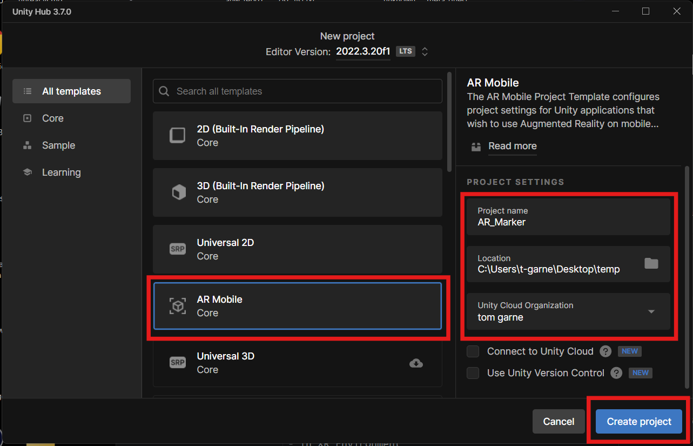
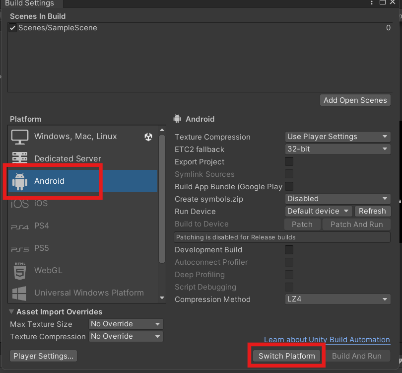
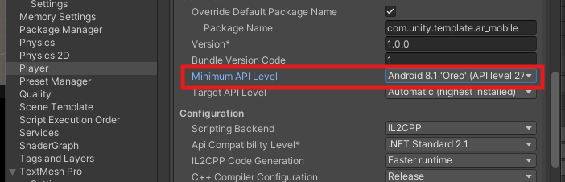
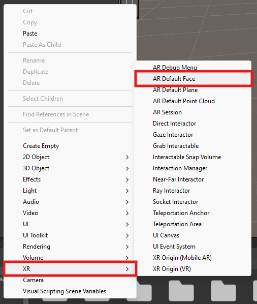
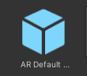
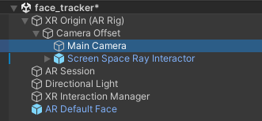
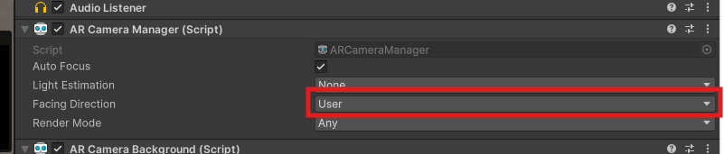
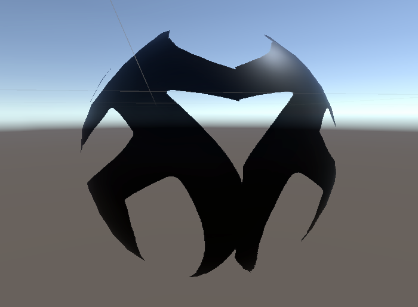
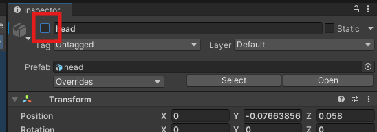

# Unity AR - face tracking

This Worksheet will guide you through creating a Augmented reality(AR) face tracking Unity project and deploying it to an Android devices.

The screen shot were created on a PC using Unity version 2022.3.20f1, they may look slightly different on a Mac but as long as you have a similar version of Unity the functionality is the same.

if you get stuck please ask for help.

## 1. Create a new AR project

- Create a new Unity Project in Unity Hub

- Choose the **AR Mobile core** template (you may need to download it first)

The project has a lot of dependencies so may take a while to load the first time.

### Convert to Android

We will be deploying our project to an Android tablet, so need to change the target platform, it is best to do this now before we start.

- In the top menu go to **File > Build settings**

- Choose **Android** and **Switch settings**

AR core is only supported on more recent versions of Android, so we need to set the minimum version.

- In the top menu, go to  **Edit > Project Settings**
- In the **Player** Section find the **Other settings** section
- Change the**Minimum API Level** to **27**.

### New Scene

First we are going to create a brand new scene

- In the top menu go to **File > New Scene**

- Choose **AR** and press **Create**

### Scene Contents

We could have set this up ourselves manualy but using teh AR template saves us time.

The two main things an AR scene needs are an **XR origin** and **XR Session**

- Delete the Cube from the Hierarchy.

#### Save the scene

- In the top menu, go to **File > Save as** and save your scene in the **Scenes** folder. Call it "face_tracking_scene".

## 2. Add a face

To begin with, we just want to see a blank face.

### Create a face

- In the Hierarchy, **right click** and choose **XR > AR Default face**

The default face has a broken pink texture on it so we need to make a new one.

- **Right click** in the Assets panel and make create a new materials (**Create > Material**). Rename it and Change the Base Map colour.

- Drag the material onto the **AR default Face** in your Hierachy.

We now need to turn this edited face into a prefab

- Drag the **AR Default Face** from the **Hierarchy** into the **Assets** Panel, it should turn blue.
- 

### Create a face manager

- On the **XR Origin**,  add an **AR Face Manager** component.
- Drag your new **AR Default Face** prefab from the **Assets** panel onto the **Face Prefab** slot on the **AR Face Manager**.

## Change camera

Unity uses the rear camera as the default, for face tracking we need to use the front facing camera.

- In the **Hierarchy** find the **Main Camera** inside the **XR Origin**.

- In the **Inspector**, in the **AR Camera Manager** component, change the **Facing Direction** to **User**

## Test on a device

We can now test the project on a real device

## 3. Test on a device

Now that we have successfully tested our project in the simulated environment we can try it on a real device.

As this process with be the same every time you build to android I have made a seperate guide showing you how to do it.

[Build to an android device](./build_to_android.html)

## 4. Testing

You should see a mask covering you face on your device. If it doesn't work, go back and make sure you have not missed anything.

## 5. More textures

The default face deforms to fit your face and reacts to your face. this works well with materials with image textures on them.

- Download these images and put them in your assets folder.

[tattoo image](./assets_for_worksheet/tattoo.png)
[mask image](./assets_for_worksheet/luchadores.png)
[lighning image](./assets_for_worksheet/lightning.png)

- Make a new material in the assets panel, and call it "face_material"

- Change the **Surface Type** to **Transparent**
- Drag one of your images into the **Base Map** slot

You can test the material by creating a new sphere in the **hierarchy** and dragging the material on to it.

To improve the edges of transparency you can experiment with the alpha clipping and blend modes properties on the material.

When you are happy you can apply delete your test sphere you can now apply the texture to the face.

- **Double click** the **AR Default face** prefab to open it

- Drag the new material onto the **AR Default Face** in the Hierarchy.

- Now rebuild the project to test the face on your device.

## 6. Object

You can also add different prefabs to your face.

download the following objects:

[head.fbx](./assets_for_worksheet/head.fbx)
[glasses.fbx](./assets_for_worksheet/glasses.fbx)
[moustache.fbx](./assets_for_worksheet/stach.fbx)

First we need a referece so we know where to put the objects on the face.

- Open the **AR Default Face** prefab.
- Drag the head you just downloaded onto the **Hierarchy**, make sure it is placed at 0,0,0 position in the inspector.

You can now use this head as a guild to add and position the other objects.

- Add as many objects as you want and position them on the head

You may need the head again, but we want to hide it for now.

- In the **Inspector** **un-check** the tick box at the top.

We also need to hide the original face

- In the **Hierearchy** select the **AR Default Face** and turn off the **Mesh Renderer** component.

You can now build your project again to test it.

## 7. Challenge

There are a few improvements and additions we can make.

### Challenge 1

- Find and add your own models and textures to the face maybe some with animations.

### Challenge 2

If you added the glasses model you should see that you can see the arms of the glasses through your head if you look to the side.

- Fix this by creating a new material with a shader of **AR /Occlusion**
- Turn the **Mesh Render** back on on the Face
- Drag the material onto the face.
- Test again
- The face should not appear, but will hide anything behind it.

<!--stackedit_data:
eyJoaXN0b3J5IjpbLTQ5MDQ3MDczOCwxNzA3MTM5NzY2LC0xOD
Y5ODg4MDBdfQ==
-->