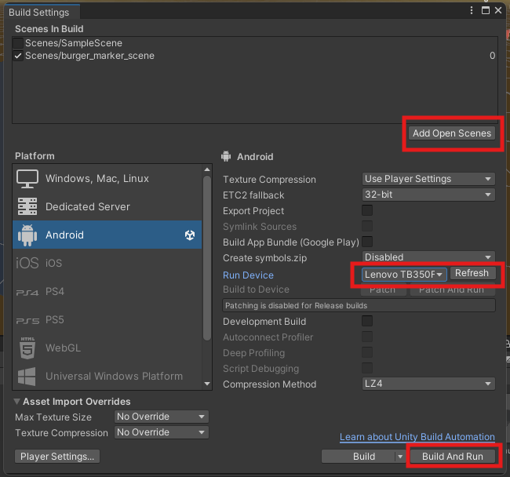
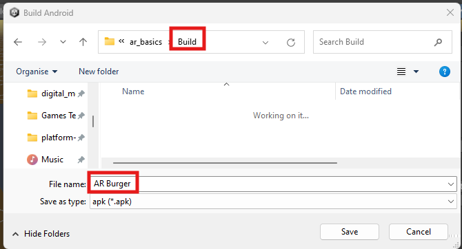

## Building to an Android device

This worksheet will show you how to build from Unity to an Android device. This works for phones, tablets and Meta Quest VR devices.

### Android

We will be building to an Android device in this worksheet. It is possible to build to an an IOS device, but it takes extra steps.

If you want to learn more about building to an IOS device, you can follow this tutorial

https://betterprogramming.pub/test-your-unity-game-on-an-ios-device-without-a-developer-account-ac256fb00a1

### Build settings

Unity will build to Windows, Mac or Linux by default, depending on which operating system you are using. We want to switch our target platform to Android. It is best to do this right at the start of you project but can be done at any time.

- In the top menu go to **File > Build settings**

- Choose **Android** and **Switch settings**

#### AR

AR core is only supported on more recent versions of Android, so we need to set the minimum version to support the maximum number of devices which support AR core.

- In the top menu, go to  **Edit > Project Settings**
- In the **Player** Section find the **Other settings** section
- Change the**Minimum API Level** to **27**.

### Set-up you device

All Android devices are slightly different, so you may need to research how to do this on your particular device

Most phones and tablets require 2 steps on the device:
1. Turn on developer mode
2. turn on USB debugging

#### Turn on developer mode

- On your phone or tablet, go to **settings**
- Open the **about** section (normally at the bottom)
- Tap the build number 7 times.

You should get a message confirming you are now a developer.

#### Turn on USB debugging

Still in the settings

- Open the **System** section
- Find **Developer Options**
- Turn on **USB debugging**

#### VR devices

To turn on developer mode on a meta quest you need to open the meta app on your phone, find the vr device and turn on developer mode in the settins.

### Plug in

Now that you have set up your device you can plug it in

- Plug your Android device into your computer using the USB cable.

You should get 2 message boxes appearing on your device asking for permission to share files and to connect for debugging.

- Accept both pop up messages, if you accidentally refuse one, just unplug and try again.

### Build you app

Now that our device is ready we can build to it from Unity.

- Back in Unity, go to **File > Build Settings**
- Press **Add Open Scene** to make sure you are building the correct scene, **untick** the sample scene.
- **Refresh** Run devices and choose the device you plugged in.
- Press **Build and Run**

- Create a folder called "Build" inside your project folder. (If you are using git, the default unity git ignore file will helpfully ignore the build folder)
- Go into the new Build folder, name your file, I called mine "AR Burger".

- Press **Save** and your project will build and deploy the app to your device. It may take a few minutes the first time.

