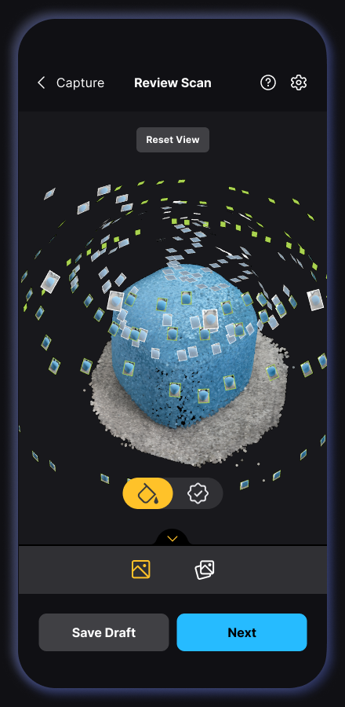
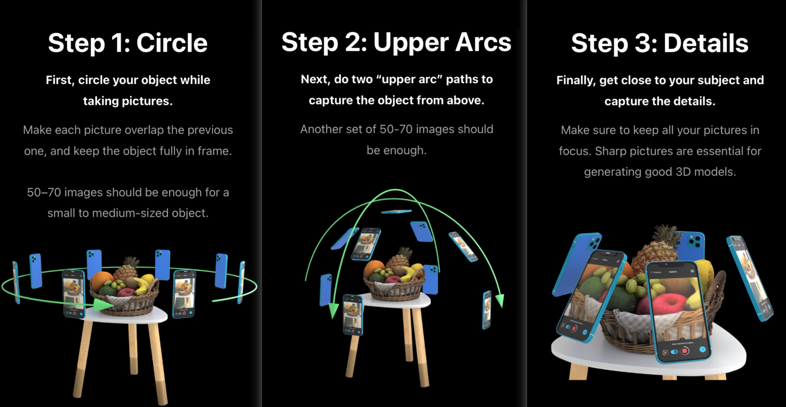
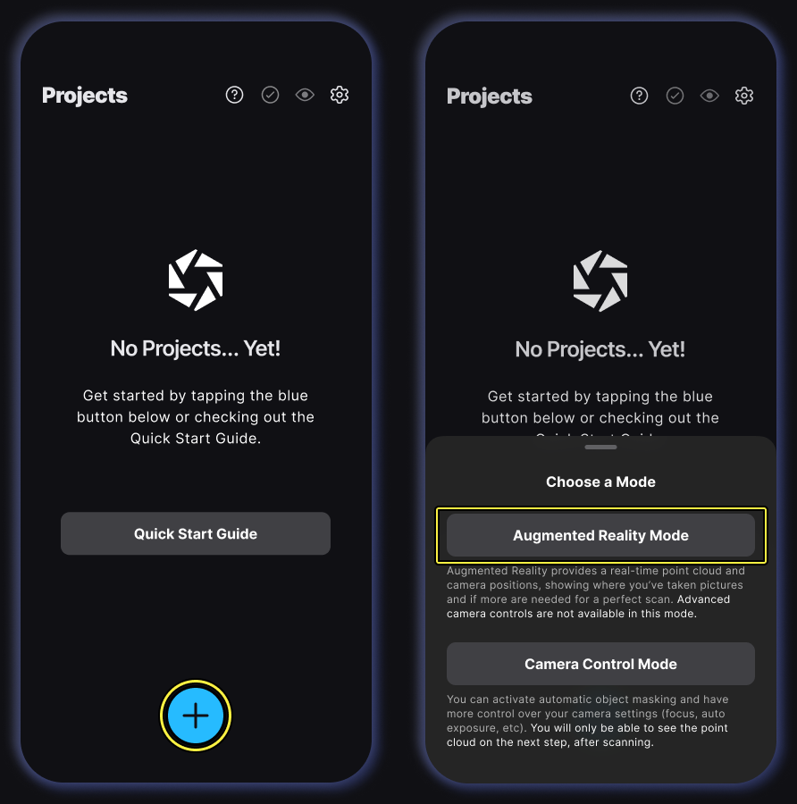

# 3D scanning

For this worksheet we will be using phones and tablets to 3D scan objects

## 1. Photogrammetry

We will be using Photogrammetry,  this works by taking lots of photos of your subject and then finding common elements to compare them, triangulating features to create a 3D model.

> [!NOTE]
> There are other methods for 3D scanning objects such as Lidar through a specialist device or on higher end phones and tablets. At the bottom of this worksheet I link to other apps which support Lidar which you may want to experiment with.

# 2. Reality Scan

We will use [Reality scan](https://www.realityscan.com/en-US) from Epic games who make the Unreal Game Engine. It is free and available on most mobile devices.

It can produces some very good results if used well:

[Reality scan examples on sketchfab](https://sketchfab.com/search?q=realityscan&type=models)
 
You can find the app on the android of Apple store

[https://www.realityscan.com/en-US/mobile](https://www.realityscan.com/en-US/mobile)

There is also a PC app which allows you to upload images and give you much more control over how your scan is processed.

> [!IMPORTANT]
> This guide uses version 1.7.1 of the mobile app, but you should use the latest version which may have some differences.

## 3. Principles of Photogrammetry 

Before we scan anything we need consider how photogrammetry works to achieve the best quality 3D model

It can take a while to take all the images and process them so we want to maximise our chances of getting a good scan.

### Photo Quality

Each image needs to be sharp, not blurry or noisy
	- Move the camera **slowly**
	- Ensure there is plenty of even light
	
### Subject Coverage

The entire object needs to be captured, if you don't take a photo of an area it will not be part of your model.

Take photos above and bellow the object and circle it to at multiple heights to capture all the details.

### Information Overlap

Each image should overlap with another so that common reference points on each photo can be used to stitch together the whole object.

## Environment

The environment your object is in should be consistent through out the scan to ensure the images all match, using a turntable and a blank background can help with this.

- If you are outside, choose a grey day to avoid harsh shadows or the light levels changing during the scan
- no wind, the object or background should not move during the scan.

## Materials

Some objects are more suitable then other and will give better results

Avoid objects which are:
- Transparent
- Shiny
- Plain

> [!NOTE] Organic objects with texture and detail work best.

# 4. Scan an Object

Now we know the basics we can try to scan an object

- Open the app and press the plus symbol to create a new scan.

- [reality scan youtube site](https://www.youtube.com/@RealityScanOfficial)

Reality scan has 2 modes, 

1. Augmented reality guides you through the process and automatically takes images

2. Manual give you move control giving better results but you have to manually take the photos. One huge benefit is that it allows you to flip the object over and capture the base.

For this first test we will try augmented mode.

- Find a suitable small object to scan
- Place it somewhere you can access every side to get the best angle or use a turn table
- Scan you object, make sure you capture everything and don't move too quickly.

For more detailed instructions, there is a useful guide

[reality scan step by step](https://dev.epicgames.com/documentation/en-us/realityscan-mobile/realityscan-step-by-step-guide)

## Evaluate the scan

Once you have finished scanning your object you need to wait for it to process a point cloud locally on the device.

At this stage you want to see how it looks. If lots of bits are missing or misaligned you may want to consider rescanning the object differently to improve the results.

When you are happy with it, press process and wait for it to generate your 3D model.

## Process

When its finished you should be able to view the model on the app.

it is a good idea to crop it before processing it further to maximise the texutre quality.

## Export

Once the 3d model has been generated you can either download or send it to sketchfab.

If you Export the model to sketchfab you can download it as an .obj file which will import to most 3D packages.

Here are some I created and sent to sketchfab:

[limestone sculpture](https://sketchfab.com/3d-models/limestone-sculpture-c4f95299aa564662b8b6a532c6e152da)

[wooden cup](https://sketchfab.com/3d-models/wooden-tankard-859f4a430da14b728d80ea953bcf8e43)

You should be able to download them using the link bellow the model.

If you export straight from the app you will get a .zip file containing a .glb file and textures, these can be difficult to open in some packages (Maya), but there are lots of tools ways to convert the file to a different format.

[https://convert3d.org/glb-to-fbx](https://convert3d.org/glb-to-fbx)

## Import

Try to import the .fbx file in to Maya

# Additional resources

## Other photogrammetry apps

There are other photogrametry apps available which you can experiment with for you own project, I particularly recomend:
- [polycam](https://poly.cam/tools/photogrammetry)
- [Kiriengine](https://www.kiriengine.app/)

If you are on a PC, you can also use the reality scan PC add through the Epic games launcher which has many more options for refining you scan.

-[reality scan](https://www.realityscan.com/en-US)

## More tutorials

- [How to use reality scan for mobile](https://www.youtube.com/watch?v=spPIqK3NVwc)
- [reality scan youtube site](https://www.youtube.com/@RealityScanOfficial)

# References

[three principles](https://dev.epicgames.com/community/learning/courses/blA/unreal-engine-realityscan-photogrammetry-basics-by-quixel/RklR/unreal-engine-realityscan-scanning-basics) 
