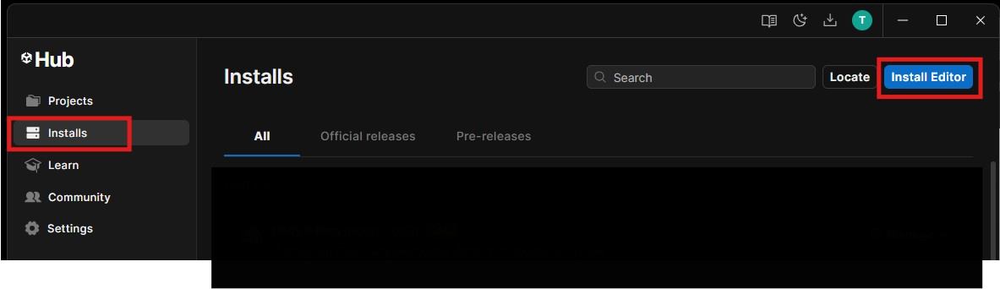
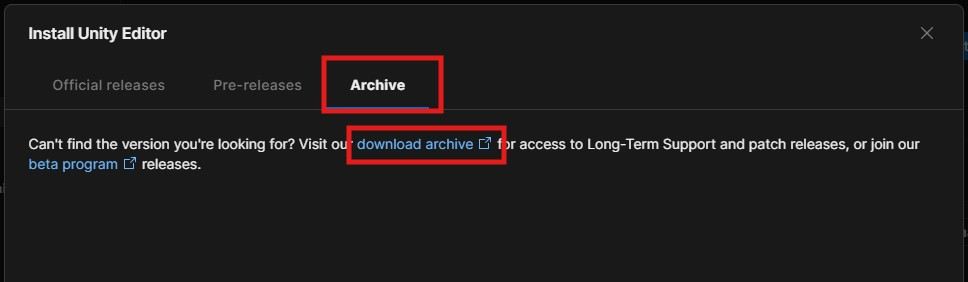
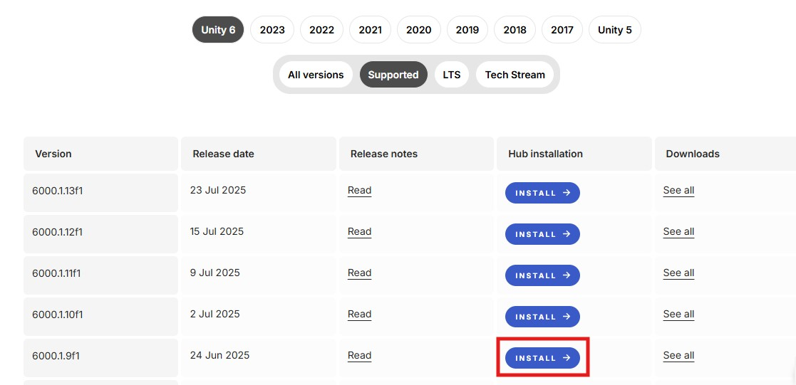
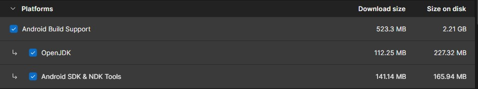
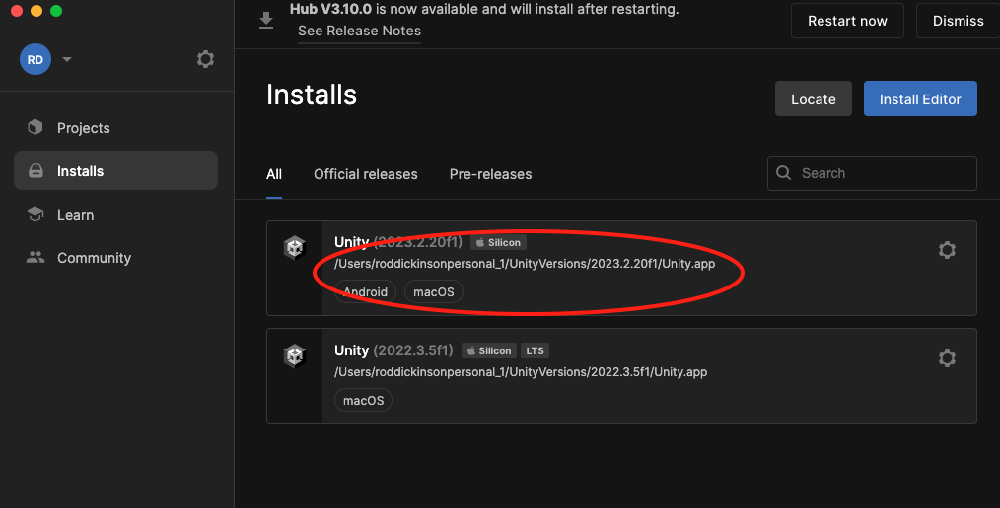

# Installing Unity for AR and VR

The brief requires you to use a specific version of Unity, this year we will be using version 6000.1.9f1.

This version is already installed on the lab machines, the rest of this guide will show you how to install it on your own machine.

## 1. Unity Hub

If you do not already have it, download and install Unity hub

[Unity hub download](https://unity.com/download)

## 2. Unity

You can now open Unity hub and install the correct version of Unity

- Go to **Installs > Install Editor**

- Go to **Archive > download archive**

- find version **6000.1.9f1** and choose **Install**

- Select the **Android Build support** platforms and the **OpenJDK** and **Android SDK & NDK tools**

- Now press **continue** and wait for it to install, it is a fairly large install so may take a while.

## 3. Unity on a mac

If you are using Unity on your own Mac check that your Unity Editor is installed inside a parent folder that contains no spaces. EG: **UnityVersions** rather than **Unity Versions**.

If it is installed in a parent folder with spaces it will not build your project to your device.

So you will need to quit the Unity Editor and Unity Hub, rename the folder and then follow the prompts re-add / re locate the Unity editor when you reopen Unity Hub.

