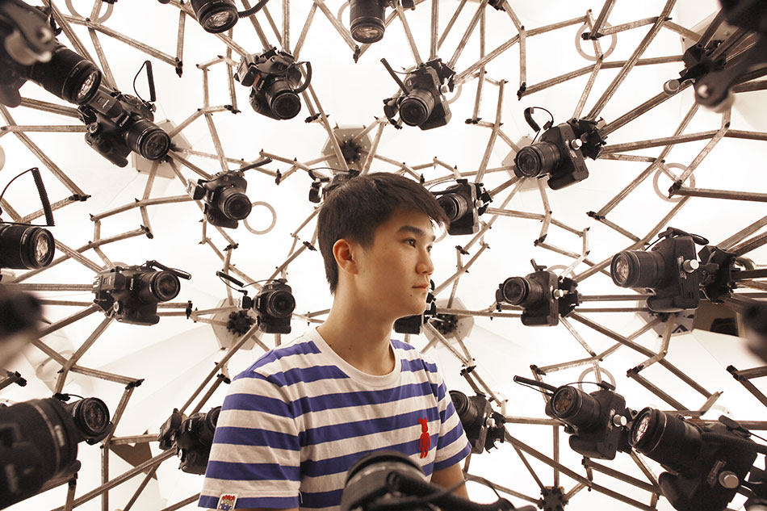

# 3D Scan a person

3D scanning an entire person is more difficult than scanning an object.

The main issue is keeping the person still while you capture the images.

Ideally you would capture the entire person as quickly as possible.

Professional rigs use multiple cameras to capture the everything in one frame.

[copypod](https://www.designboom.com/design/peoples-architecture-office-3d-copypod-pavilion-05-23-2017/)

## One camera

We do not have a multi camera rig but as long as the person stays still, we can achieve quite good results with only one camera.

Think about the principles of 3D scanning

- no shiny or transparent items
- no movement
- capture photos of all angles
- make sure the photos overlap

## 1. Just the head

Just doing the head is good compromise, it is easier to keep just your head still and is a smaller area to capture.

[scanned head](https://sketchfab.com/3d-models/grandpa-realityscan-35316e9640384a5589ab662a4f4998c8)

In pairs, scan each others head.

- Your subject **must** stay absolutely still
- Use **manual mode**, I have found it gives much better results.
- Take off any glasses, you can always add them in again later.
- Consider tying up long hair.
- Seat the model in a comfortable position with access all around them for scanning.
- Try to not blink when you are taking photos of the front of their face.

- Take Lots of photos, the app lets you take 250, you should aim to take at least 150. The more the better.

> [!NOTE]Think about the facial expression, you could make multiple scans with different expressions.

After you have scanned, wait for initial processing then crop the image before the final cloud processing

If you are not happy with your scan try again. Think about what may have negatively effected the scan.

## 2. Scan a whole person

It is very difficult to get a good scan of an entire person, but it is possible to get acceptable results if you are careful and your subject is good at standing still.

### Size

People are quite big, make sure you get images over the entire body including the top of their head and under their arms and legs. Pay particular attention to the face and hands. 

### Position

If you want to rig your character you need to scan them with their arms away from their body and their legs separated so they don't stick together.

Using 2 tripods as stands for the arms can really help them to hold the arms still.

### Scan

- Try to scan a whole person
- Look at the result and consider how you could improve it.

> [!NOTE] If you are struggling to get a complete scan, you could consider scanning the person in parts and joining them together in Maya afterwards.

