# Creating 3D models with Generative AI

In this worksheet we're going to create a 3D Mesh of a flower using generative AI.

In this example I have made a 3D model of a flower from a single still photo.   

I'm using https://www.meshy.ai/  but you should also try https://studio.tripo3d.ai/    

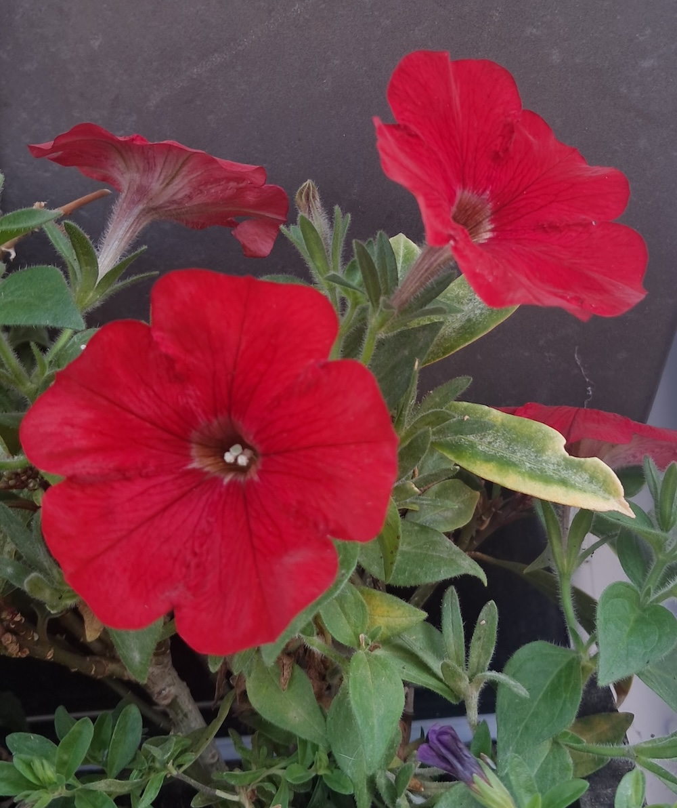

I was careful to make sure the photo had a plain background. If yours doesn't you could clean up the photo and remove the backaground using Adobe Express.    
https://new.express.adobe.com/.  

## Remove background from reference photo

[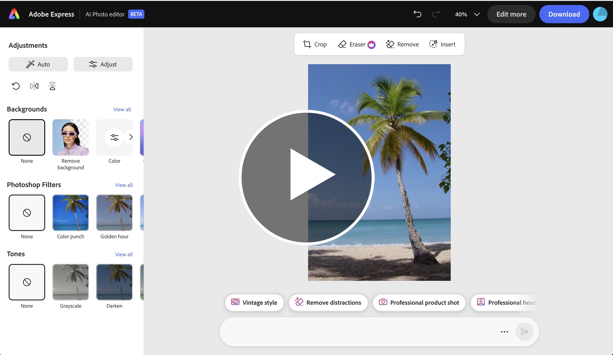](https://uwe.cloud.panopto.eu/Panopto/Pages/Viewer.aspx?id=5a196d57-f4ba-49d9-bfd6-b4cd01328425 ) 

## Generate Model 
### Meshy.ai

Now I'm going to use the downloaded cleaned image to generate a 3D mesh.   

Create an account https://www.meshy.ai/ to get free credits.  You should get enough credits to do a number of tests and produce the assets for this project.
Upload your photo. Click generate, but then change the model to 'Meshy 6 Lite' on the next screen.   

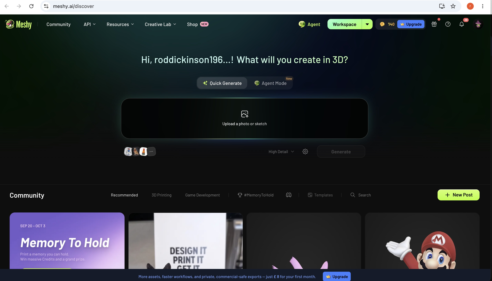

Make sure 'Meshy 6 Lite' is selected and click generate (otherwise you have to pay to download the model).  

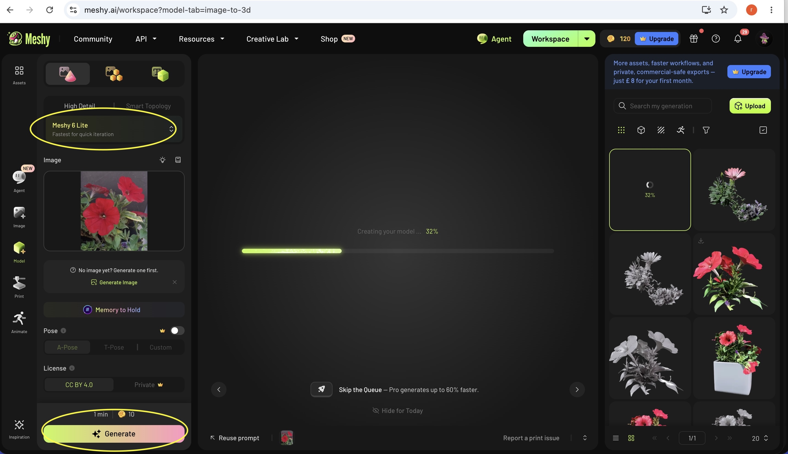

To texture the 3D model select texture and Generate Texture.   

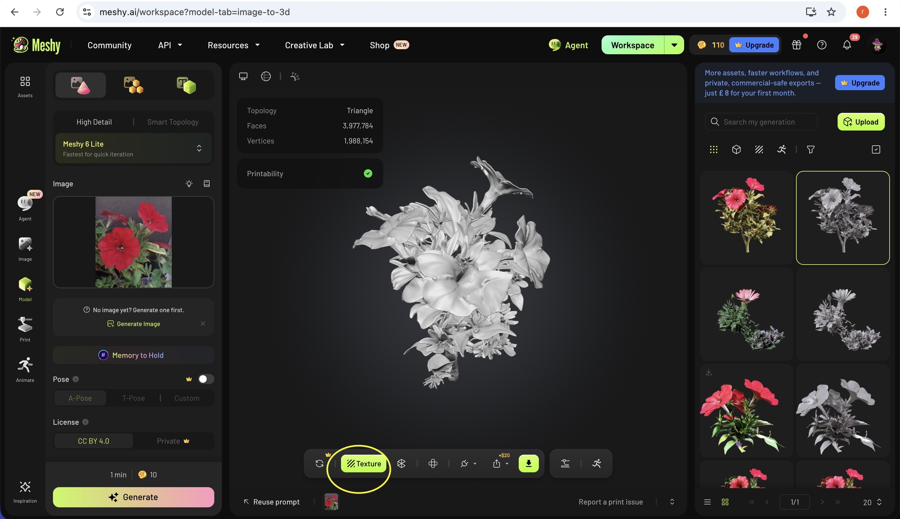

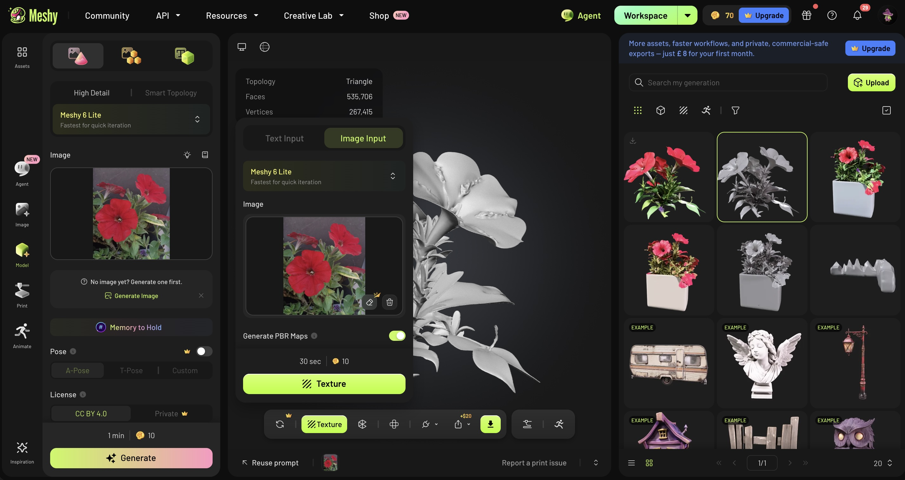

Result:   

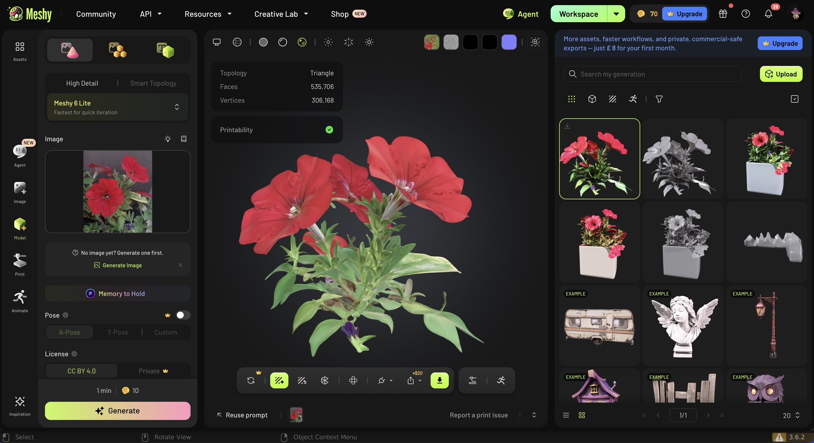

To download select FBX (file type) and Export. 

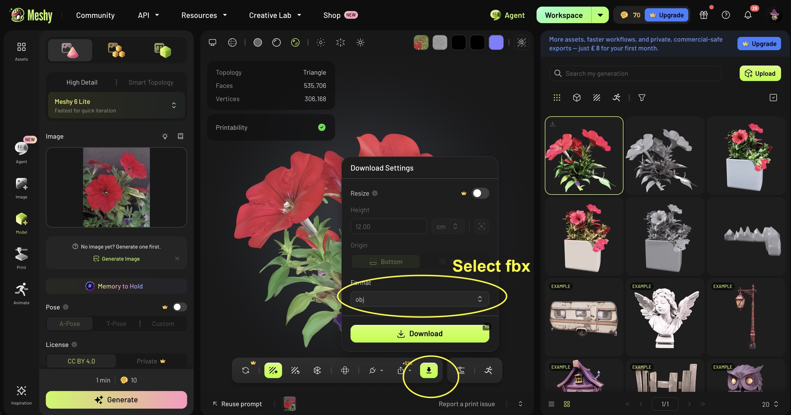
### tripo3d.ai
You can also try using https://studio.tripo3d.ai/ .   This works in exactly the same way. Make an account, log in and use the free credits.   

Upload the photo. Click 'Generate'.    

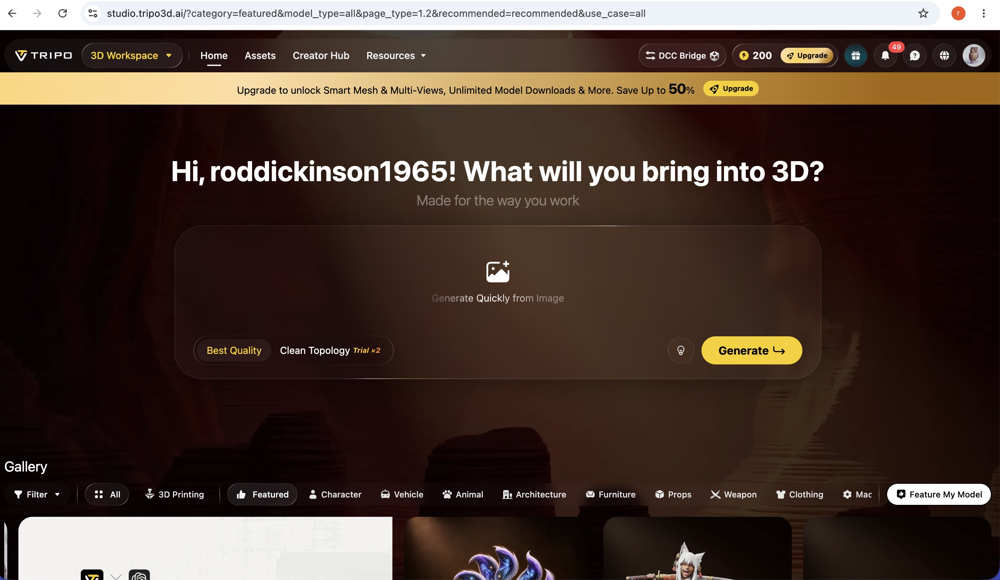

Now on the next screen change the model to 'Legacy 2.5' so that you can download the result for free.

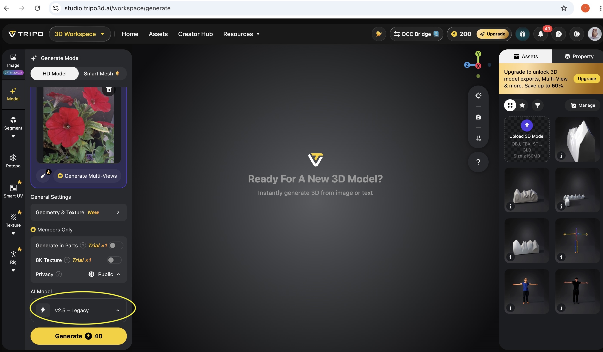

Now click 'Generate'.    

This generates the model and texture, but as you can see with variable results.    

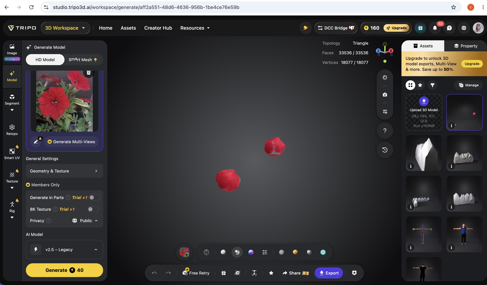

### Conclusion

Try both platforms and a variety of photos. Experiment! Sometimes https://studio.tripo3d.ai/ may be more successful than https://www.meshy.ai/. Sometimes the result from your second or third model maybe better than the first one. 

