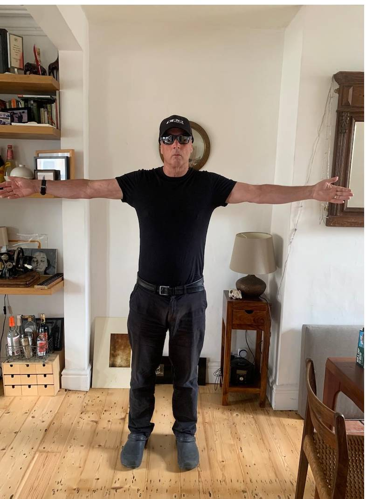
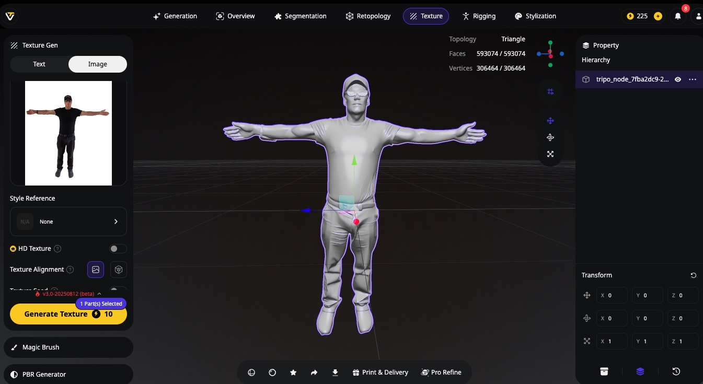

# Creating Avatars with Generative AI

In this worksheet we're going to create a 3D Avatar using generative AI.

## Remove background from reference photo
In this example I have made an Avatar of myself from a single still photo of me in T pose.   

I'm using https://studio.tripo3d.ai/   but you could also try https://www.meshy.ai/    

First of all I'm going to clean up the photograph and remove the background using Adobe Express.    

 

## Generate Avatar 
Now I'm going to use the downloaded cleaned image to generate a 3D avatar.   

Create an account https://studio.tripo3d.ai/ to get free credits.   

Select Generation and Build and refine.   

# Method One
Upload the photo and add a text prompt. Click 'Generate'.     

To texture the 3D model select texture and Generate Texture.   

Result:   

To download select FBX (file type) and Export.   

# Method Two
You can also try generating the T pose from a portrait photo
Upload the photo and add a text prompt. Click 'Edit Image'.     

Result:  

Now click 'Generate'.     

Add the texture as before: Result      

This produces variable results, as you can see, but maybe useful if you have no full body photo.

Now I'm ready to rig the avatar.   

## Generate Avatar Method Two

