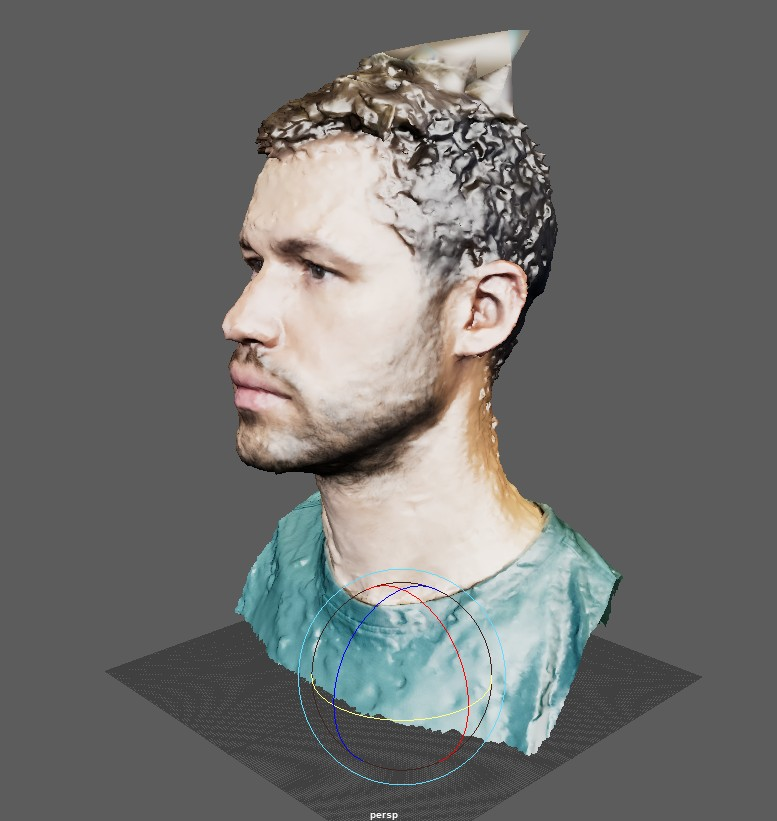
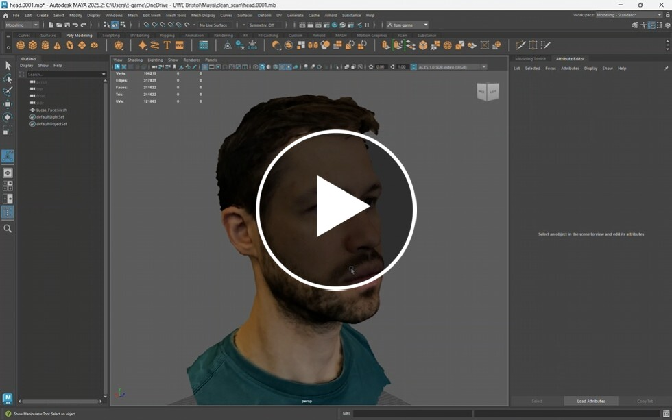
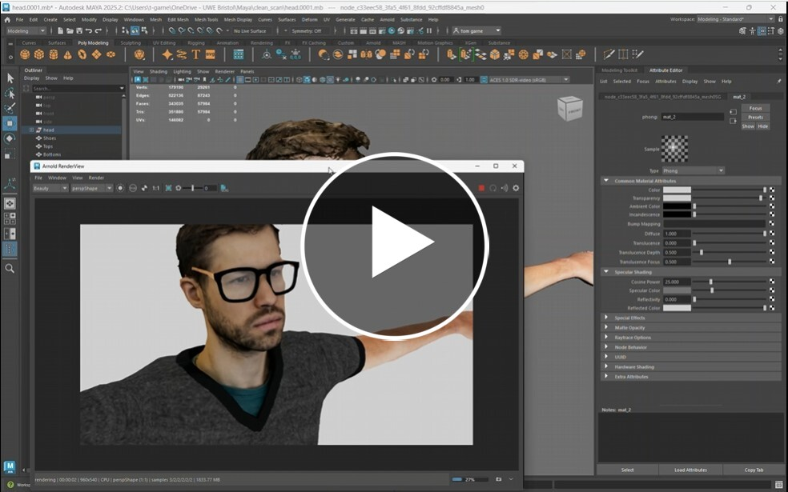
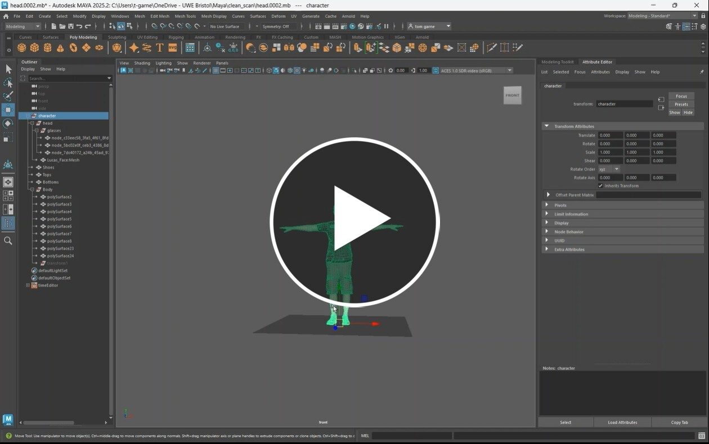

# Tidy up scans

Now that you have finished scanning your objects or people you may find they need some tiding up.

This may be very minor or could require some sculpting.

If you model is too messy, you may want to consider generating a new one.

## Smooth, re-mesh and texture

The following video gives you some tips on who to improve you model in Maya.

If you do not have your own model you can use this one.

[rod head download](assets/Rod.zip)

>[!HINT]
> Hold down **Ctrl + B** and move the mouse to change the brush radius
Hold down **Ctrl + M** and move the mouse to change the brush hardness
or just double click on the tool to open the options panel.

## Compositing

Now that we have cleaned up the model we can look into adding other elements, Adding glasses and a body.

Here is a clean version of Rods Head:

[Rods Head](assets/rod_head.fbx)

You can find your own accessories on Sketchfab.com. or use this hat:

[Beanie hat download](assets/beanie.fbx)
(This file is from https://sketchfab.com/3d-models/black-knit-beanie-edb7f2c044b64d5da40484495239fee3, but the texture has been reduced)

The following 2 characters have been downloaded from Mixamo.com using the t-pose animation.

[Character 1 download](assets/Ch18_nonPBR.fbx)(from Mixamo.com)

[Character 2 download](assets/Ch31_nonPBR.fbx)(from Mixamo.com)

## Exporting

Now that our model is complete we need to export it so that it can be rigged.

We need to 

- Rescale so it the correct height
- Position the origin
- freeze transforms

We are now ready to rig the Character next week.

