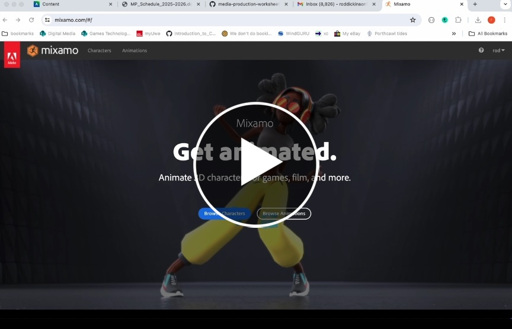

# Rigging Avatars with Mixamo

In this video I'm going to use the free platform https://www.mixamo.com/ to auto rig my 3D Avatar.      

I've downloaded my FBX Avatar and I'm now ready to rig it so that it can have motion capture animations and other found / downloaded animations applied to it.    

If you do not have your own character, you can practice with this one;

[Tom character](./assets/tom.fbx)

 
