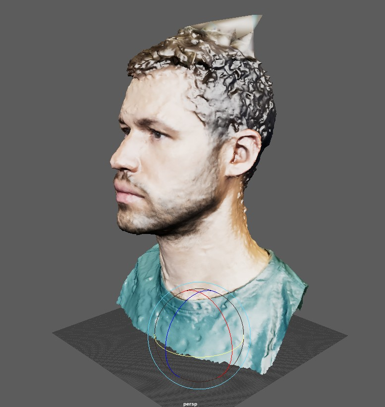
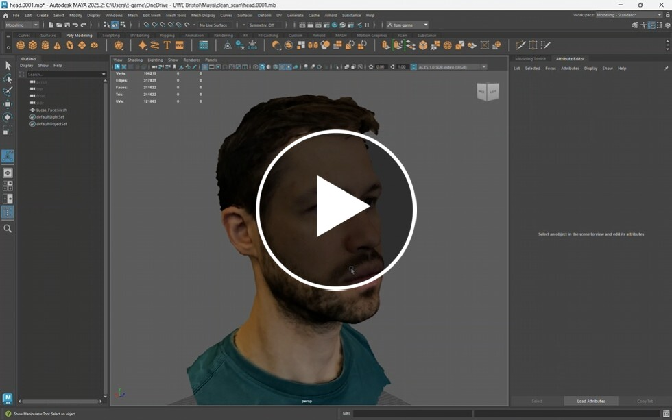
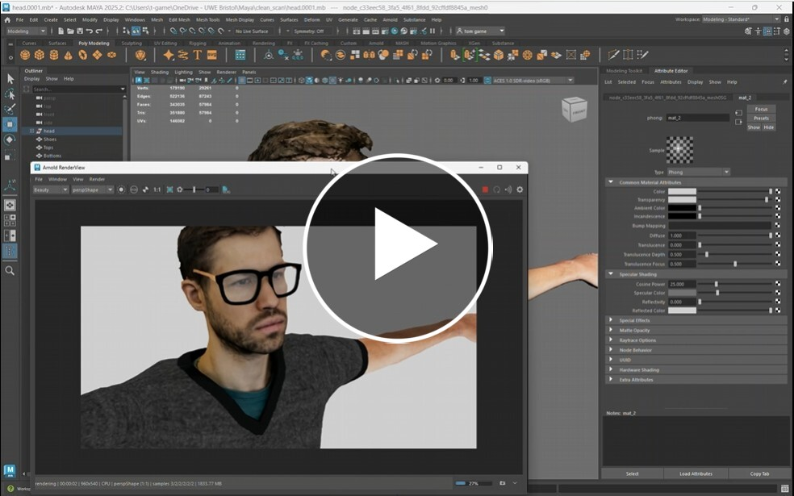

# Tidy up scans

Now that you have finished scanning your objects or people you may find they need some tiding up.

This may be very minor or 

## Smooth, remeshing and texture

The following video gives you some tips on who to improve you model in Maya.

## Compositing

Now that we have cleaned up the model we can look into adding other elements.

