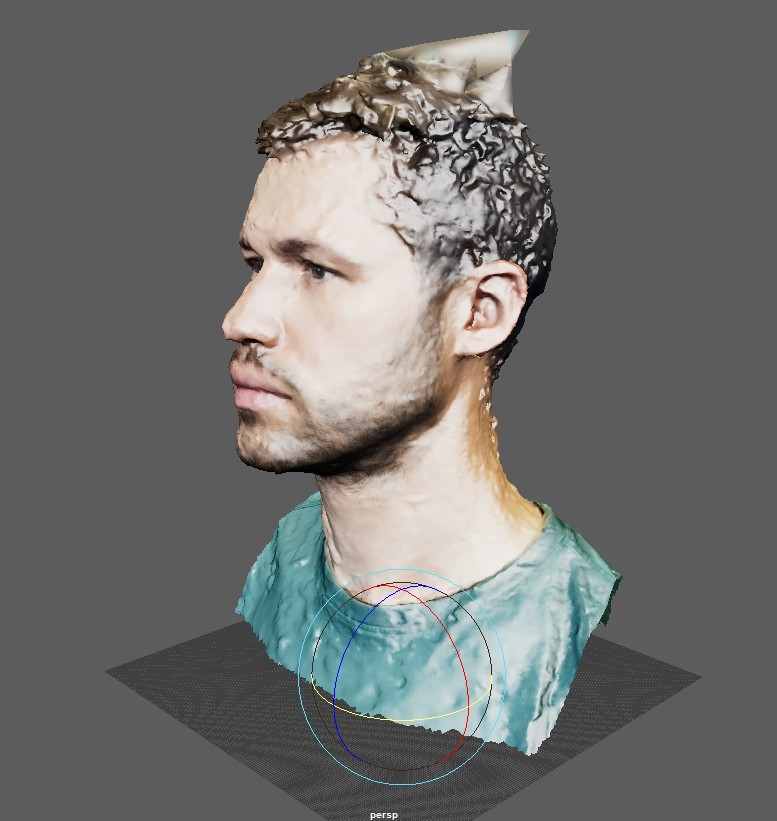
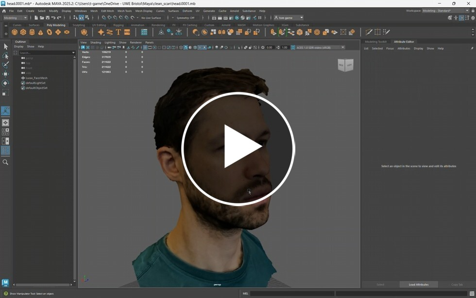
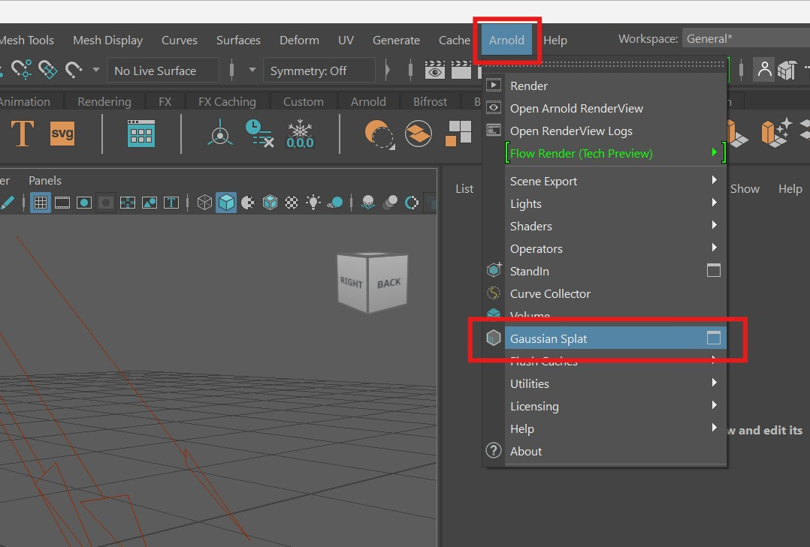
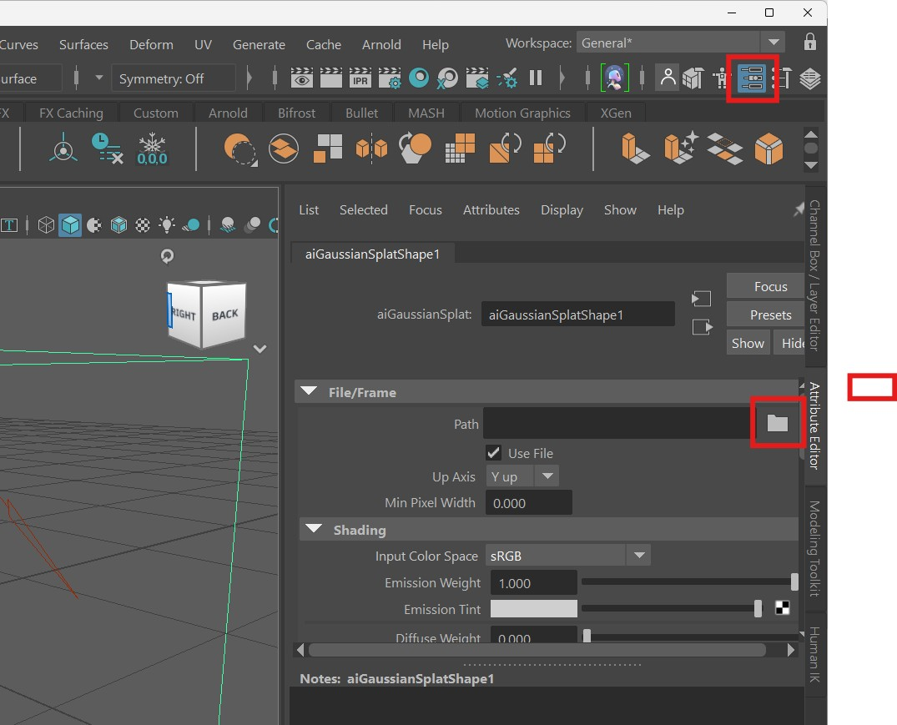
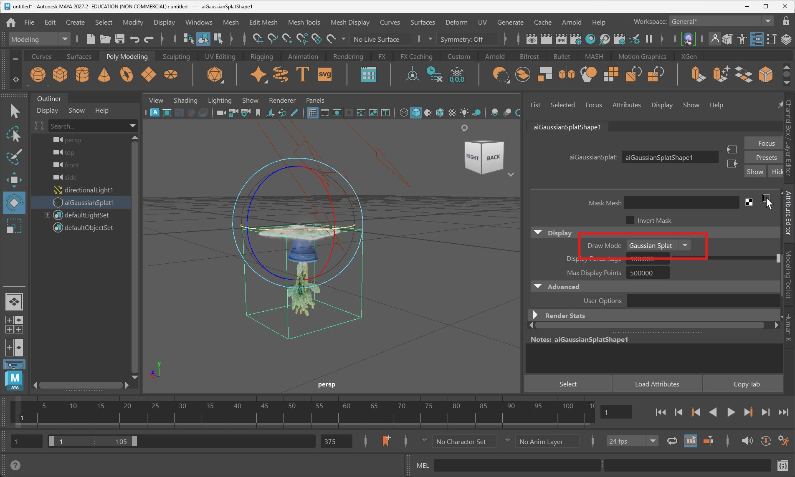
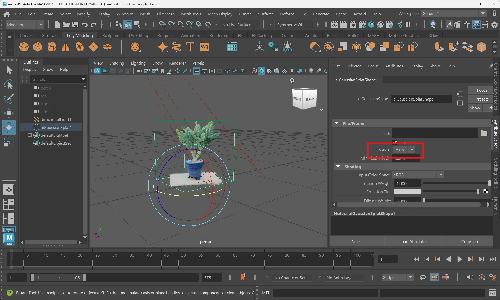

# Tidy up Photogrametry scans

Now that you have finished scanning your objects or people you may find they need some tiding up.

This may be very minor or could require some sculpting.

If you model is too messy, you may want to consider generating a new one.

## Smooth, re-mesh and texture

The following video gives you some tips on who to improve you model in Maya.

If you do not have your own model you can use this one.

[rod head download](assets/Rod.zip)

>[!HINT]
> Hold down **Ctrl + B** and move the mouse to change the brush radius
Hold down **Ctrl + M** and move the mouse to change the brush hardness
or just double click on the tool to open the options panel.

# Importing Gaussian  Splats

Recent versions of Maya support splats, you will need version 2027, with the MtoA plugin version 5.3 or higher ( look at arnolde > about  in the top menu)

## Add a splat to Maya

You can practice adding a splat using [my cactus splat file](assets/Prickly_Pear_SPLAT.ply), or download one your self from somewhere like [Super splat](https://superspl.at/), you will need to create a free account and not all splats are downloadable.

To add a splay to Maya, go to **Arnold > Gaussian Splat**
 

In the **Attribute editor** choose the path to your splat, is should be a ply file

Finally, you will need to change the **draw mode** to **Gaussian Splat**

You may also need to rotate it.

## Edit your splat

The following official Maya videos show you how to maske and light your Gaussian splats.

[Masking Gaussian Splats](https://www.youtube.com/watch?v=Bv7dejoLly4)

[Lighting Gassian Splats](https://www.youtube.com/watch?v=vX3fLhrTavM)

## Rendering 

You can render them out the same way you would a normal scene in Maya, but if you want to render out a point cloud instead of a gaussians you can use this video

[Render out a point cloud](https://www.youtube.com/watch?v=LNhsTrYBUto)

