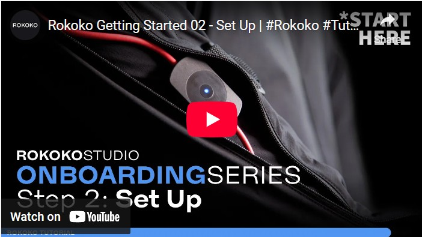
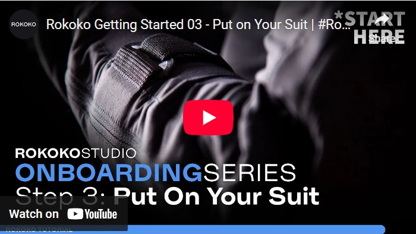
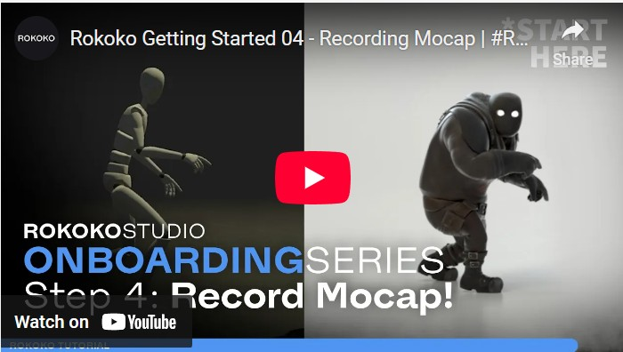
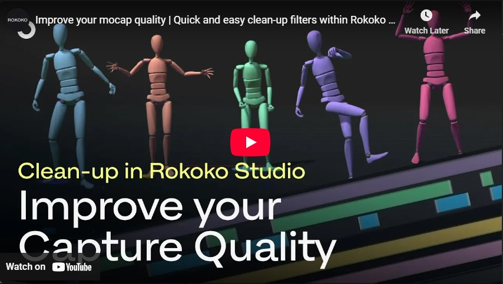
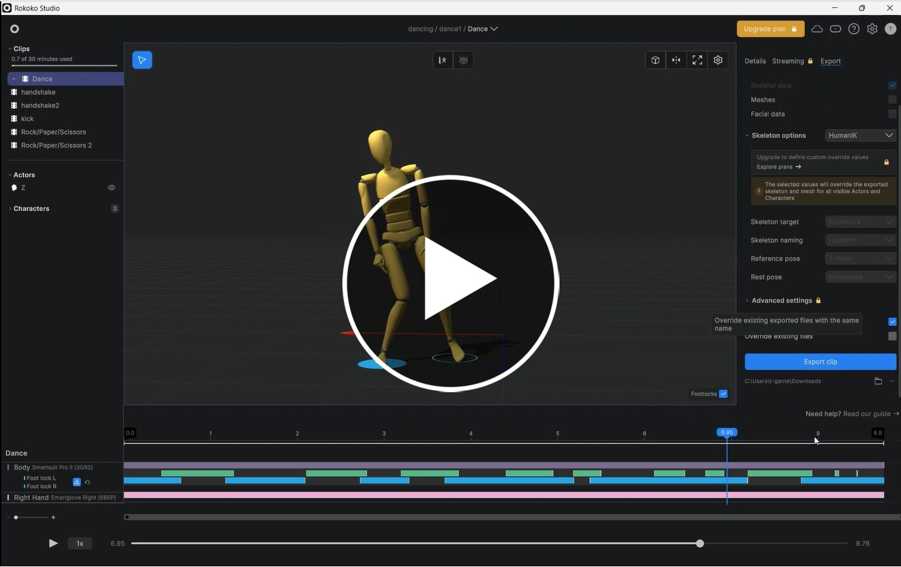

# Motion capture with Rokoko

We will be using a Rokoko Smart suit 2 with their Rokoko studio software to capture our motion tracking data.

> [!NOTE]
> [smart suit 2](https://www.rokoko.com/products/smartsuit-pro)

The Rokoko Smart suit uses inertial sensors (IMU's) to capture the movement of the suit without external cameras.
The IMU's are connected to a hub on the back of the suit which then transmit the data wirelessly to a computer.

To ensure the connection is fast and consistent we are using a router to create a local wireless network.

## 1. Rokoko studio

The Smart suit works with Rokoko Studio to record the motion data.

We will be using the free version on a PC in the lab. 

> [!NOTE]
> [https://www.rokoko.com/products/studio/download](https://www.rokoko.com/products/studio/download)

## 2. Smart Suit

We will be using the Rokoko Smart suite 2

You put the suit on just like a normal boiler suit, with the zip at the front. Be careful not to step on the sensors.

## 3. Record some data

Now you have to suit on and connected to the software we can capture some motion.

### Tips to get a good recording

 - Have a clear plan before you start to avoid having to have muliple sessions to capture all the data you need.
 - Recalibrate the suit between takes
 - Keep clips to under a minute to reduce sensor drift.

## 4. Clean up

Now that we have our footage we may need to clean it up to improve the tracking quality.

## 5. Export

- You can now export your clips as an fbx files for use in Maya or Unity.

### Extras

There are lots of video on the Rokoko you tube site you can use to impove your motion capture

[rokoko studio](https://www.youtube.com/watch?v=WF4FwVRWOa8&list=PL0nPCZDbYnms3zt1-A1cmf-S1fGyS6Rc3&index=6)

