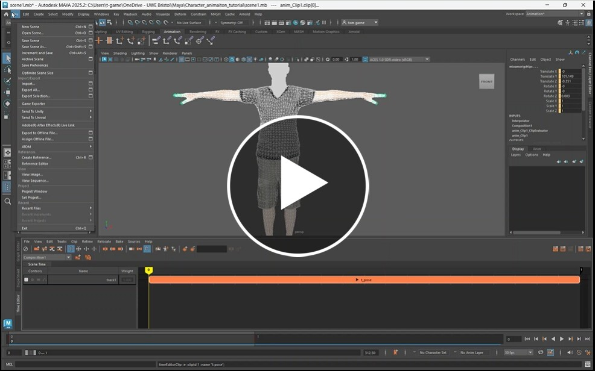
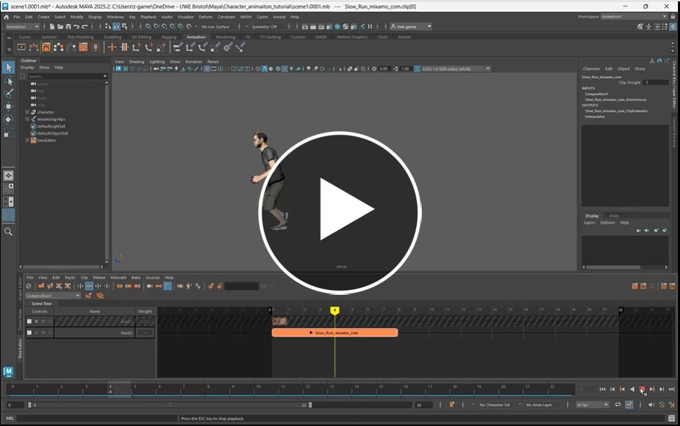
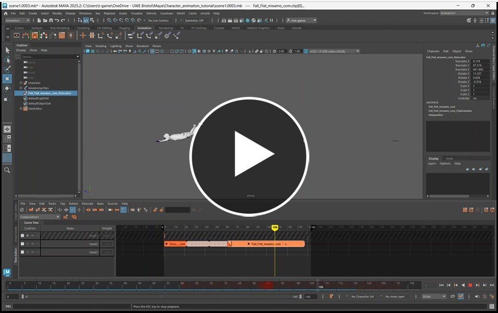
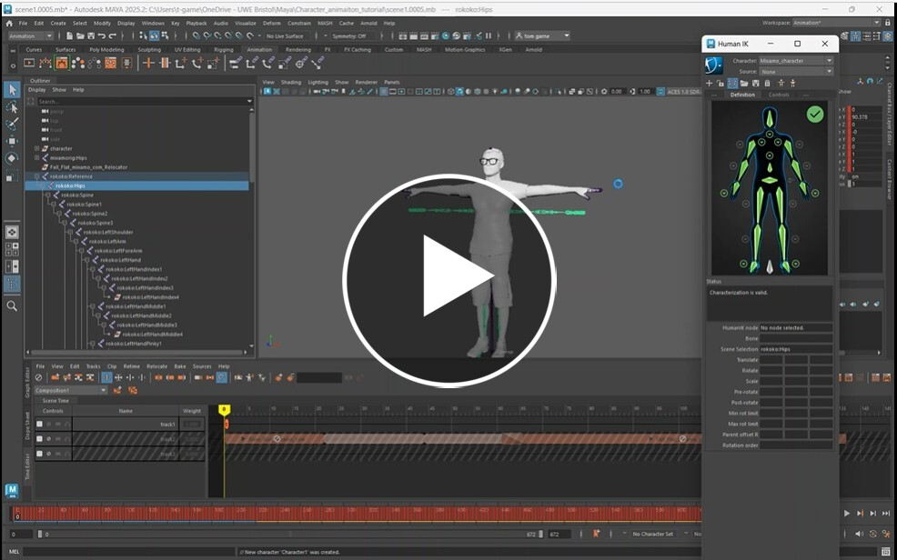

# Animating a Character using Motion capture data

In this worksheet we apply motion capture data to our character.

> [!NOTE]
> Remember to save often

## 1. T-pose

When rigging, a t-pose is used to calibrate the character. 

You need to do this before importing any other mo-cap data from Mixamo or Rococo.

In this video we will export our character in a t-pose from Mixamo and import it into Maya.

## 2. Add a Mixamo Mo-cap clip

We can now add more animations from Mixamo

## 3. Blending Multiple Mixamo Mo-cap clips

We can now add another Mixamo mo-cap clip and blend it with the first.

> [!TIP]
> The end of the first clip should match the start of second clip as closely as possible to get a good blend, you can clip either of the clips to find the best spot.

## 4. Adding Rokoko Mo-cap data

Adding the Rokoko MO-cap data take a few more steps, be we can blend 

