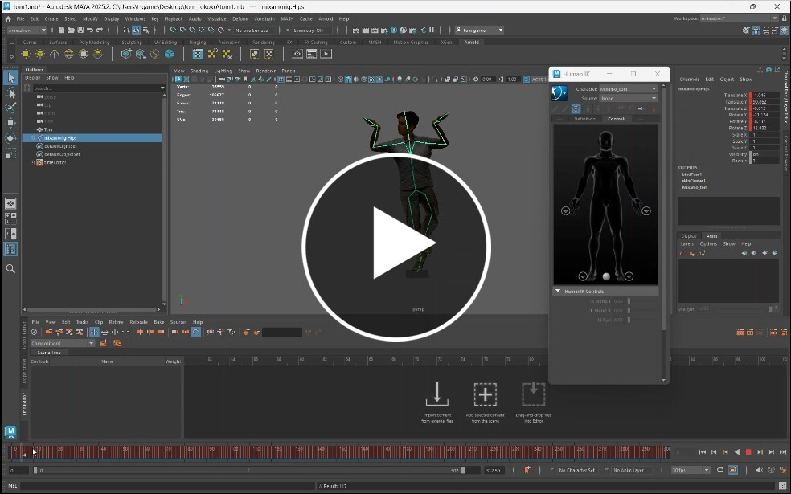
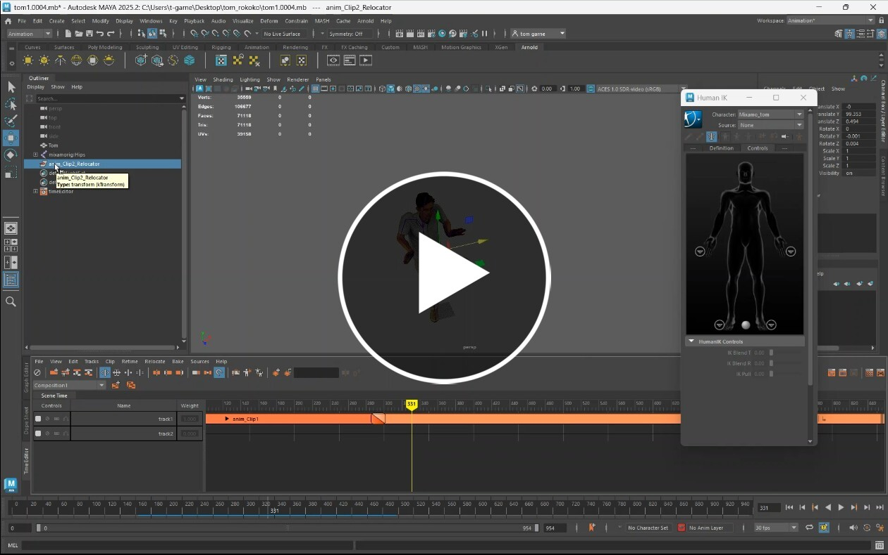

# Animating a Character using Motion capture data

In this worksheet we apply motion capture data to our character.

> [!NOTE]
> Remember to save often

## 1. T-pose

When rigging, a t-pose is used to calibrate the character. 

You need to do this before importing any other mo-cap data

In this video we will export our character in a t-pose from Mixamo and import it into Maya.

## 2. Add a Mixamo Mo-cap clip

We can now add a motion capture clip from Rokoko.

## 3. Edit animation data

The animation data you get from the Rokoko motion capture suit is not always perfect, this video show you how to adjust it.

## 4. Add multiple clips

You can blend together multiple Rokoko animation clips.

> [!TIP]
> The end of the first clip should match the start of second clip as closely as possible to get a good blend, you can clip either of the clips to find the best spot.

If the clips do not start and end in the same position you can alter the location using a relocator

