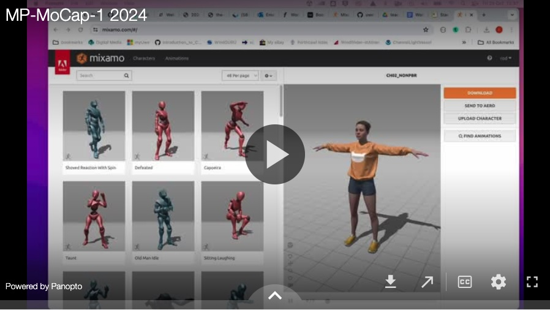
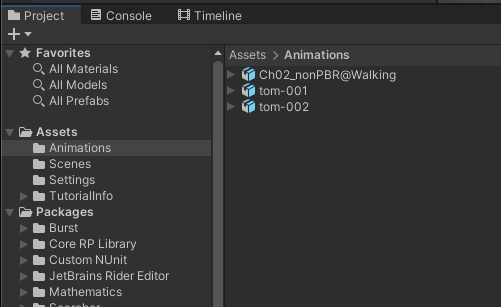
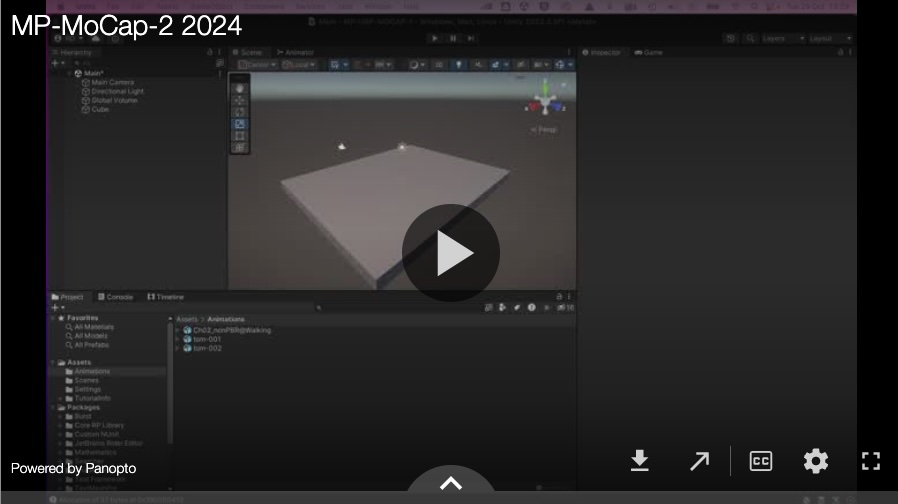
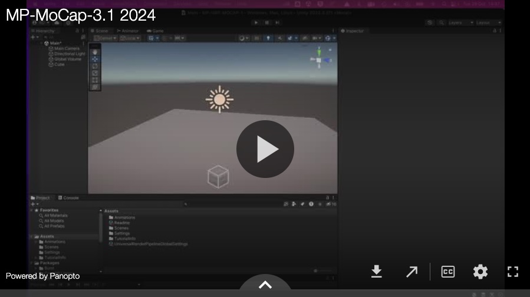
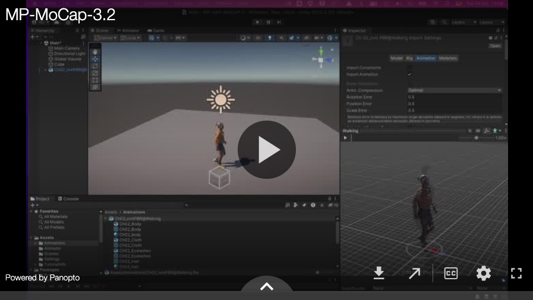
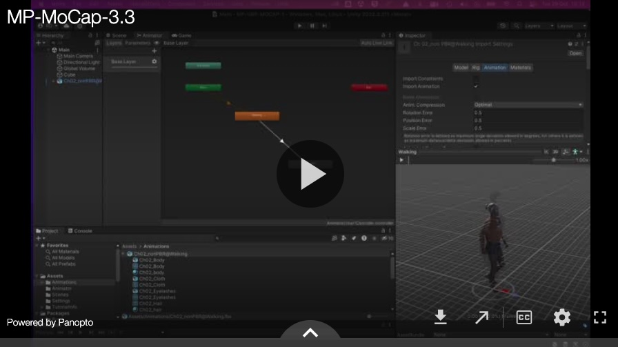

# Animating with MoCap data 

To start using MoCap data you'll need a new project set up and have downloaded a Mixamo character with an animation attached from https://www.mixamo.com/

This is a free website with 1000s of animations amd 100s of characters that you can download and use in your project.

Change your Unity scene name to 'Main'. Add a cube in the scene and scale it to make a ground plane.

You'll also need to import your motion capture data / .fbx file into your Unity project. Make an Animations folder for everything. I've imported two call tom-001 and tom-002.

Now there are several steps that you need to follow to use your mocap data in a character animation in your scene:

 - Set up the character
 - Create an Animation Controller and add animations to the character
 - Add MoCap animations to the Animation Controller
 - Looping and chaining animations in the Animation Controller

## Set up the character

Next we'll set up our character. Changing the rig to humanoid and attaching textures and materials.

## Create an Animation Controller and add animations to the character

This video steps through setting up an  Animation Controller and adding a basic animation to it.

## Add a MoCap animation to the Animation Controller

This video steps through adding MoCap animations to an Animation Controller to use the MoCap animations with the character.

## Looping and chaining more MoCap animations in the Animation Controller.

In this video I add further animations to the animation controller and create multiple transitions.

## Add Triggers

In the next worksheet we will use a trigger function to trigger specific animations on a keypress [next](triggers.md)

