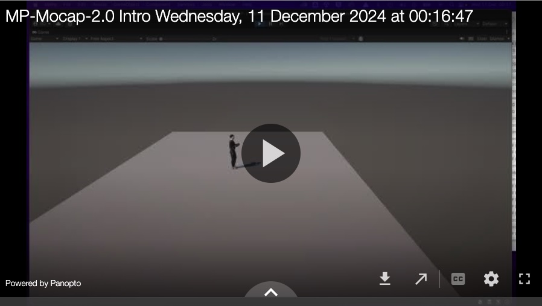
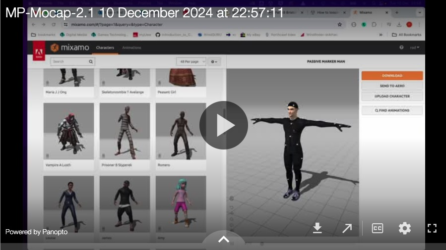
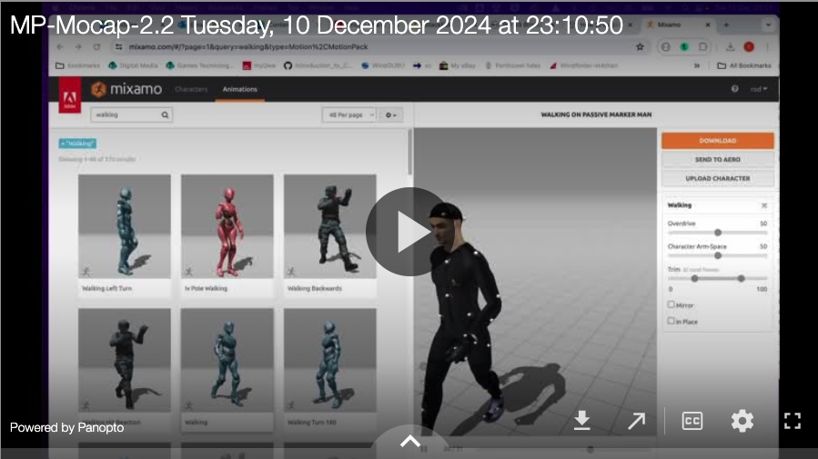
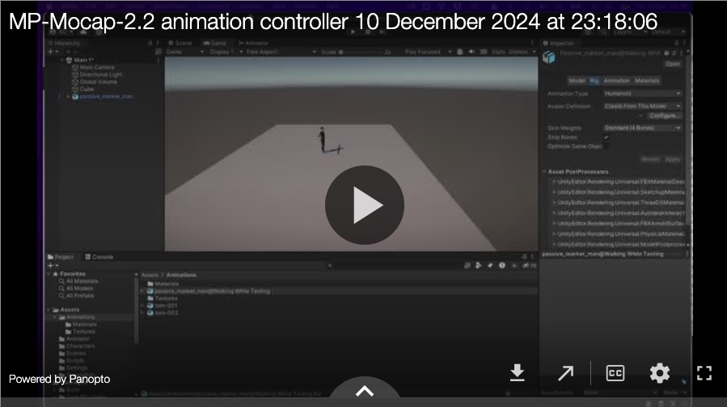
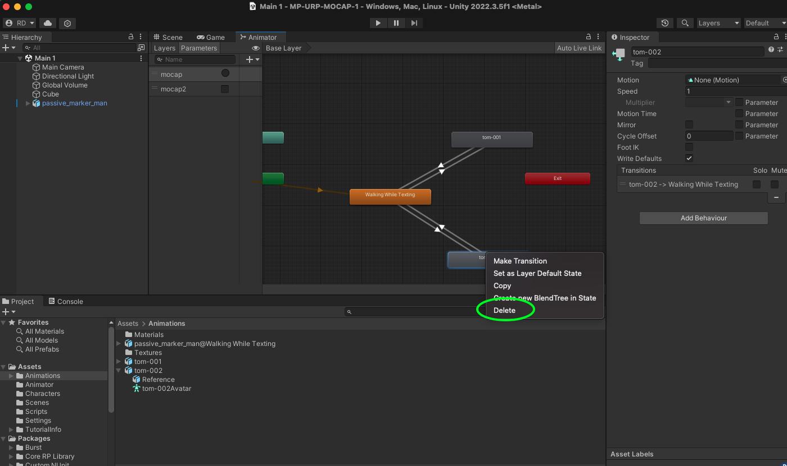
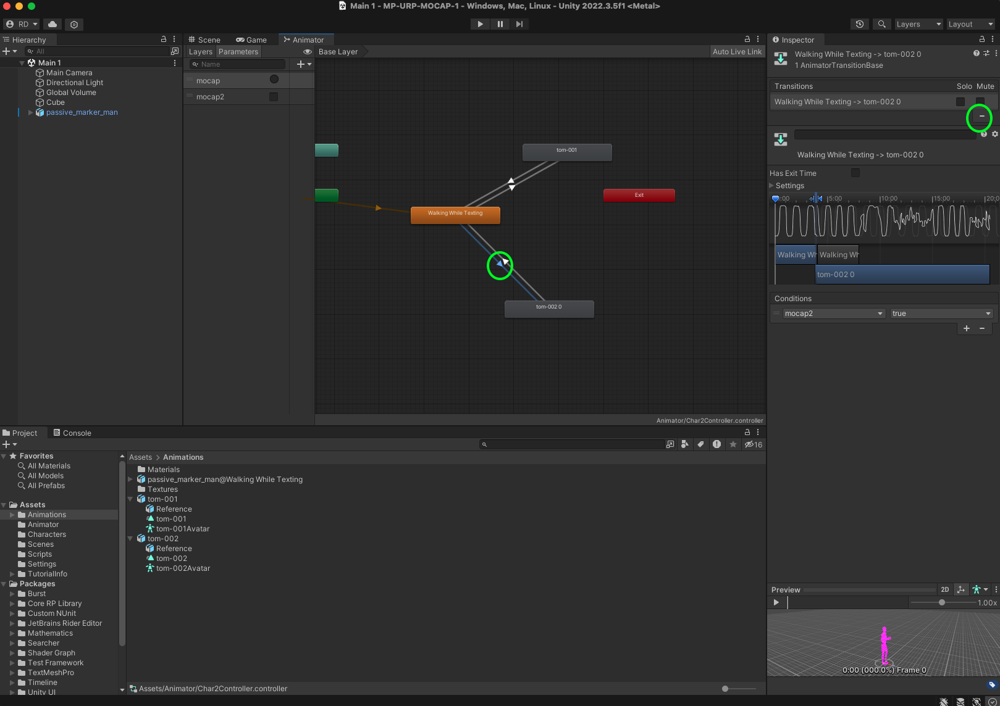
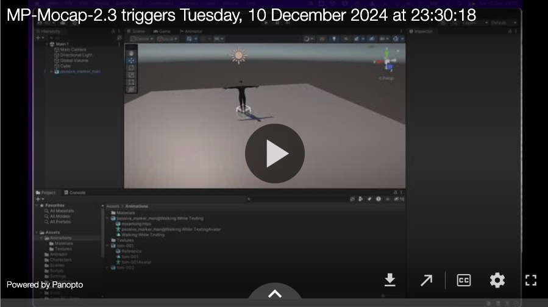
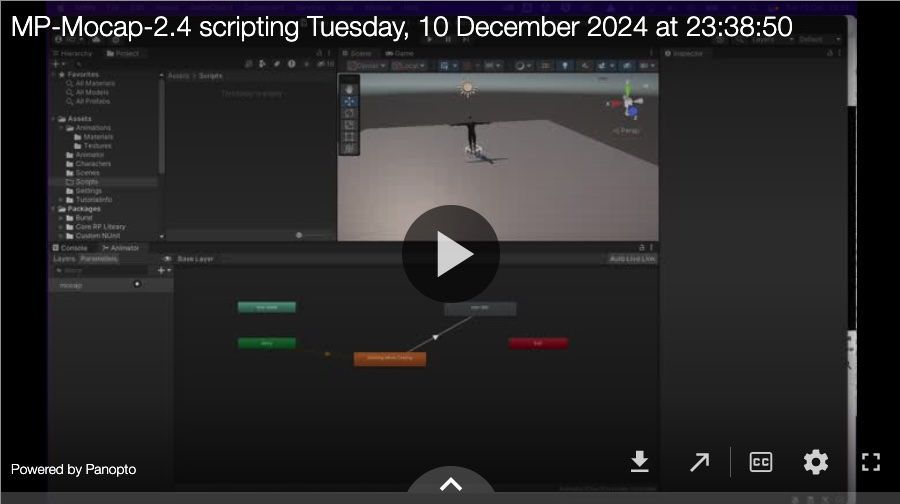
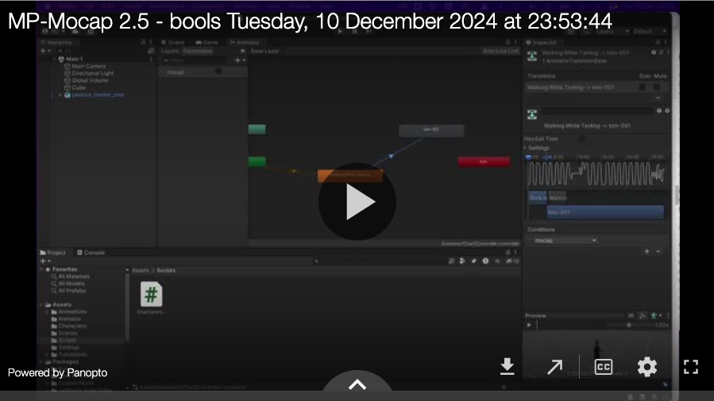
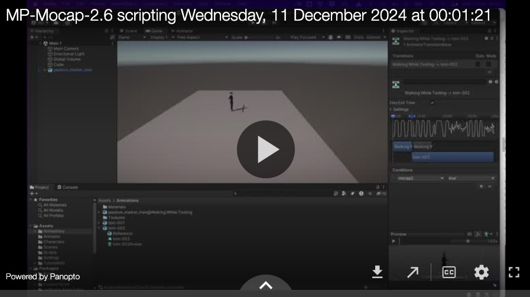

[Back](README.md)

# Using Triggers with Animation Controllers and MoCap Animations 

In this tutorial we're going to download a new character from Mixamo.com and we're going to apply a set of animations to it from scratch.

Then we are going to use a trigger function to trigger the motion capture animations to play on a keypress. Like this (the animation changes when I press '1' on my keyboard):

## Download and prep a character and animation
The first step is download a T pose character  import it into Unity and prep it for use.
You need to make sure your character is in a T Pose (and not animated).

  

Then download an animation (just the animation, not the character), and import it into Unity and prep ready for use.

## Create an animation controller
Then we will build an animation controller to run the animations and animate the character.

You may find that you want to edit / delete animations from your animation controller.
To do this right click on the animation node in the animation controller.   

If you just want to remove / delete a transition select it and click the minus sign in the inspector.

## Add a Trigger to an animation controller
Next we will add a trigger to one of the transitions / animations.

## Scripting for the animation controller Trigger 
Finally we will create a script that sets the trigger

## Adding a bool trigger 

Instead of a 'Trigger' it is possible set a bool to true or false to start and stop an animation.

This maybe more useful, giving you complete control over the animations.

To do this we will add a bool parameter to the animation controller

Then edit the script to set the bool to true when the Return key is pressed.

