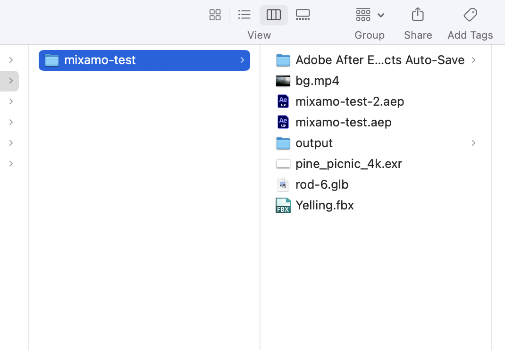
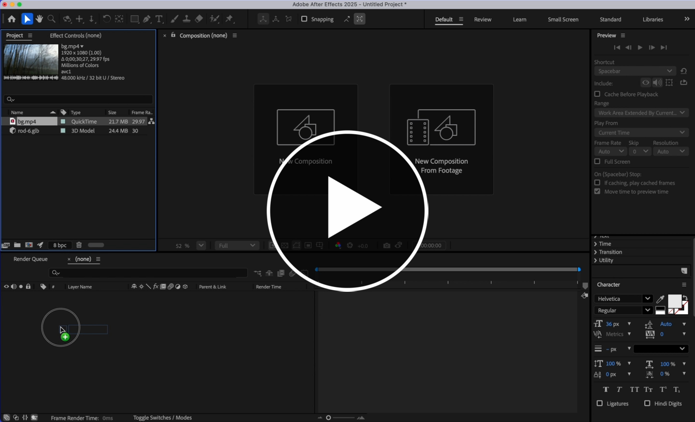
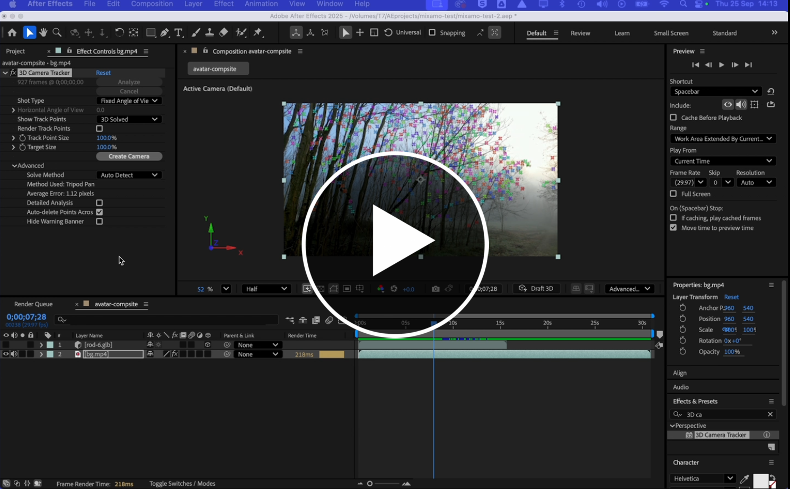
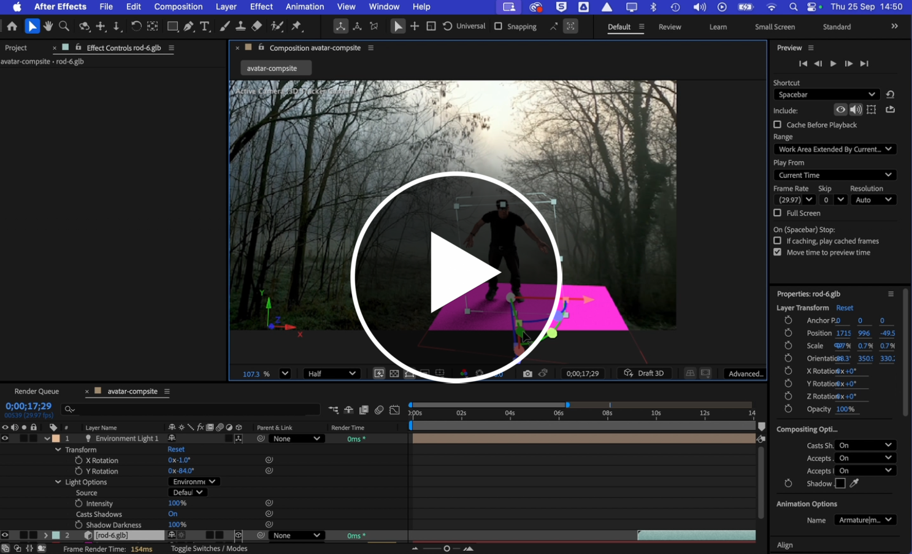
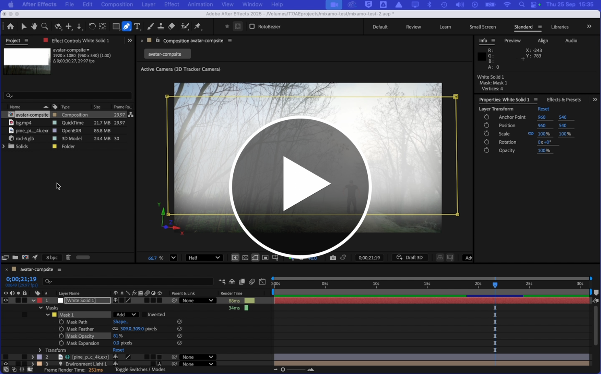
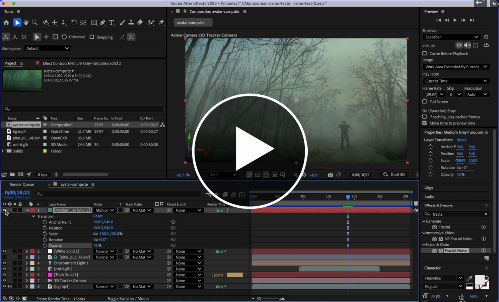

# Compositing with an .FBX character (with animations) and After Effects

## Overview  

In this workshop we are going to composite your avatar into some live action footage.  

To begin you'll need some 1920 x 1080 HD video footage and your avatar outputted as either an .fbx or .glb with animations baked into the file. Follow the previous tutorial if you aren't sure how to do this.   

We are aiming for something like this: 

The avatar is stitched into the video footage, tracked / pans with the video, has shadows being cast in real time, and is integrated into the scene using perspective and some filters / fog / post production effects.

Perhaps you have already filmed some background footage or already found some. 
If not https://www.pexels.com/ is a good source of footage:
- Be sure to convert it or download it as 1920 x 1080px. 
- Any movement should be smooth and not jerky. (the image tracking we are going to use gives best results with these parameters).  
- Here is the clip I used https://www.pexels.com/video/panning-shot-of-trees-in-the-forest-6462474/ (you must choose something different).

We are going to using Adobe After Effects 2025 to do the compositing. These techniques will not work with earlier versions.  

## 1. Importing into After Effects (AE)

Before you import any assets into After Effects create a dedicated folder for both your assets and your AE project file as I have done here. 

   

After Effects references files when they are in your project, so if you move the files the reference will be lost and your footage and 3D model will not show in AE. 

This first video steps you through how to import your footage and avatar into After Effects and how set up your composition (timeline). And how to position your avatar.  

 

## 2. Tracking your footage 

This video shows you how to track your footage so that your avatar moves with the footage.  
This uses image tracking and a virtual camera.

 

## 3. Add lighting and shadows

We will add an environment light and HDRI light map and activate the shadows on the avatar.  
Now that your avatar is moving with the footage this video shows you how to light and add a shadow to the avatar to visually connect it with the ground.  

We will add an environment light and HDRI light map and activate the shadows on the avatar.   

For this video you will need an HDRI backdrop to match the lighting your scene:   
https://polyhaven.com/hdris

 

## 4. Adding some post production polish: Fog

This next video shows you how to add some atomsphere / fog to the scene.

 

## 5. Adding some post production polish: Colour filter / adjustment layer

This video shows you how to colour tint the whole scene with an adjustment layer.  

 

## 6. Add to render queue and render output.

Once your video compositing is complete the final step is to render the output.  
Set the render area by dragging the handles (green laso). And then add to the render queue.  

- View the render queue - yellow lasso
- In the render queue you can select where the output should go (and filename) - green lasso
- Leave the render settings as 'Best settings'
- And adjust the Output module. Click on Output module blue text to open the dialog / settings  - red lasso.

Adjusting the output module:  
- In the dialog / settings select quicktime > click Ok to accept and close the dialog     
This will render the video as a .mov (on windows you should select .avi)

Render the video:

Your .mov or .avi will be a huge file. You can can now either compress it and change the format to .mp4 either using Adobe Media Encoder, or import it into Premiere or Cap cut to edit and add sound / graphics. (There isn't a video for this as we know you used Premiere extensively last year).  

Tip: Handbrake is an excellent free video converter and compressor   
https://handbrake.fr/downloads.php (I use it much more than Adobe Media Encoder).   

