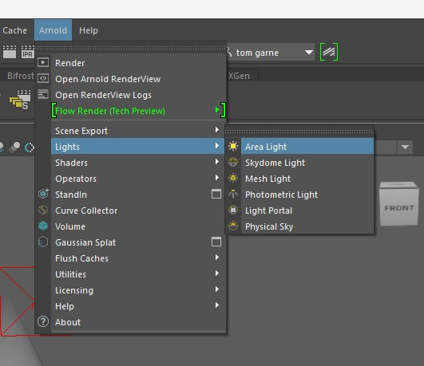
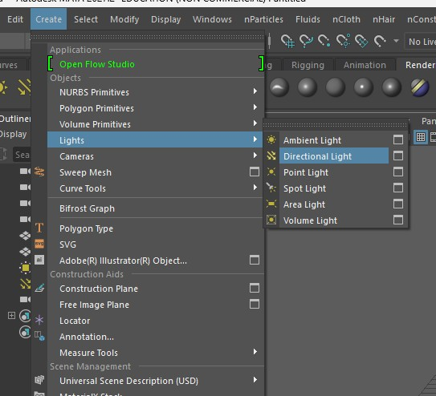
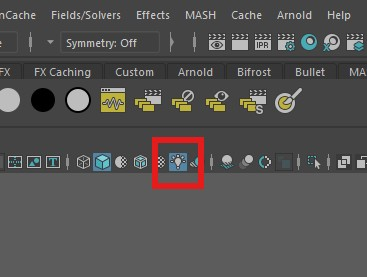
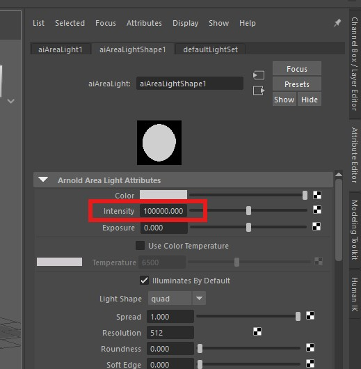
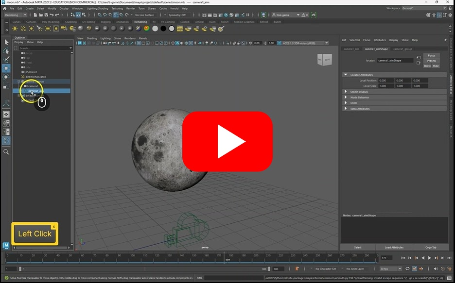
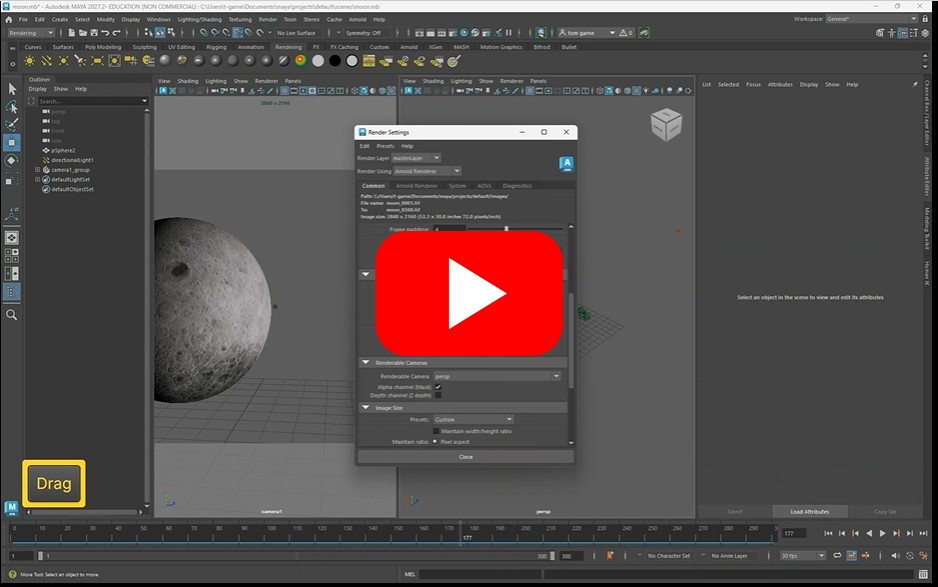
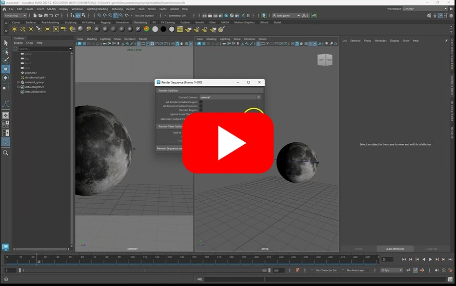

# Exporting a Sequence

This worksheet will cover how to setup your camera and render out an image sequence of your animation.

## Lights

If you do not add lights to your scene your render will be black.

Add lights through the **Arnold > Lights** top menu

Or by creating a standard spot, direction or point light through the **create > Lights** top menu

Note that the ambient light does not work in the Arnold renderer.

To see an aproxomation of the lights in your viewport, turn them on 

Otherwise, you will only see the effect when rendering.

### Lights troubleshooting

If you lights do not show up in your render, check the following

- Are directional, spot or area lights are pointed in the right direction
- Are your lights bright enough, if you are not sure, type a really big number in the attribute editor ( 100000) to see if you get anything.

## Camera

Although you can render the perspective camera, it can be very inconvinient to use the same camera to edit and render your scene, the bellow video shows you how to make a new camera:

When exporting an animation from Maya, rather than rending straight to video you need to render out a sequence of images, one for each frame of your animation.

## Render settings

Now we have setup our camera we can render it out, but first we need to decide on the format and size of our rendered images.

## Render a sequence

We can now render out our sequence.

You should now have a folder full of rendered images.

You can import them into a video editor like premier to the export them as a video file.

## Other resources - fog

If you want to add some atmosphere to your scene, you could add fog.

Maya has a few ways to add fog, but be aware that it will increase render times.

[Maya fog](https://www.youtube.com/watch?v=q2Bq4lRkvAs)

