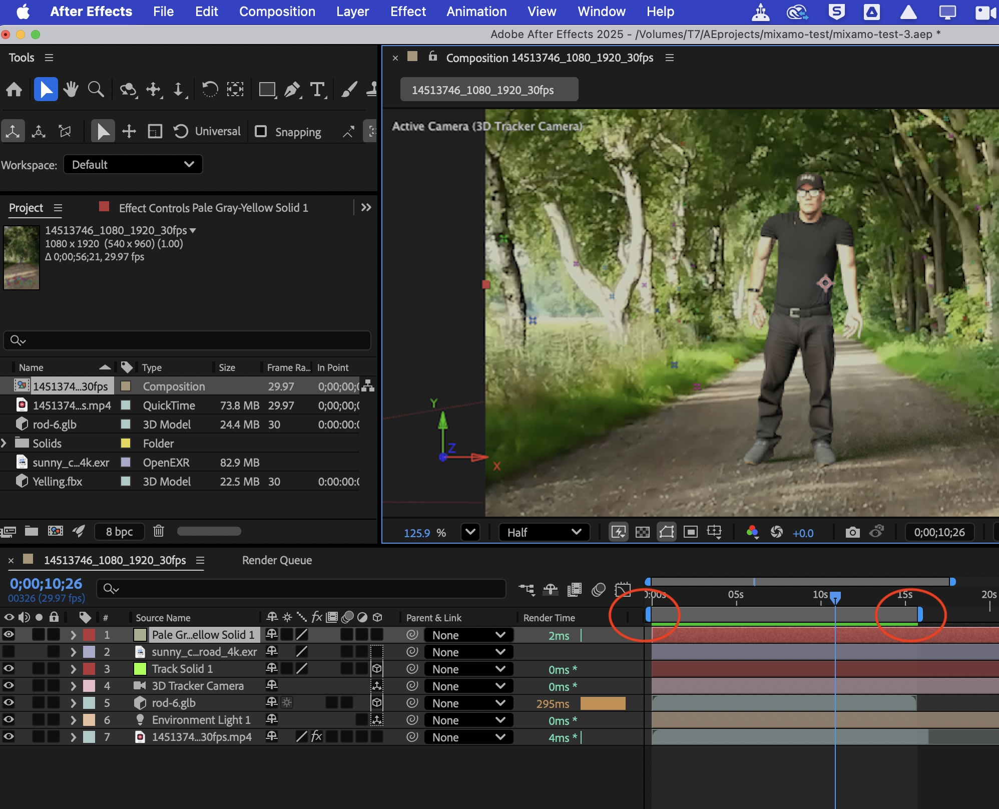
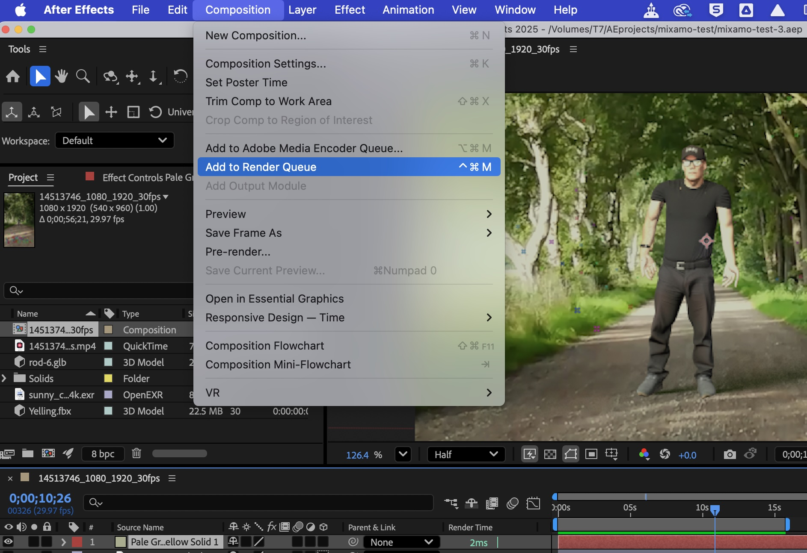
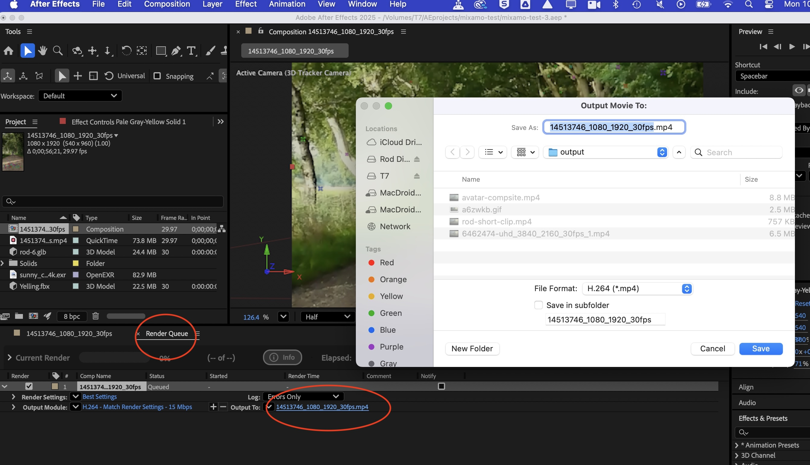
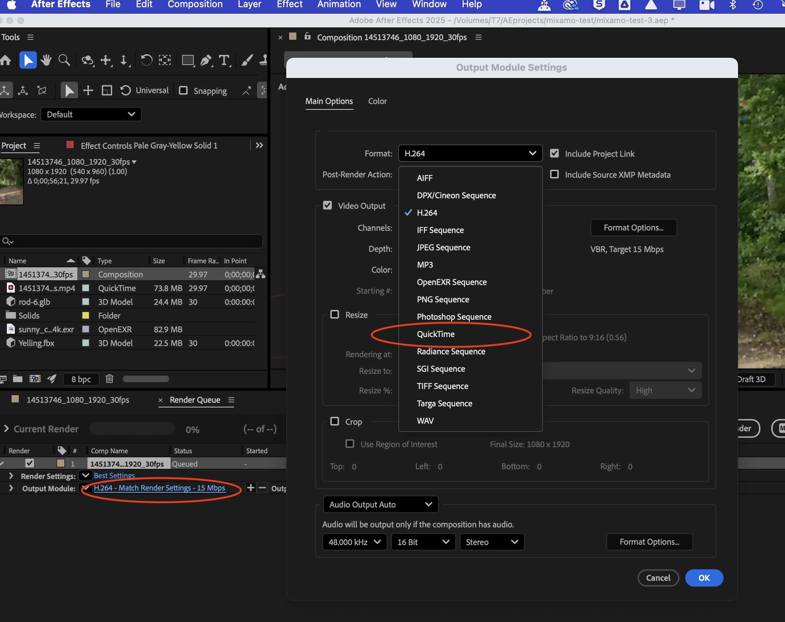
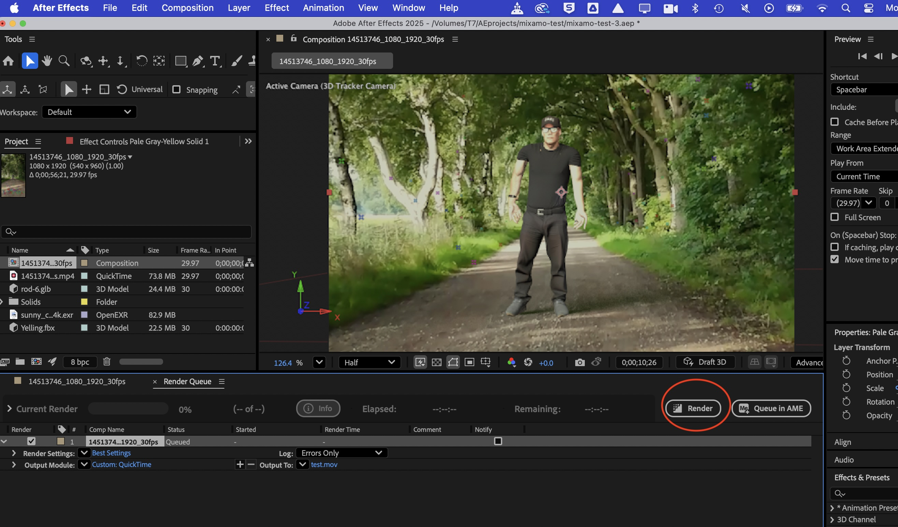

# Exporting with After Effects

## Overview  

In this worksheet we are going to export a composition from After Effects.  

If you are going to produce a final mp4 video from After Effects the settings are slightly different to producing a video for further editing in Premiere.  

Watch out for the variations in the settings...    

## 1. Select your render area   

Use the handles to select your render area.  

   

## 2. Send to render queue

Once you have selected the area to render. Add to the render queue.

   

Toggle the render queue tab and set where your video will save (and make a name for the file). I usually make an 'output' folder too.

   

## 3. Settings

In the settings leave 'Render Settings' as Best Setting.  (image below)

####  Output module settings
There are two factors to consider for the Output Module settings:   

If you plan on editing your clip in Premiere or another video editor it would be better to output it in the less compressed, higher quality, Quicktime or AVI format so that when you edit it you begin with a higher quality piece of Media. When you export it from Premiere you can then export it as H264/MP4.   

On the other hand if  you are going to produce a final mp4 video from After Effects leave the Output Module settings to H264.

####  1. H264 format
If you are going to produce a final mp4 video from After Effects leave the H264 settings.

   

####  2. Quicktime or AVI format
If you are going to edit the outputted clip in Premiere click 'Output Module : ' and change the Format to Quicktime (or AVI on windows).   

   

Click ok

## 3. Render

Then click 'Render' to output your clip.

   

That's it!
