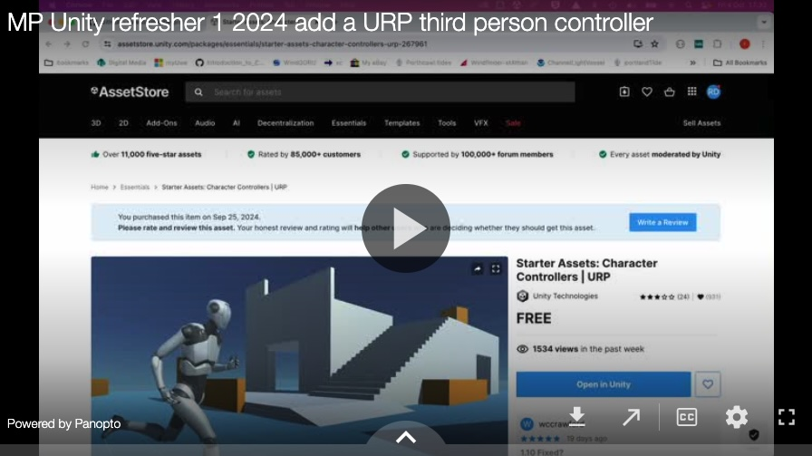

[Back](https://uwetom.github.io/media-production-worksheets)

# Add a URP Third Person Controller

This video steps through using the starter assets URP 3rd Person Controller
https://assetstore.unity.com/packages/essentials/starter-assets-character-controllers-urp-267961

## Code refresher

The next worksheet is a code refresher for Unity, you should definitely complete this before doing any coding in C#   
 [next](code-refresher.md)