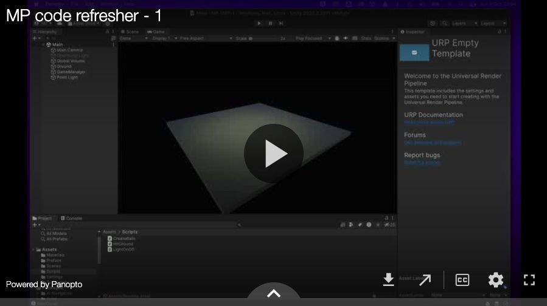
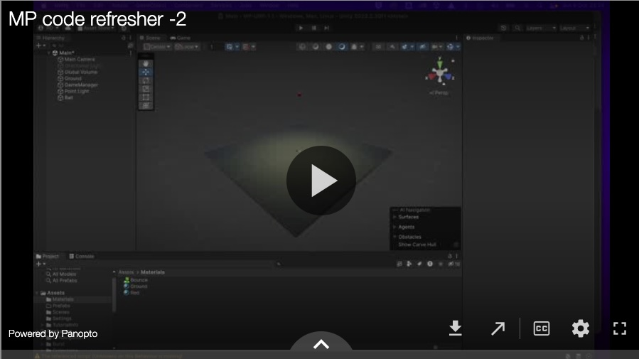
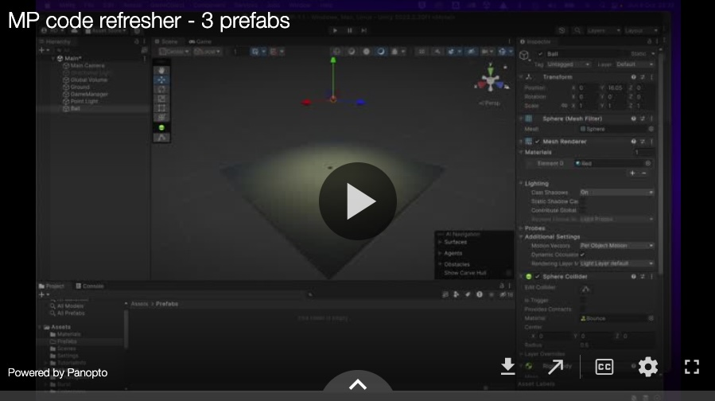
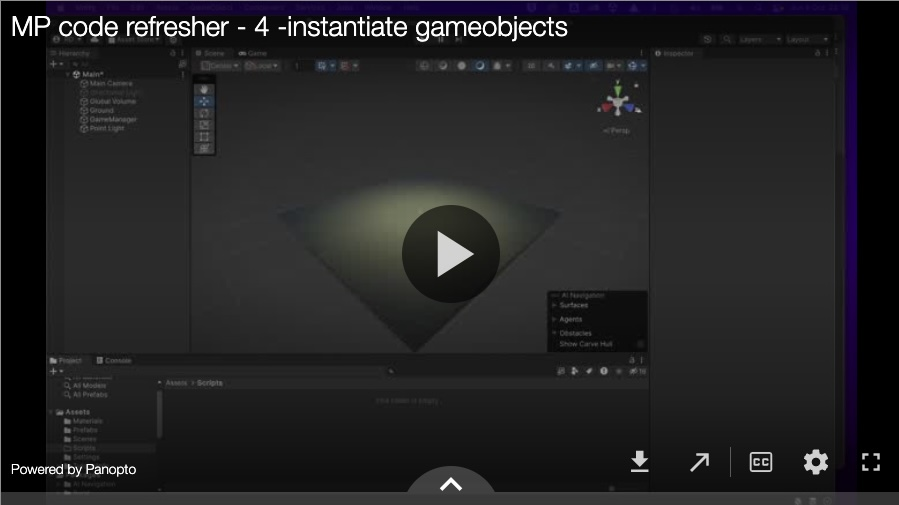
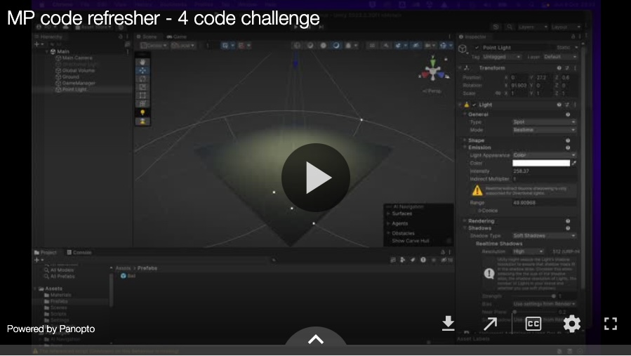
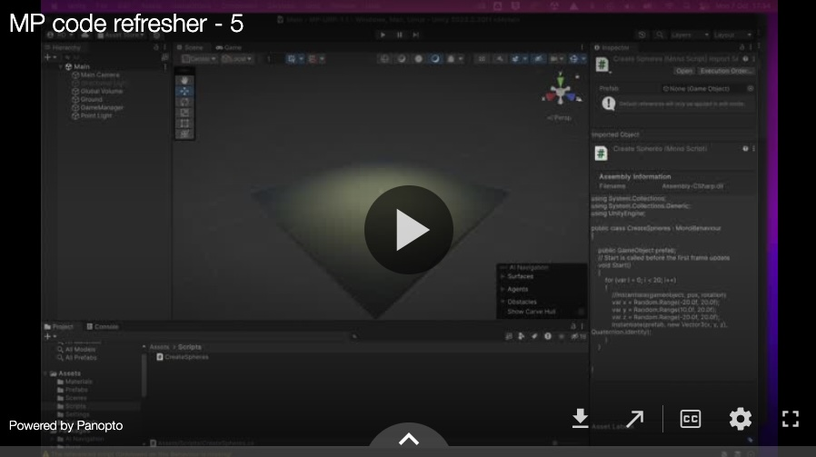
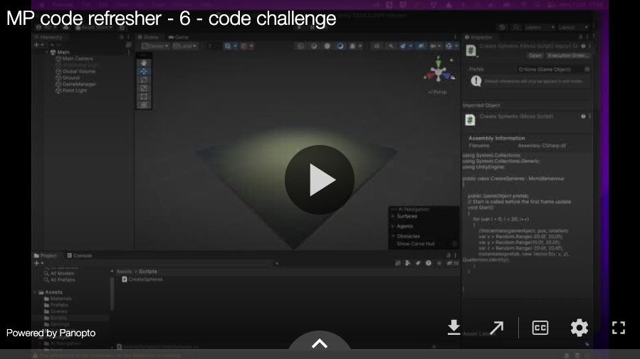
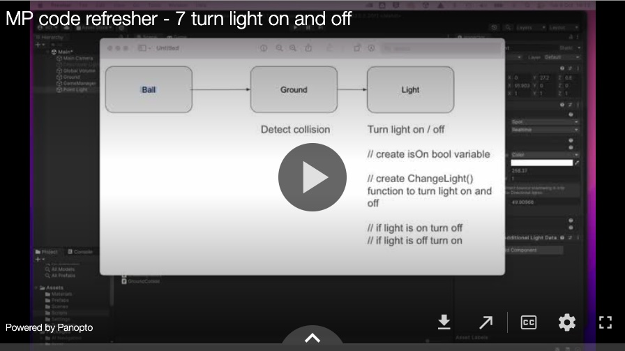
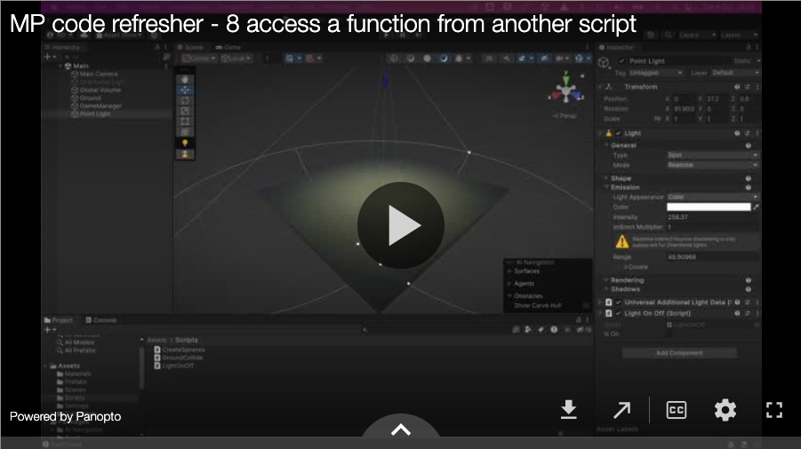
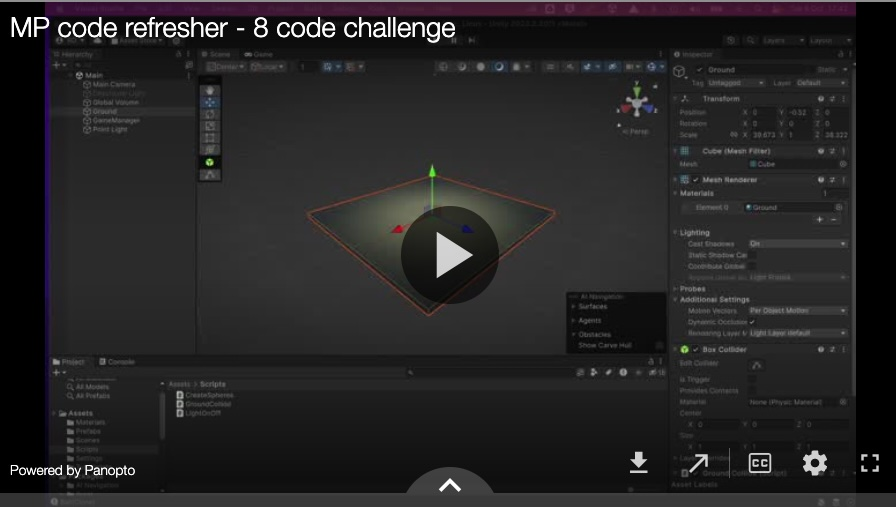

[Back](README.md)

# C# Code Refresher

## Setup

This first video introduces the tasks we are going to undertake in this exercise:
To create a series of gameobjects at run time, detect collisions and use the collisions to trigger other events on different gameobjects (turning lights on and off).

Video 2 shows the scene set up:

## Prefabs
Video 3 explains how to create a prefab:

## Instantiate (add) gameobjects as your scene is running
Video 4 uses the 'instantiate' function to add a gameobject to a scene at run time:

The  'instantiate()' function needs 3 parameters (I think I say 4 in the video below):
They are : 1. the prefab gameobject to create, 2. its xyz position in space (a Vector3), and 3. it's rotation

    Instantiate(gameobject, new Vector3(x,y,z), rotation);

Find the  documentation for Instantiate at [https://docs.unity3d.com/](https://docs.unity3d.com/) 
Watch  video 4 to see how to use it. 

## Code Challenge

Once you have instantiated a single gameobject work out how to instantiate 20 of the same objects into your scene:
Watch the full description of the Code Challenge:

[Need the solution?](https://uwe.cloud.panopto.eu/Panopto/Pages/Viewer.aspx?id=e0bddfca-7769-4715-9b5a-b201016f069d)

## Creating an interaction with collisions

The next task is to use the collision created by the spheres falling to the ground to trigger the spot light to turn on and off.

Intro to the next part of the task

## Collision detection challenge

See if you can work out you how to detect collisions in your scene with c#

Tip you'll need to use `OnCollisionEnter` to detect a collision and retrieve information about the collision object.

[Need the solution?](https://uwe.cloud.panopto.eu/Panopto/Pages/Viewer.aspx?id=604c37fc-f50c-4481-abbb-b20201198cf3)

## Turning the light on and off
Video 7 shows you how to turn the light on and off while the scene is running, and also how to detect if the light is on and off.

The rough plan for the script looks like this:

    // create isOn bool variable
    // create ChangeLight() function to turn light on and off
    // if light is on 
    // if isOn == true 
    //		turn off the light
    // if light is off 
    // else if isOn == false 
    //		turn off the light

## Access a function in another script (Turning a light on and off)
The next step is to trigger the `ChangeLight()` function to run when there is a collision.

However  the `ChangeLight()` function is in a different script to the collision detection.
So we need know how to let the scripts communicate with each other. 

Specifically we need the collision detection script to run the `ChangeLight()` function in the light script...  So that's what we're going to do next.

## Add more lights  challenge
You should now have one light flickering on and off when the spheres hit the ground plane.

The last (stretch) code challenge is to add more lights that all flicker on and off when the spheres hit the ground plane.

Hint: you will need to refactor (rewrite) bits of your code. There are a few ways to do this but probably the easiest have the light script check the collision script for collisions on every frame.

