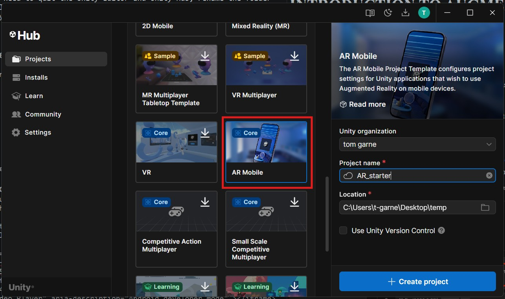
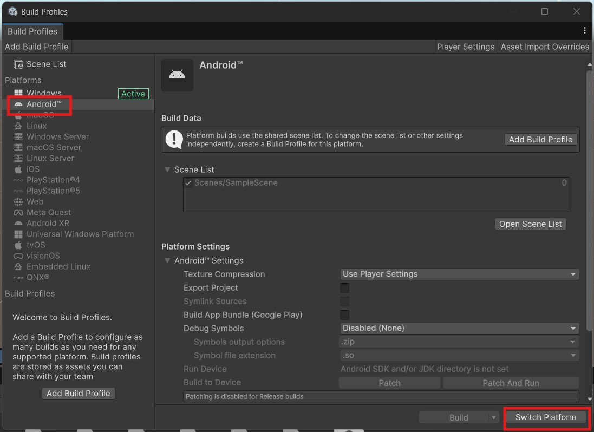
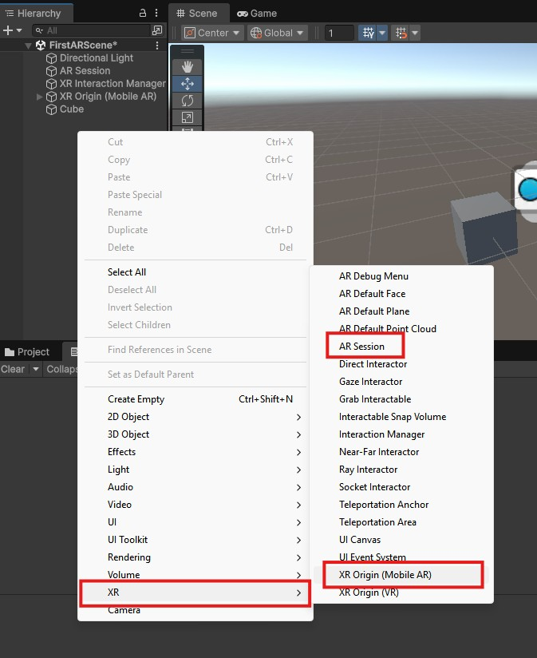
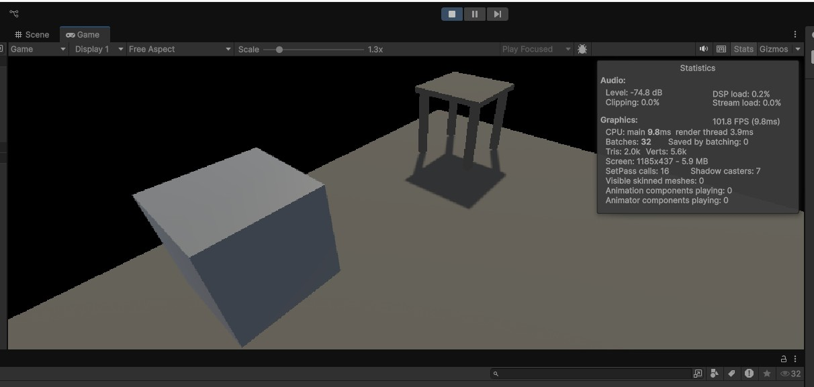
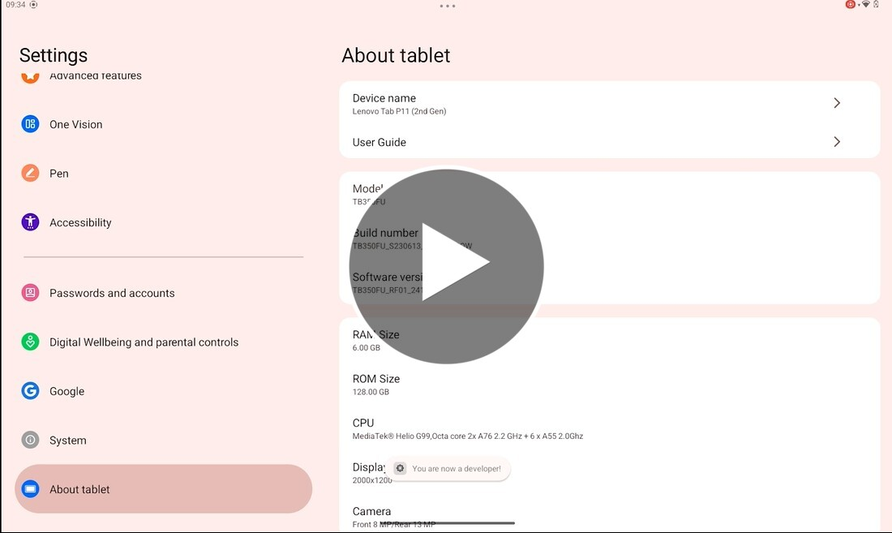
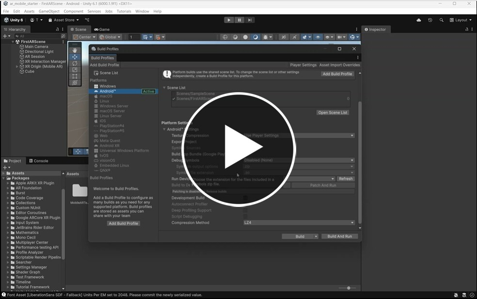

# Introduction to Augmented Reality (AR) in Unity

## 1. Unity Installation

Unity is already installed in the lab, but if you want it on your own machine follow the install guide

[Unity install guide](../wk13-install_unity)

You need version 6000.1.9f1, it will take 15 to 20 minutes to install.

## 2. Create a new Project

First we want to create a new Unity project.

- Open **Unity Hub**
- Choose **Projects**
- Create a new **AR Mobile** project ( you may need to download the template)

This template will do a most of the setup for us, importing the correct packages, configuring the settings and adding some starter assets.

The main package used is the **[AR foundation](https://docs.unity3d.com/Packages/com.unity.xr.arfoundation@6.2/manual/index.html)**, I recomend you look at the documentation for support and ideas when creating your own project.

### Switch to Android

We are going to build to an **Android** mobile device so we need to switch the platform.

- On the top menu, select **File > Build Profiles**

## 3. New Scene

We can now Create our first AR scene

- In the scene folder, **right click** to create a new scene
- Name it "FirstARScene"
- Open the scene

This scene now needs some specific AR assets to work.

- Delete the **main Camera** in the hierarchy.
- **right click** in the Hierarchy and add an **XR>AR Session**
- also Add an **XR>XR Origin (Mobile AR)

We now want to add something to the scene

- Add a simple cube
- Resale it to 0.5

> [!NOTE]
> Our AR scene will appear in the real world, so we are dealing with real world sizes, a brand new cube is 1m tall, so our cube will appear to be 0.5m.

The cube will appear at the origin, which is the same place as our camera.

- Move the cube 1m away from the origin
- Give the cube a new material

> [!TIP]
> **right click** in the assets panel and create a new material, change the colour then drag it onto the cube.

## 4. Test in the Simulator

Now that we have a simple scene we can test it out.

It is important to test your scene regularly on a real device, but its useful to be able to do a quick test first to make sure everything works as expected.

Helpfully, the template also includes an AR simulator.

- Press play to run your scene in the AR simulator

- look around the scene and find your cube.

To look around, hold down the **right mouse button** and move the mouse.

To move, hold down the **right mouse button** and press **w,s,a,and d** on the keyboard, to go up and down press **q and e**

The simulator represents a real room, you should see a floor, wall and a table.

> [!NOTE]
> You can edit this environment to more closely match a real location, in the top menu, go to **Window > XR > AR foundation > XR environment**

## 5. Build to a phone or tablet

Now that we have a basic AR project and scene and we have tested it to make sure it basically works in a simulated environment.

We now want to check that it runs on a real device.

### Android Developer mode
Before we build, we need to turn on **developer mode** on our Android device so that we copy our new app to it.

The menus items may be in different, but the following video shows how to enable developer mode on most Android devices:

### Build

We can now build our scene to our device

> [!NOTE]
> It may take a while to build the first time, but will be much quicker if you re-build after making changes as many of the files will be cached.

### 6. Test

The app should open automatically when you unlock you device, if it does not you should be able to find it installed in your app library.
 
Move the phone around and see if you can see you cube hanging in space, you may need to move backwards as it may have appeared on top of you.

The cube should remain in place in the real world as you move around it.

- If you cannot find the cube,
	- Try restarting the app. 
	- If you still cannot find it, check that you build the correct scene in Unity.

## Challenge

1. Try to replace the cube with another object
- Find a free object on the Unity asset store or sketchfab.com and add it to your scene. or use the prefab is this package:

	- [Nefertiti](assets/nefertiti.unitypackage)
- Build your scene to the tablet, it should be much quicker the 2nd time.
2. Add an animation to your object that automatically plays in the scene.

## References

- [AR foundation](https://docs.unity3d.com/Packages/com.unity.xr.arfoundation@6.2/manual/index.html)
