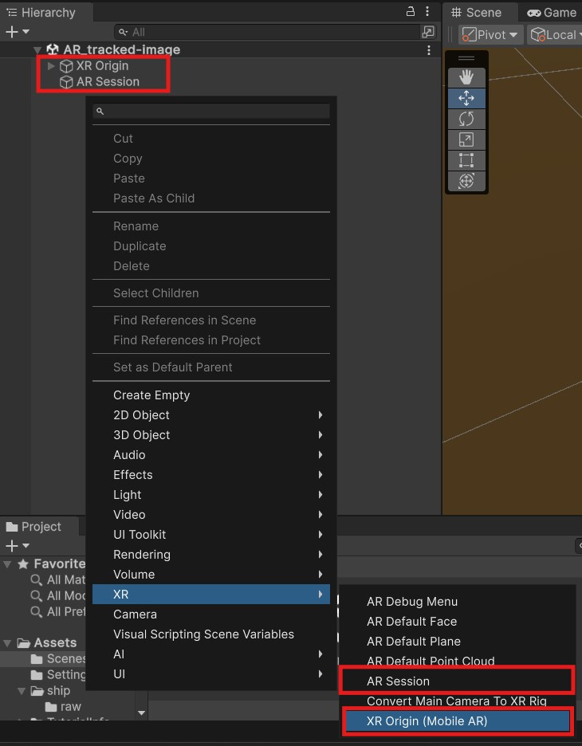
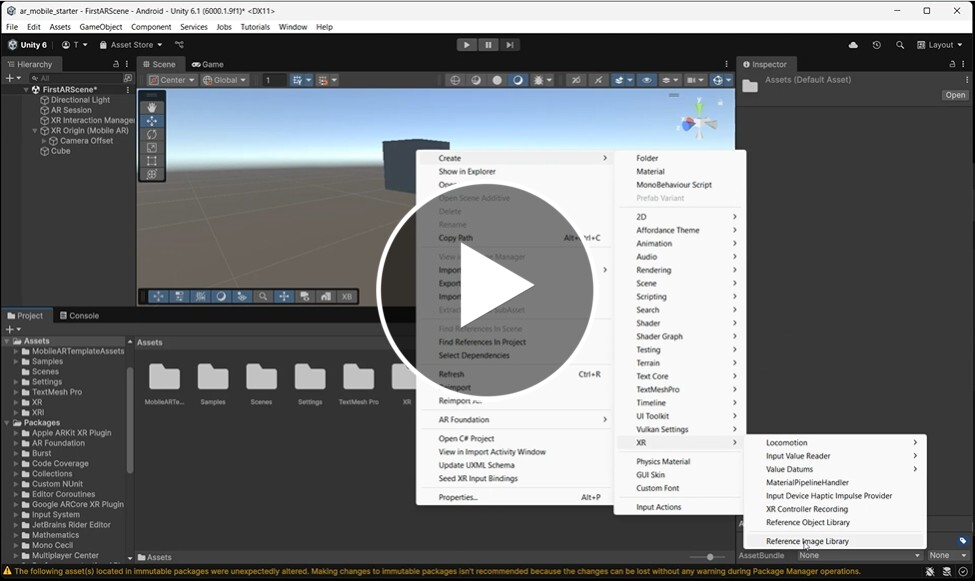
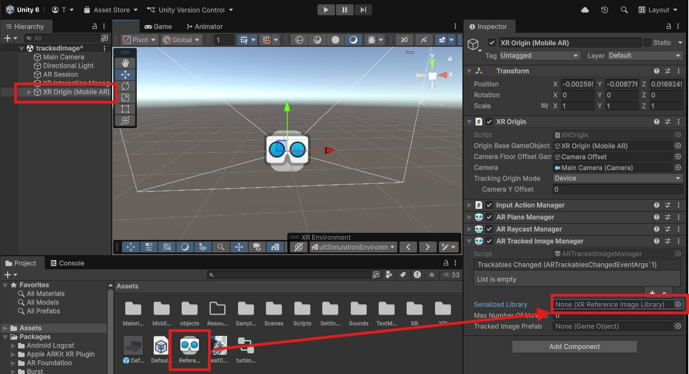
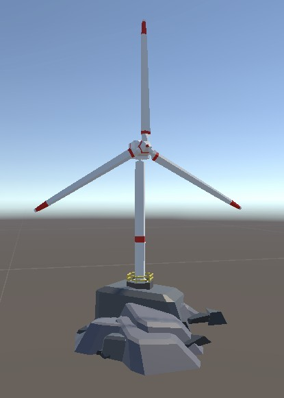
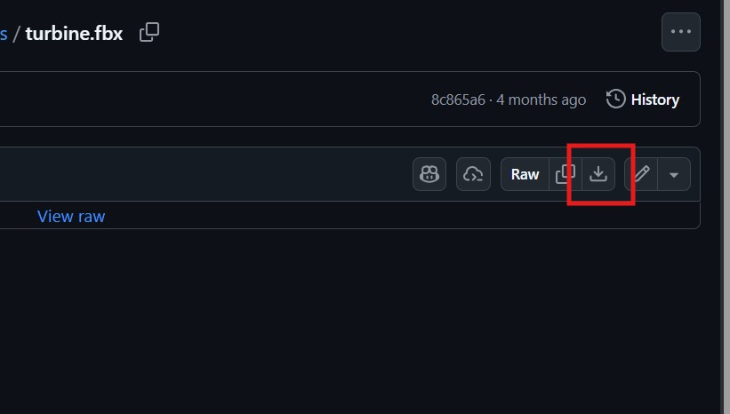
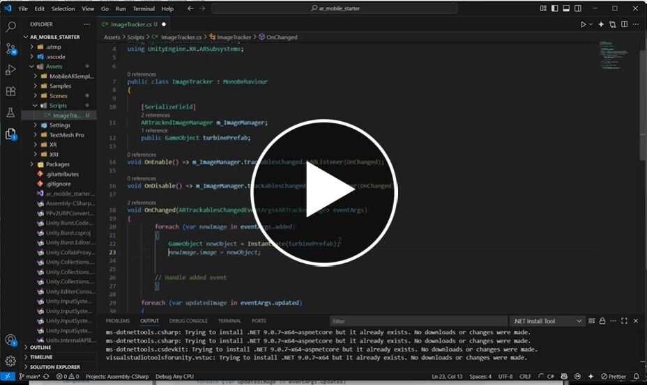
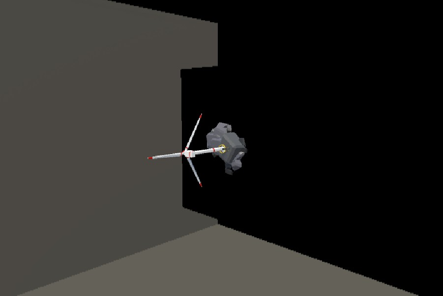
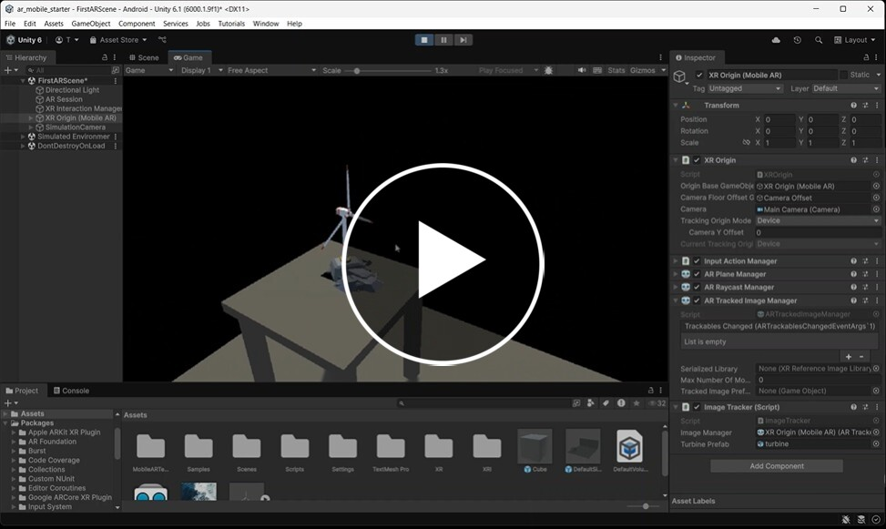
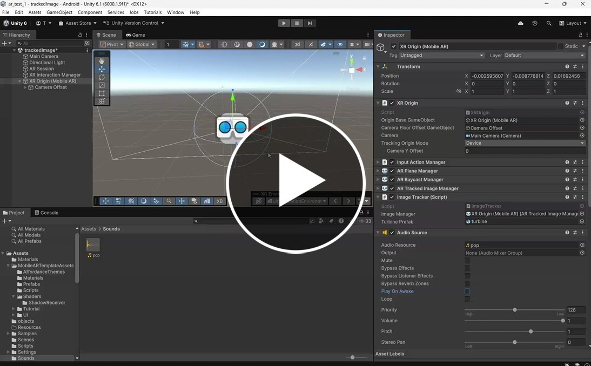
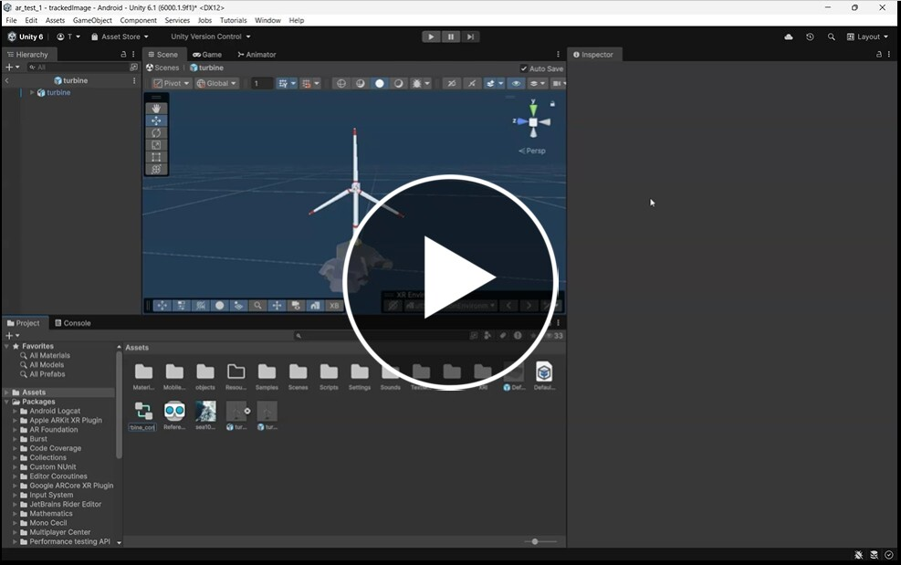

# Track an image

Last week we learnt how to create a simple AR scene, how to test it in the simulator and build it to a real device.

This week we will look into how to position our 3D scene at a specific location in the real world.

## 1. Create new scene

You can carry on from last weeks worksheet, or make a new AR project like you did last week.

- Create a new empty scene.

- Add an **XR Origin** and **AR Session** (hint: right click in the hierarchy and choose XR)



- Save the scene.

## 2. Tracked image

If we place the XR rig in the center or our scene, when we open it on a real device this will be location of the camera. 

Last week we added other objects and positioned them relative to the XR rig so they appeared where we wanted.

However, we want to create an experience in a specific location, so want to be able to decide exactly where object will appear in the real world, not just relative to where the user first opens the app.

One way we can control where our objects appear is by using **tracked images**.

This allows us to link virtual 3D objects to real images.

### Choose an image

The images can be anything we want, but for accurate tracking Unity recommends:

> - Size must be at least 300 x 300 pixels
> - Format must be PNG or JPG.
> - Image should avoid repeated patterns.
> -  Avoid images with that contain a large number of geometric features, or very few features (e.g. barcodes, QR codes, logos and other line art)

> [!NOTE]
> You can find more detailed recommendations here [ARCore tracked image recomendations](https://developers.google.com/ar/develop/augmented-images#unity-ar-foundation)

> [!TIP]
> Google has a tool that you can use to see the quality of your image [arcoreimg tool](https://developers.google.com/ar/develop/augmented-images/arcoreimg#macos)

For todays session I have made a 10x10 cm image for you


[sea10x10.jpg](assets/sea10x10cm.jpg)

- Download this image and drag it into your assets folder

I have printed these out for use in the session.

## 3. Tracked image manager

The tracked image manager component manages all the images we want to track.

- Add a tracked image manager component to your Rig

[](https://uwe.cloud.panopto.eu/Panopto/Pages/Viewer.aspx?id=9d6bb1d7-8616-40bb-9069-b32b00c41f36)

Lastly, we need to add our new library to our tracked image manager so that it knows what images it is looking for.

- Drag the **ReferenceImageLibrary** onto the **Serialized Library** slot in your **AR Tracked Image Manager** component.



### 4. Import a 3D model

We want a 3D object to appear on our tracked image.

- Download this fbx file and add it to your assets in Unity but do not add it to the scene.

[wind turbine model download](assets/turbine.fbx)
( to dowload this model, click to open then click **Download raw file**)



We can now create a script to instantiate our 3D model onto the tracked image when it is found by the camera.

[](https://uwe.cloud.panopto.eu/Panopto/Pages/Viewer.aspx?id=a9c04acb-d421-4cdb-9c88-b32b00cc1ba9)

[AR foundation Documentation](https://docs.unity3d.com/Packages/com.unity.xr.arfoundation@6.1/manual/features/image-tracking/artrackedimagemanager.html)

#### Finished Script

This is the finished script from the video, try to only use this if you get stuck.
```
using UnityEngine;
using UnityEngine.XR.ARFoundation;
using System.Collections.Generic;
using UnityEngine.XR.ARSubsystems;


public class ImageTracker : MonoBehaviour
{

    [SerializeField]
    ARTrackedImageManager m_ImageManager;
    public GameObject turbinePrefab;

void OnEnable() => m_ImageManager.trackablesChanged.AddListener(OnChanged);

void OnDisable() => m_ImageManager.trackablesChanged.RemoveListener(OnChanged);

void OnChanged(ARTrackablesChangedEventArgs<ARTrackedImage> eventArgs)
{
        foreach (var newImage in eventArgs.added)
        {
            GameObject newObject = Instantiate(turbinePrefab);
            newObject.transform.SetParent(newImage.transform, false);

        // Handle added event
        }

    foreach (var updatedImage in eventArgs.updated)
    {
        // Handle updated event
    }

    foreach (var removed in eventArgs.removed)
    {
        // Handle removed event
        TrackableId removedImageTrackableId = removed.Key;
        ARTrackedImage removedImage = removed.Value;
    }
}

}

```


## 5. Test in the simulator

You can now press play to test the scene in the simulator

Helpfully the simulator has a simulated image, move aroud the scene until you see you turbine.



## Adjust simulator

You may notice that the turbine is on its side.

You can adjust the angle of the simulated image plane by editing the environment.

[](https://uwe.cloud.panopto.eu/Panopto/Pages/Viewer.aspx?id=fe6c7413-df5e-4795-a889-b32b00e708e1)


## 6. Build

We can now build and test the scene on our device just like we did last week and try it with a real image.

- Build the scene to an device.

If you point your camera at your image the model should appear.

Make sure this works for you before you carry on to the next step.


## 7. Sound

- Play a sound when the prefab is instantiated
	- Add an Audio source to the xr Origin and attach a sound to it.
	- Use your existing script to play the sound when the tracked image is found.

[pop sound to download](assets/pop.wav)

Here is a solution if you get stuck:
 
[](https://uwe.cloud.panopto.eu/Panopto/Pages/Viewer.aspx?id=4911b432-39b3-4772-b220-b3af01070cdb)

## 8. Animation

If you open up the turbine in the assets panel you can see it has an animation on it. 

- Try to make the animation play in the scene.

Here is a solution if you get stuck:

[](https://uwe.cloud.panopto.eu/Panopto/Pages/Viewer.aspx?id=e11433f3-76e4-48e7-95fa-b3af010c5b96)


## 9. More complex objects.

We have just instantiated one prefab onto our tracked image, but that prefab can be as complex as we like.

- **Right click** in the Hierarchy to create a new empty game object
- Rename it "Turbine Environment"
- Add multiple turbines, and maybe other shapes and objects to the new object.
- Drag the object into the Assets panel to turn it into a prefab
- Delete the object from the hierarchy
- drag the new prefab onto the turbine prefab slot on your script
- test the scene in the simulator


## 10. multiple markers

You can track multiple markers at the same time

- Find and add another image to the library just like you did at the start of this worksheet. When you add them you can see they have a name.

In your existing script you can use that name to instantiate different prefabs

e.g.

```
 void OnChanged(ARTrackedImagesChangedEventArgs eventArgs)
 {
 	foreach (ARTrackedImage newImage in eventArgs.added)
 	{
 		// check to see the name of the tracked image ( you assigned this in the tracked image manager image library)
 		if(newImage.referenceImage.name == "sea") {
 			GameObject newObject = GameObject.Instantiate(turbinePrefab);
 			newObject.transform.SetParent(newImage.transform, false);
		} else if(newImage.referenceImage.name == "beach") {
			GameObject newObject = GameObject.Instantiate(otherPrefab);
			newObject.transform.SetParent(newImage.transform, false);
		}
	}
}         

```

## References

["Wind Turbine" (https://skfb.ly/6QZUA) by iedalton is licensed under Creative Commons Attribution (http://creativecommons.org/licenses/by/4.0/).](https://skfb.ly/6QZUA)

[https://www.soundsnap.com/foley_toy_popper_pop_01](https://www.soundsnap.com/foley_toy_popper_pop_01)

[AR foundation Documentation](https://docs.unity3d.com/Packages/com.unity.xr.arfoundation@6.1/manual/index.html)
