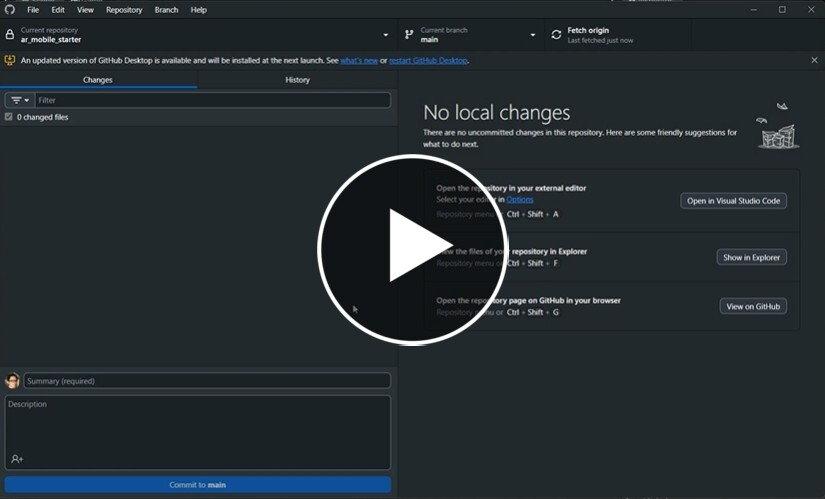

# Unity with Github

We will use Github desktop to manage our Unity files

It is already installed on the lab machine, but if you are using your own machine, you can download it here

[download github desktop](https://desktop.github.com/download/)

You will also need to create a github account

- Open your Unity project
- Open and sign in to Github desktop

The following video will show you how to add an existing Unity project to github:

It does not always go so simply, especially if you are trying to add an existing project which you have already been working on.

## Trouble shooting

The best time to initially add your project to Github is right at the start, as soon as you have created a new project. This is because there is a limit to how much you can push to Github in one go.

Git only cares about what you have changed, When you create a new repository everything is new and need to be pushed up, but as you work on the project you will only need to push up changes you have made.

Github as 2 limits, if you go above these your project will not push successfully.

1. Total push cannot be larger than **2BG**
2. Individual files cannot be larger than **100 MB**

### Failed to push

It is not always clear why the repository has failed to push, the error messages can be unhelpful. But the majority of the it is because you have broken one of the above limits.

The best solution to this is to divide the push up into smaller chunks

- Undo the last commit by **right clicking** on the commit in the history tab and choosing **undo**. If you have multiple commits you may need to undo them all starting at the top.

- Add your large folders to your .gitignore file so that Github desktop ignores them. 

- Try to commit and push again 
- If it fails again, undo the commit and try to add more folder to the gitignore unill you can push successfully.

Once you have sucessfully pushed you will need to slowy remove the folders from your gitignore file and push them one at a time.

If you get stuck on a particualr folder you can investigate if you have a file over 100BMB ( these are normally texture files) you will need to delete or edit them to make them smaller.

# References

[GitHub push limit](https://docs.github.com/en/get-started/using-git/troubleshooting-the-2-gb-push-limit)

[GitHub storage limits](https://gitprotect.io/blog/github-storage-limits/)