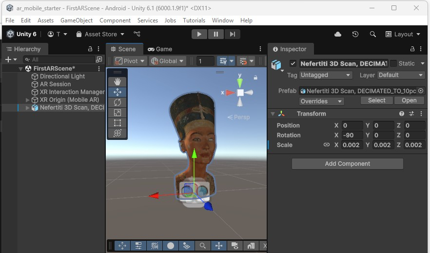
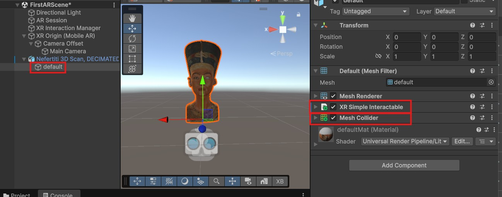
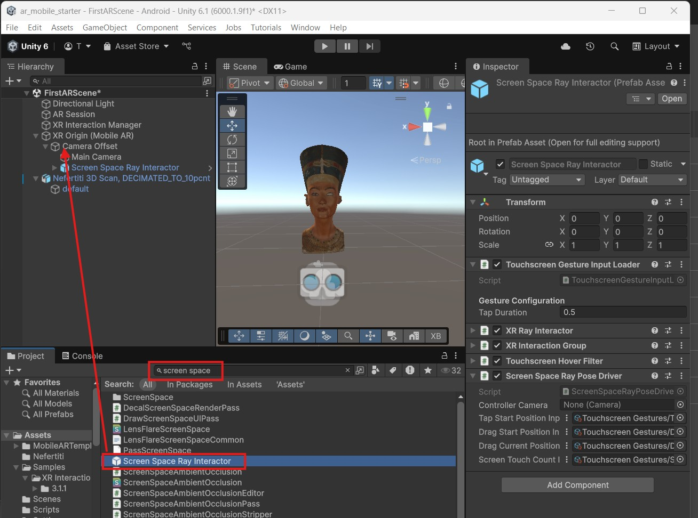
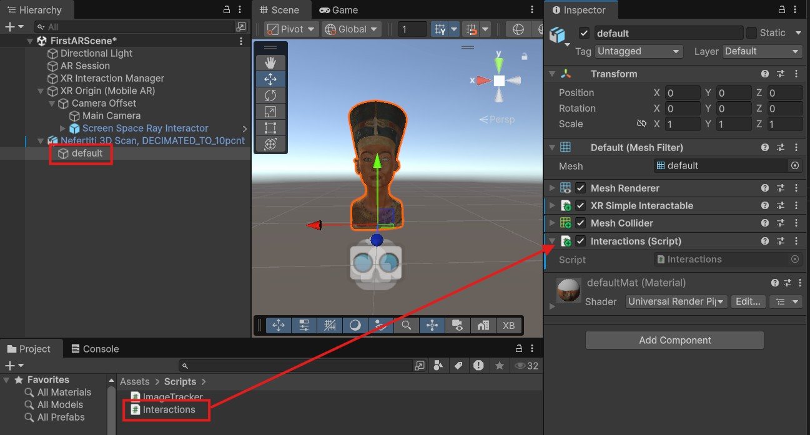
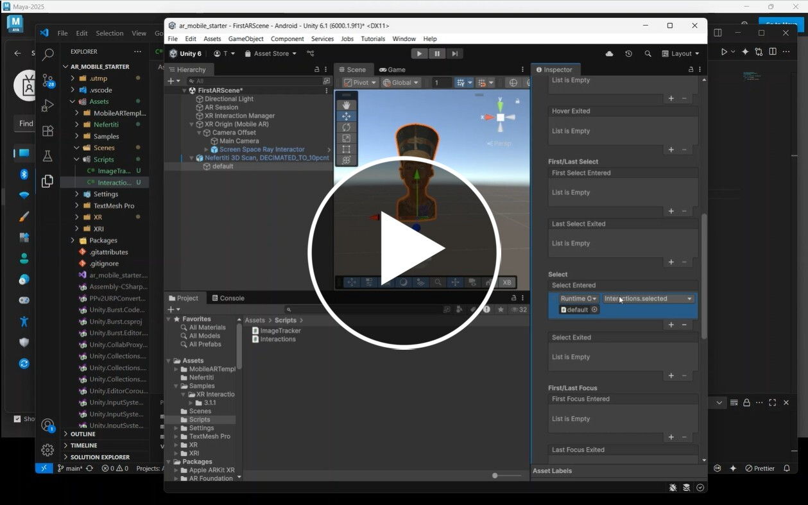
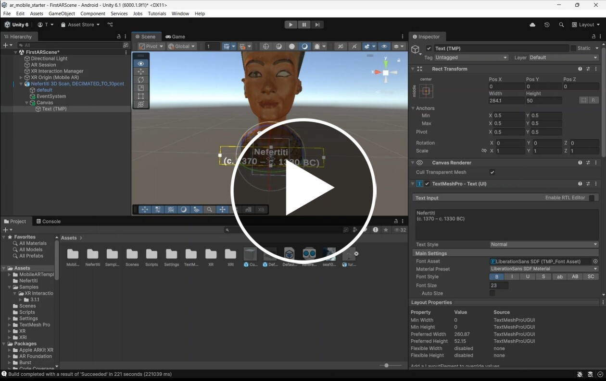

## Unity AR - Interactions

In this worksheet we will look at adding interactions in our AR project.

## 1. Starting project

You can use last weeks project or make a new project using the AR mobile template.

> [!IMPORTANT]
> Remember to switch the build platform to **Android** in **File > build profile**

- Create a new scene
- Add an **xr session** and **XR Orgin**.

We can now add an 3d object to interact with,

- Download this Nefertiti package and import it into your project.
[Nefertiti](assets/nefertiti.unitypackage)

It will appear in a folder called **Nefertiti**

It is currently too big and the wrong way round

- Drag the model into the scene, then rotate and resize it until it is about 1m high.

> [!NOTE]
> Remember a new cube is 1m high



## 2. XR Interaction toolkit

We want to interact with the objects in our scene by touching the screen.

We could manually setup and program the inputs ourselves but helpfully Unity has made an interaction toolkit package which contains everything we need.

We will be using it for AR, but as the name suggests, the XR toolkit also also works with VR projects and we will use it again later in the course.

> [!WARNING]
> Tutorials you find online may be using other versions of Unity and the toolkit which may not be compatible with what is covered in this worksheet. If in doubt, as always, check the documentation:
[XR Interaction toolkit 3.1](https://docs.unity3d.com/Packages/com.unity.xr.interaction.toolkit@3.1/manual/index.html)

### Interaction Toolkit Components

There are two main **components** we need to add to our scene when using the toolkit for AR.

1. Interactables
	- These are added to individual objects in our scene, marking them as interactable so they can be selected and manipulated by the user.
2. Interactor
	- This is placed on the camera or controller which will select the interactables.

### 1. Interactable

We just want to be able to select our object, so we just need a simple interactable

- Add an **XR Simple Interactable** component to default object inside the statue.
- Also add an a **Mesh Collider** component.



> [!NOTE]
> Adding the **Mesh Collider** next to the objects **Mesh Renderer** component ensures it sizes correctly.

### 2. Interactor

We want to select our object by touching the screen on our device and detecting if the touch is on the object. 

We also want it to work with mouse clicks on our simulator.

This is mainly achieved by adding a **XR ray interactor** component but more components are needed to map the different inputs.

Helpfully, the template has wrapped up everything we need in a single prefab.

- Search for **screen space** in your assets panel
- Drag the **Screen Space Ray Interactor** onto the **Camera Offset** object in our **XR origin** object




## 3. Script

We now have everything set up, you can now select the object by clicking on it.  But, we can't test it yet as we haven't told Unity to do anything when the object is selected.

We will make a script with a function that we can call when the object is selected.

### Create a script

- Make a new script called "Interactions"
- Add a **public** function called "selected" which shows a simple **Debug** message on the console.

Try to do this yourself before checking the solution bellow.

#### Solution

```
using System.Collections;
using System.Collections.Generic;
using UnityEngine;

public class Interactions : MonoBehaviour
{
   public void selected()
   {
        Debug.Log("object selected");
   }
}
```

### Add the script to your object	

Now add the script to your Object

- Drag your new script onto the default object, next to the **XR Simple Interactable** component.



### Connect the interactor to the script

We can now connect the script to the interactable.

[](https://uwe.cloud.panopto.eu/Panopto/Pages/Viewer.aspx?id=2001e192-e376-414b-9ead-b32c00dfc546)

Great, we can now test this in the simulator

- Test in the simulator and make sure you get a message in the console when you touch click on the statue.

Well done, now that we have a script hooked up to the interaction we can fire off any other code we want, we could play a sound, instantiate another object, play an animation, all three or anything else we can think of.

## 4. Annotation

We will add some annotations to the statue which appear when its touched.

[](https://uwe.cloud.panopto.eu/Panopto/Pages/Viewer.aspx?id=7140b712-f0bb-4e29-9ee5-b32c00fc5a55)

> Nefertiti
> (c. 1370 – c. 1330 BC) 

You can more information if you like [Nefertiti Wikipedia page](https://en.wikipedia.org/wiki/Nefertiti)

## Challenge 1

Try to Alter your interaction script to show and hide the annotation when the statue is touched.

- Add a new boolean variable to the top of the script to hold the current visibility of the annotation, set it to false.
- Add a new public GameObject variable to hold the annotation object.
- Add an if statement to your selected function to toggle the SetActive() property of your annotation object.

Try to write this yourself before looking at the solution bellow

Solution

```c#
using System.Collections;
using System.Collections.Generic;
using UnityEngine;

public class Interactions : MonoBehaviour
{

    bool annotationVisible = false; //current visibility of annotation
    public GameObject annotation; // annotation object

    public void selected()
    {

        Debug.Log("show annotation");
        //toggle visibility of the annotation
        if (annotationVisible)
        {
            annotation.SetActive(false);
            annotationVisible = false;
        }else {
            annotation.SetActive(true);
            annotationVisible = true;
        }

    }
}
```

In my script I have set the visibility of the annotation to be false at the start, so I want to turn it off in the editor to match.

[Hide annotations](images/hide_annotation.jpg)

Lastly, I need to drag my annotation object into the new public GameObject variable slot I just created on my script.

[Drag object to script](images/annotation_to_script.jpg)

## 5. Test

Now we can test our project

- Press play to test on the simulator

The annotation should appear and dissapear when you touch the statue.

### Test on a device

We have done quite a lot of work, so its now important to test on a real device to make sure it works on a touch screen.

Build your project to an Android device, if you cannot remember how go back to last weeks worksheet

## Challenge 2

Now that We have the basic functionality working try to use your Unity skills to take this project further.

- Convert the statue into a prefab and add it to the week 2 project so that it appears on a tracked image.

> [!TIP]
> To turn an object into a prefab, drag it from  the scene hierarchy onto the Assets panel, then delete the original. You can now use it in your tracked image script just like you did with the wind turbine.

