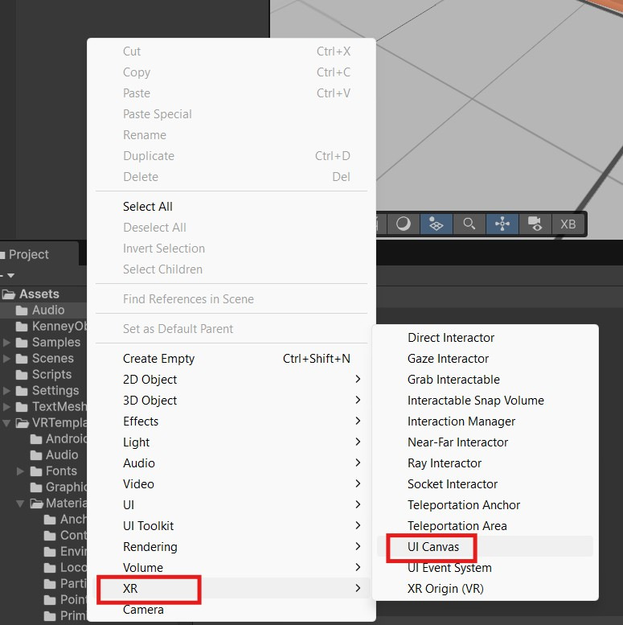
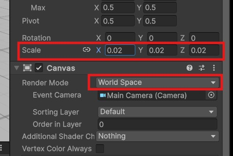
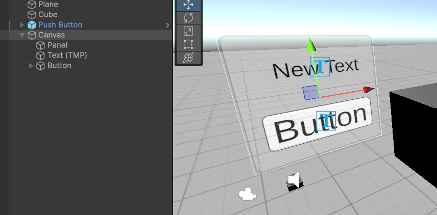
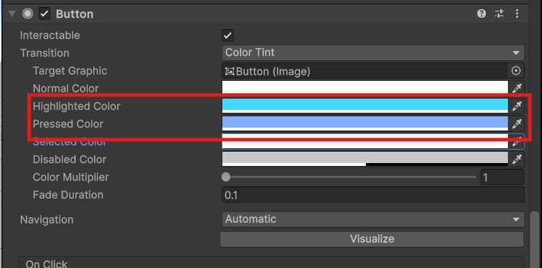
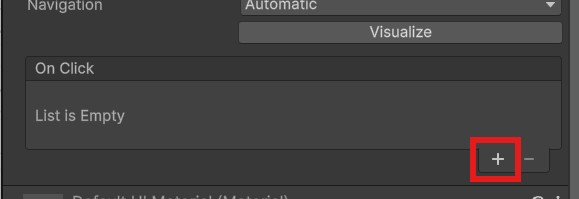
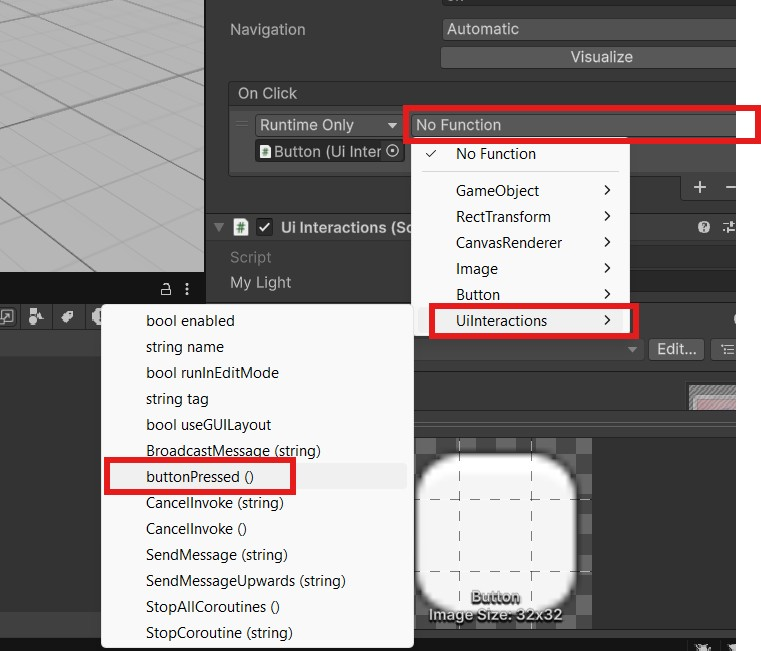
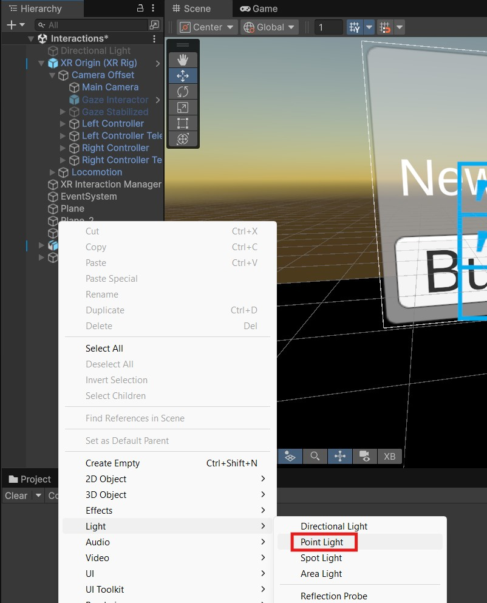
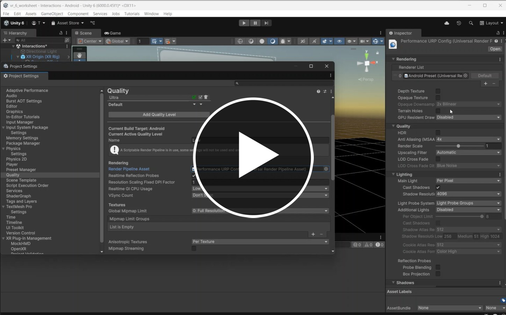
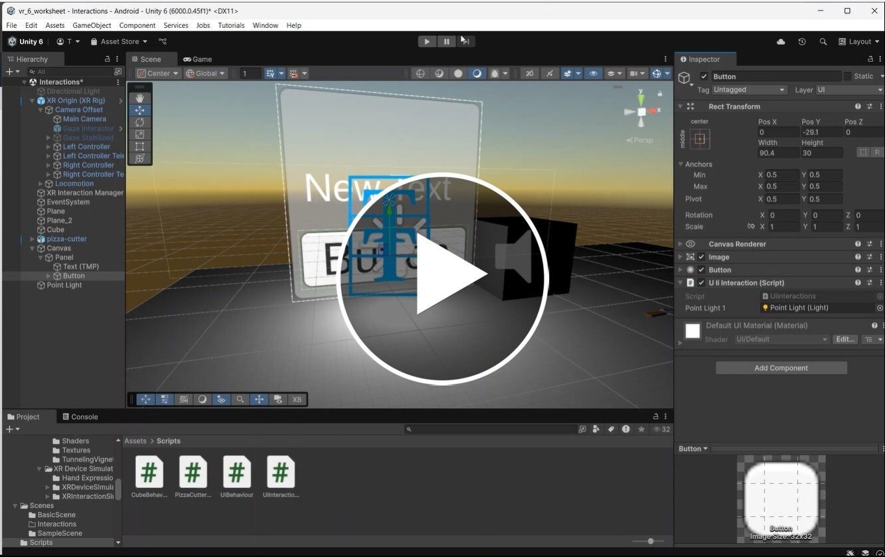
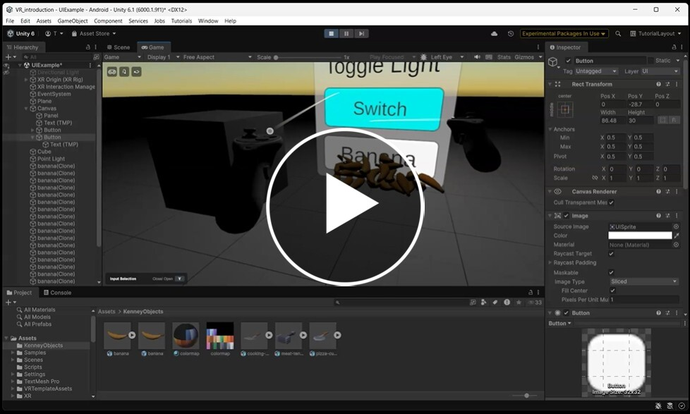

# VR UI, 2D interactions and lighting

In this worksheet we will export UI and lighting in VR

## Open a Project

- Open last weeks Unity project or create a new VR project

> [!TIP]
> Follow last weeks worksheet to create a new VR project
> [VR introction worksheet](../week_14-VR-introduction/)

## New scene

- In the Scenes folder, duplicate the **BasicScene** and rename it to **UIExample**

- Add a new cube so that we can use it to judge the scale ( new cubes are 1m)

## 1. User Interface

### Create a UI

A VR User interface (UI) uses the same components as we use in other Unity project, the main difference is that you want to use the **XR UI canvas** which is created in **World space**. 

> [!NOTE]
> World space objects exist in the 3D environment, screen space elements are suck to the camera and are not recommended in VR

- **Right click** in the Hierarchy and choose **XR > UI CANVAS**



- Scale the canvas down to 0.02.
- Move it back and up a meter so it is not right on top of the player.

Notice that the render mode is **World Space**.



You can now add standard ui elements to the canvas

- Add a **Panel, Text and Button** to the canvas.

> [!TIP]
> Right click on the canvas in the hierarchy, and choose **UI > panel** 

- Change the width, height of the Text and button in the **Inspector** to size appropriately.

You can also change the font size, the text for the button is nested inside it.

- Change the text size so the button and text appear correctly in the panel



- Test your scene in the simulator to check the size and scale of the ui.

### Challenge 1 - change button colour

- Change the colours of the buttons so the user gets feedback when they interact with them.



- Change the text on the text box to "Toggle Light" and the text on the button to "Switch"

### UI events

Now that we have a UI we want the button to do something when it is clicked.

- Make a new Script and call it **UiInteractions**
- Create a new public function on the script called "buttonPressed"
- Make the function log a Debug message so we can test it works.

```c#
using UnityEngine;

public class UIiInteraction : MonoBehaviour
{
    public void buttonPressed() {
        Debug.Log("button Pressed !");    
    }
    
}
```

- Now drag the script onto the button

We want to trigger the function on the script when the button is pressed. Helpfully, the button has a build in On Click event we can use.

- Select your button and scroll down to the "On Click" event
- Press the "+" icon to create a new item



- Drag the script onto the "None (Object)" box
- In the **No Function** box, select **UiInteractions > buttonPressed()**



- Test the scene to see if you get a console message when press the trigger when you hover over the button the press the trigger.

Make sure this works before continuing to the next step.

## 2. Lights

- Add a new **Point Light** to the scene



You should notice that it does not seem to cast any light.
 
 To enable the light we need to change some settings.
 
 [](https://uwe.cloud.panopto.eu/Panopto/Pages/Viewer.aspx?id=7baeea87-0e5a-4c29-8307-b31400fbc72d)
 
 ### Challenge 2 - toggle light
 
 - Use your existing script to turn the light on and off when you click the button on the ui.
 
 > [!NOTE]
 > To turn off a light in a script you can set the enabled property to false.
 
Try to do this yourself first, but if you get stuck here is the solution:

 [](https://uwe.cloud.panopto.eu/Panopto/Pages/Viewer.aspx?id=04711d78-bd53-45e4-9c69-b314010c9669)
 
### Challenge 3 - spawn prefab

- Add another button to the UI and use it to spawn a prefab object when it is clicked.

You can just turn a simple cube into a prefab or use something more fun from the assets store.

Or use one of these assets from Kenney.nl (click on link then download raw)

[kenney asset download](assets/kenney_objects.unitypackage)

> [!NOTE]
> - Create a prefab by dragging an object from the hierarchy into the assets folder
> - Create a new instance of a prefab using Instantiate [instantiate documentation](https://docs.unity3d.com/6000.3/Documentation/ScriptReference/Object.Instantiate.html)

Solution for if you get stuck:

 [](https://uwe.cloud.panopto.eu/Panopto/Pages/Viewer.aspx?id=bfbb757c-a85e-4a54-bf06-b3cb011ed02a)
 
 # References/further reading
 
 [Immersive design](https://developers.meta.com/horizon/design/mr-overview/?locale=en_GB)