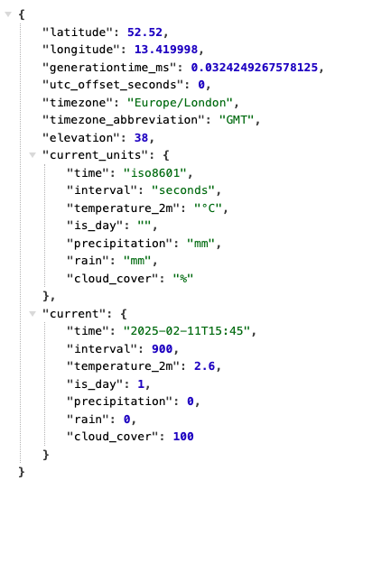

[Back](README.md)

# Code challenge - get some data

The following link should take you to a web page where you can configure options to get a URL for the current weather data for today at Q Block
[https://open-meteo.com/en/docs#current=temperature_2m,is_day,precipitation,rain,cloud_cover&hourly=wind_speed_10m&timezone=Europe%2FLondon&forecast_days=1](https://open-meteo.com/en/docs#current=temperature_2m,is_day,precipitation,rain,cloud_cover&hourly=wind_speed_10m&timezone=Europe%2FLondon&forecast_days=1)

Scroll down to find the API request URL: It begins with https://api.open-meteo.com...
Try it in your browser.

The returned data should look like:

