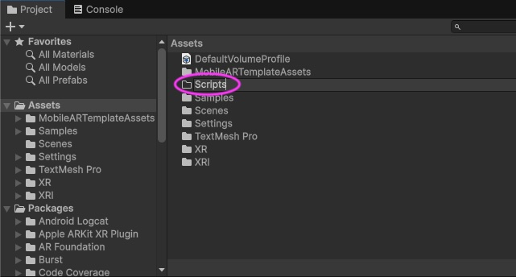

# Using external data in unity pt 1


*(AR scene of Near Earth Objects designated as hazardous by NASA, generated from a NASA dataset)*

## Overview
In this session we are going to learn how to import live, external data (in JSON format) in Unity and extract  some data from the imported JSON.  

Then in the next worksheet we will use the data to add objects and information to an AR scene (preview above)..

Most of this worksheet will involve working with a C# script and the Unity3D console. We are going to use the NASA data for Near Earth Objects that we looked at previously https://api.nasa.gov/.

We are also going to use an external C# code library for Unity called [SimpleJSON](https://github.com/Bunny83/SimpleJSON) to help us.


## Setup: Create a new project
To get started you should make a new Unity project using the AR mobile template. This is exactly what you did for the first AR Unity project and you can follow the week_11-AR-introduction worksheet to do this.

[week_11-AR-introduction worksheet](https://github.com/uwetom/media-production-worksheets/tree/master/week_11-AR-introduction)

Follow the whole worksheet to make a new scene and set the build settings, add your new scene to the build setting, test it in the simulator (all this is covered in the worksheet).

So we now have a basic AR scene working in the virtual testing environment.

## Download and import the SimpleJSON code library

Next download a zip file of the code library for Unity called [SimpleJSON](https://github.com/Bunny83/SimpleJSON) and unzip it.


Make a new folder in your Assets called Scripts.  
Add / drag the file called SimpleJSON.cs to your Scripts folder. Do not add any of the other files.
   

In the next steps we will add some external data.

## Get a link to some external data

Before you start this next section you should have followed the previous tutorial and made an account on https://api.nasa.gov/ and used your API key to get some external data about Near Earth Objects.

The URL link you generated should allow you to preview the HTTP request in your browser and see a JSON file that looks like [this]( https://api.nasa.gov/neo/rest/v1/feed?start_date=2015-09-07&end_date=2015-09-08&api_key=DEMO_KEY). It has a list of ```near_earth_objects``` that we will be using.

Save the URL link in a text file (if you haven't already).

If this isn't working you will need to revisit the previous tutorial.

## Use C# to get external data into Unity
In this next video we will use Unity networking to access the data in the NASA JSON file, live from the NASA website. Unity will access the link and download the data into your Unity project. We will look at the raw downloaded data in the console. 


[](https://uwe.cloud.panopto.eu/Panopto/Pages/Viewer.aspx?id=dde90350-6d23-411d-b23f-b3ed0136883a)


### Key technique
In this video we used a Coroutine / IENumerator. 
Coroutines provide an excellent way of easily managing things that need to happen after a delay or over the course of time. You can learn more about them here:
https://learn.unity.com/tutorial/coroutines# 

This is the code I used in the video ( please type not copy and paste!):
```C#
using UnityEngine;
using System.Collections;
using UnityEngine.Networking;
using SimpleJSON;

public class GetData : MonoBehaviour
{
    public string DataURL;

    // Start is called once before the first execution of Update after the MonoBehaviour is created
    void Start()
    {
        StartCoroutine(getData());
    }

    IEnumerator getData()
    {
        using (UnityWebRequest request = UnityWebRequest.Get(DataURL))
        {
            yield return request.SendWebRequest();

            if (request.result == UnityWebRequest.Result.ConnectionError)
            {
                Debug.LogError(request.error);
            }
            else
            {
                string json = request.downloadHandler.text;
                Debug.Log(json);
            }
        }
    }


}

```
The Unity project that you now have will allow you to download data from any data repository or API that is in JSON format. 
It will also work in an AR / VR or normal Unity project. Very useful!


## Use C# to navigate and extract data from JSON

In the next video I am going to add to the ``GetData`` C# script to extract specific information from the JSON data.

I want to get information about Near Earth Objects (asteroids) that NASA has designated as hazardous, then listing the asteroid names and their size in km.

Each asteroid is  classified as ```"is_potentially_hazardous_asteroid": false,``` or ```true```. 
We will use this to filter the data with an ```if()``` statement.

Each ```near_earth_object```(asteroid) also has a name and  size.

In this [Preview image](https://raw.githubusercontent.com/uwetom/media-production-worksheets/master/week_17-intro-external-data/images/neows-4.png)   you can see that NASA json data contains all this information.  

**Note:** Before you follow this video it might be helpful to review the section of the last worksheet called **How to get values from JSON**. We will be using keys to access the values in data.

[](https://uwe.cloud.panopto.eu/Panopto/Pages/Viewer.aspx?id=d9464bce-ae0c-4ecc-bcb6-b284011ed94b&start=0)

The final code is below (please type not copy and paste!):

This should give you a good starting point and a useful method for extracting data from **any** JSON file. The key / value principles and the nested key / value structure are used in many datasets.

```C#
using UnityEngine;
using System.Collections;
using UnityEngine.Networking;
using SimpleJSON;

public class GetData : MonoBehaviour
{
    public string DataURL;

    // Start is called before the first frame update
    void Start()
    {
        StartCoroutine(getData());
    }

    IEnumerator getData()
    {
        using (UnityWebRequest request = UnityWebRequest.Get(DataURL))
        {
            yield return request.SendWebRequest();

            if (request.result == UnityWebRequest.Result.ConnectionError)
            {
                Debug.LogError(request.error);
            }
            else
            {
                string json = request.downloadHandler.text;
                Debug.Log(json);
                ReadJSON(json);
            }
        }
    }

    void ReadJSON(string jsonString)
    {
        JSONNode node = JSON.Parse(jsonString);
        JSONObject obj = node.AsObject;
        Debug.Log(obj["near_earth_objects"].Count);
        int numOfAsteroids = obj["near_earth_objects"].Count;

        for (int i = 0; i < numOfAsteroids; i++)
        {
            string isHazardous = obj["near_earth_objects"][i]["is_potentially_hazardous_asteroid"].Value;

            if (isHazardous == "True")
            {
                Debug.Log(obj["near_earth_objects"][i]["name"].Value);
                Debug.Log(obj["near_earth_objects"][i]["estimated_diameter"]["kilometers"]["estimated_diameter_min"].Value);
                Debug.Log(obj["near_earth_objects"][i]["estimated_diameter"]["kilometers"]["estimated_diameter_max"].Value);
            }
        }
    }
}
```
<!--stackedit_data:
eyJoaXN0b3J5IjpbLTY2NDMzNjQyOCwtMTUzODQ2MjIxMSwxNT
ExMTcwOTkzLDE0MzYyMTAwMzQsLTEzNTU5MDQ3MjYsOTcxMDY0
NzYyLDE1NjM5ODExNjIsMjA3ODQwMTEyNiwtMzgyMzU3MzQyLD
EzNzcxOTEwNzQsLTEyODMzOTE1NzhdfQ==
-->