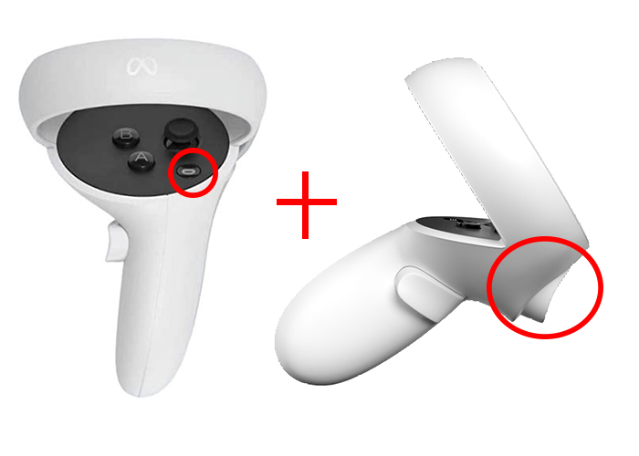
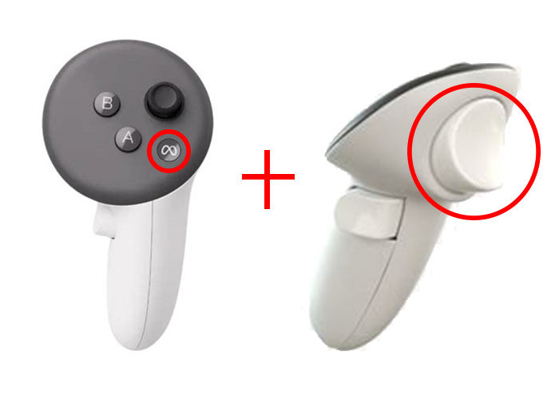
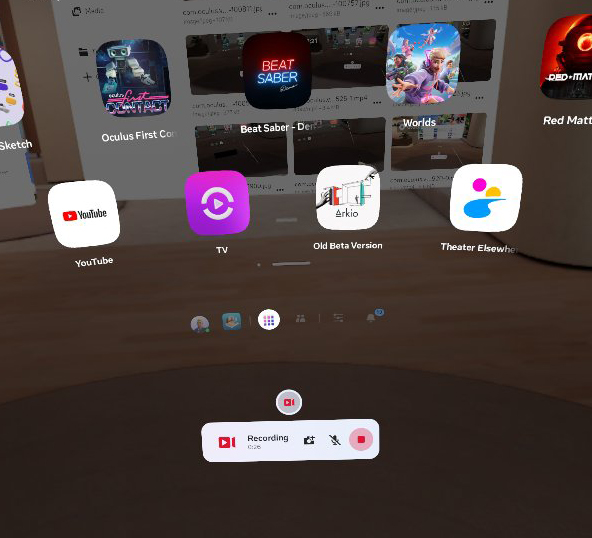
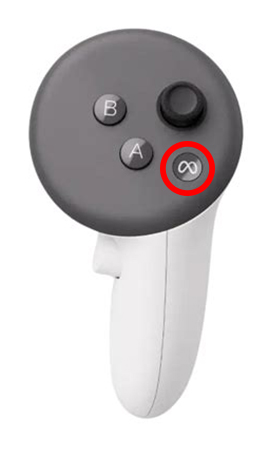
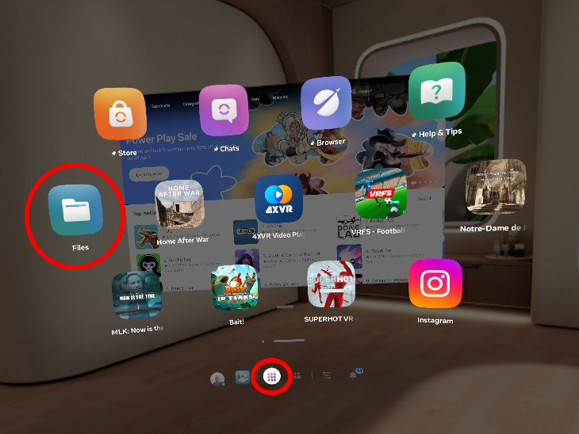
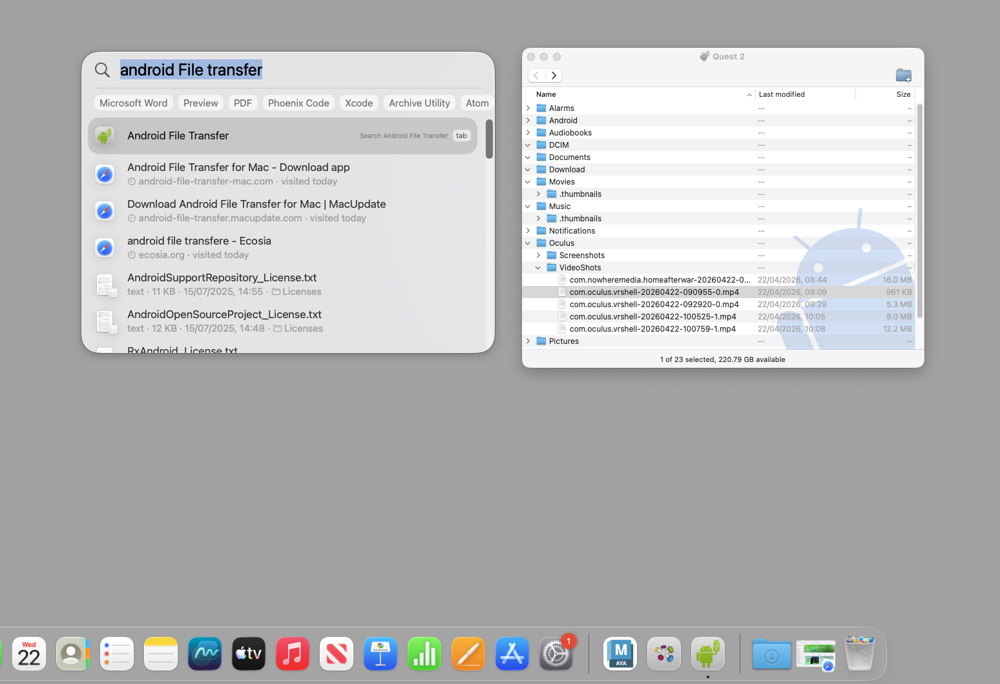
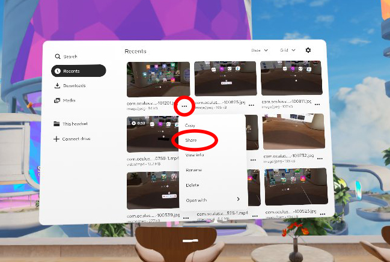
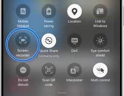
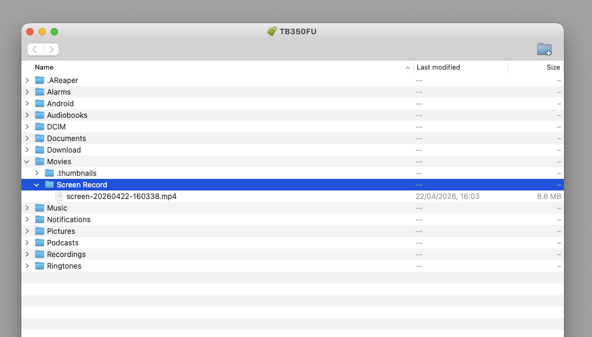

# Screen Recording

## VR recording

You can record a video on a Meta quest by **holding down** the Meta or Oculus button and then **holding down** the trigger.

This will start the recording, you should see a red dot in the center of the screen and see the camera icon at the bottom.

To stop recording, press the camera button.

## Access recordings

To see your videos, tap the Meta or Oculus button to view all apps, then open the **File** app.

## Share recordings

There are a few ways to get your recordings from the headset.

### Plug into a Mac (recommended)

The macs in the lab all have **Android File Transfer** installed, open it and plug your headset in. You can find your videos and screen shots in the **Oculus** folder.

On your own Mac you will need to install **Android File transfer** or an alternative app. 

[android file transfer](https://www.android-file-transfer-mac.com/)

[open mpt](https://github.com/ganeshrvel/openmtp)

### Plug into PC

If you plug your headset into a Windows PC is should show up as a normal external drive. However, this can be unreliable, If you are struggling to see it try to restart the headset and check for any permissions messages on screen.

### Share on whatsApp

You can select images and videos on the headset and share them to yourself on your whatsApp account.

## Tablet recording

On an android tablet you can screen record by swiping down twice and selecting the recorder screen icon.

You can then send it to yourself or plug into a pc or use android file transfer on a mac.

You will find it in the **Movies > Screen Record** folder.

