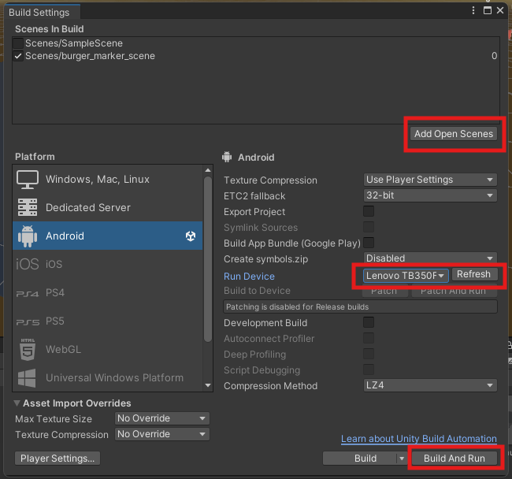

## Add a URP 3rd Person Controller

This video steps through using the starter assets URP 3rd Person Controller
https://assetstore.unity.com/packages/essentials/starter-assets-character-controllers-urp-267961

<iframe src="https://uwe.cloud.panopto.eu/Panopto/Pages/Embed.aspx?id=bf8dd8ff-9512-4a3f-b879-b1ff0110a8dc&autoplay=false&offerviewer=true&showtitle=true&showbrand=true&captions=false&interactivity=all" height="405" width="720" style="border: 1px solid #464646;" allowfullscreen allow="autoplay" aria-label="Panopto Embedded Video Player" aria-description="MP Unity refresher 1 2024 add a URP third person controller" ></iframe>

dfgdsg
kdjfgs dfg

<!--stackedit_data:
eyJoaXN0b3J5IjpbLTE3NjIyMTczNjIsNzIwNjQ3MDU4LDE5OD
I1ODk0MDIsLTE4NzYwNjc1MThdfQ==
-->