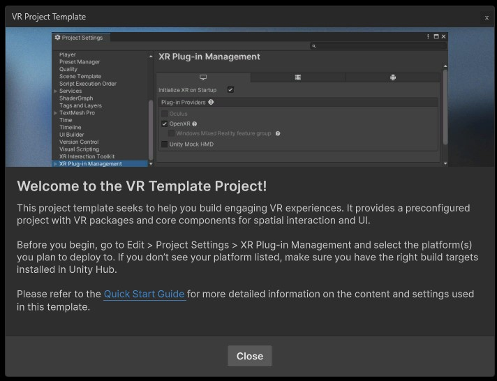
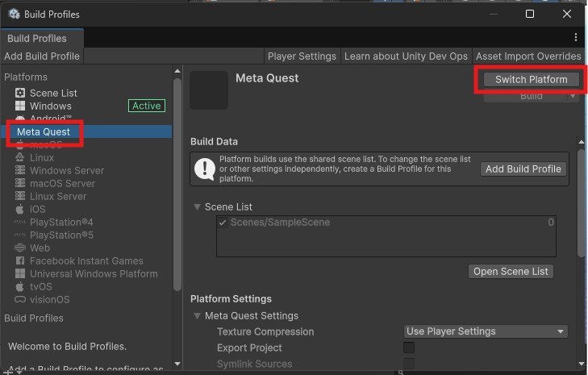
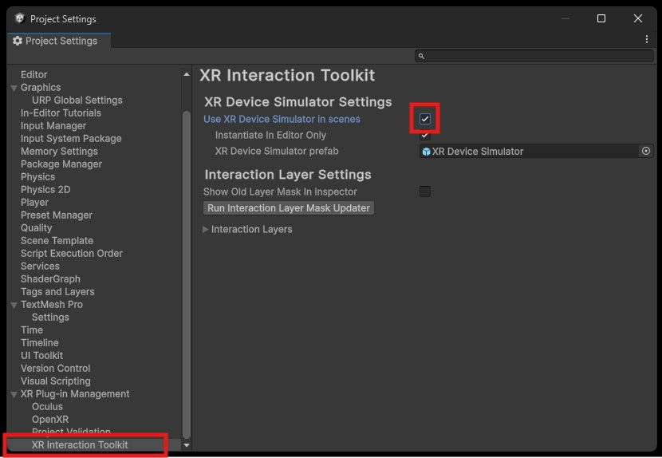
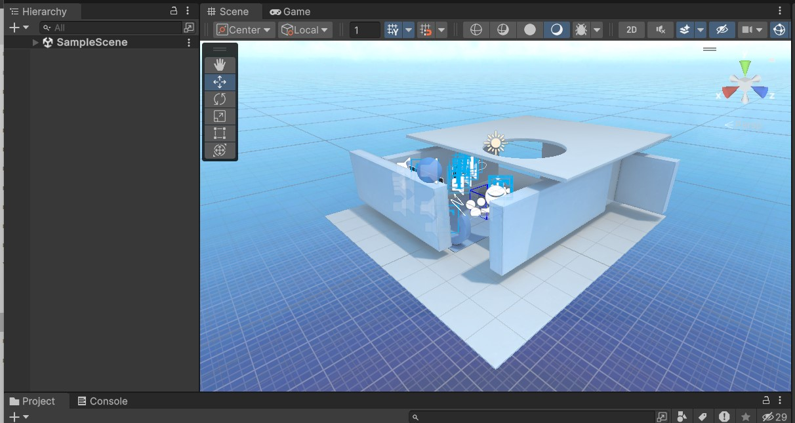
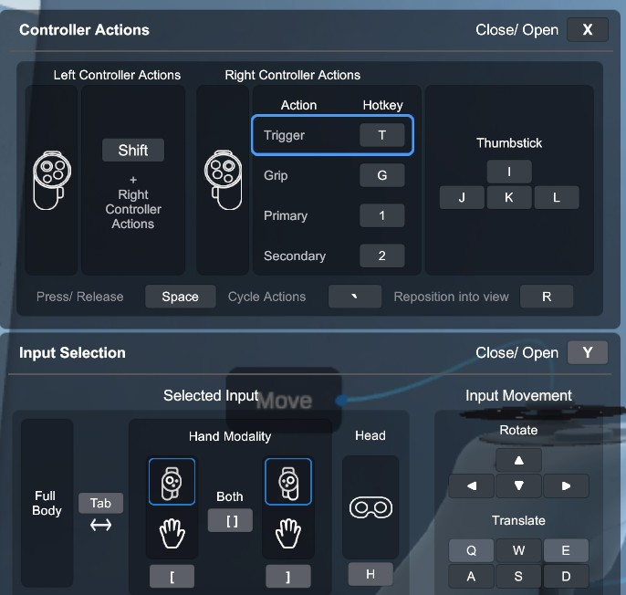
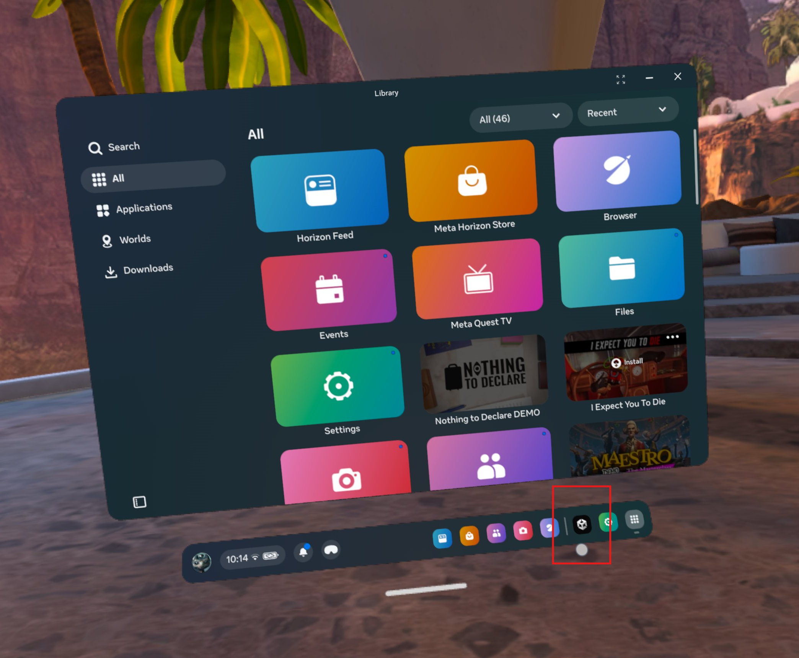
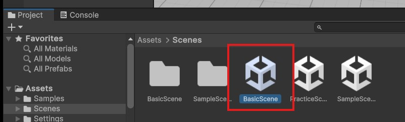

# Introduction to VR

In this worksheet we will

- Create a VR project
- Explore the XR rig
- Use the VR simulator
- Build to a VR headset

We will be using Unity version **6**, Make sure you install the correct version on your machine.

> [!NOTE]
> Unity 6 is very similar to previous versions of Unity but you may notice that some of the menus and options have changed.

## 1. VR Headsets

We are using [Meta Quest](https://www.meta.com/gb/quest/) headsets, they can be used as stand alone devices which allows you to build content directly to the headset without requiring the user to be tethered to a powerful PC. However, this does limit their performance which you will need to consider when designing your experience.

We will be using Meta Quest 1,2 and 3s headsets, you can also use the Quest 3 if you have your own. 

The headsets normally require you to create an account and sign in to use. To save time I will do this for you before the in class workshops

If you have your own headset, or book one out from the project room you will need to set it up for development yourself.

[How to setup your own headset](../wk17-VR-setup-headset/index.md)

## 2. Create a Unity Project

We will use the built in VR template.

- Open Unity and create a new VR project ( you may need to download the template)

This will setup our project with all the packages we need and includes some helpful starter assets.

Save it somewhere sensible as we will carry on with this project next week.

## 3. Set up

The template works with many different brands of headset, the pop up reminds us to specify what we are are using.

- Close the message.

### Android

The Meta Quest runs on **Android** we could choose this as our platform, but Unity 6 also gives us a specific **Meta Quest** option.

- In the **top menu**, select **File > Build Profiles** and change the Platform to **Meta Quest**
- Press **Switch Platform**

> [!NOTE]
> After it has finished you will see that the Active platform has been set to **Android**, this is slightly confusing UI but it has worked as expected.

### Device Simulation

The device simulator will let up test our VR project without having to build it to a headset.

- Go into **Edit > Project Settings**

- At the bottom, in **XR Plug-in Management**, under **XR Interaction Toolkit**  turn on **Use XR Device Simulator in Scene**

Accept the pop-up to download the simulator package.

- In the **XR Plug-in management** section, in the left tab
 change the **Plug-in Providers** from **OpenXR** to **Mock HMD Loader**.
 
 > [!CAUTION]
 > Only do this for the left tab, **NOT** the android tab or it wont work in the headset.

We are now setup and ready to try out a VR scene.

> [!TIP]
> If you have a **high specification** gaming PC you can also stream the project directly from the Unity editor to your headset.
> [Meta Quest Link app](https://docs.unity3d.com/Packages/com.unity.xr.meta-openxr@2.2/manual/get-started/link.html).
> This will not work on Macs, or lower spec PC's.

## 4. Sample scene

The VR sample scene should already be open, if not, you can find it in **Scenes > Sample Scenes**

This scene demonstrates basic VR interactions and motion. It is also a useful reference to work out how to implement similar functionality in your own project.

### Test out the scene

- Try out the scene in the simulator (A) **AND** on the VR headset (B).
- Practice with the controls, moving around the scene and interacting with the objects and UI.

### A. Simulated environment

It is really important to regularly test your project on a real VR headset, however, it can take a few minutes to build to your headset each time you want to test it. 

The simulator is great for checking the basic functionality of your scene before you invest in a full build, but be aware that some issues will only become apparent when tested on a headset.

This video shows you how to use the simulated environment.

### B. On the headset

Before you use the headset read the following:

#### Be aware of your environment

When using a VR headset you may not be able to see the world around you, it is therefore very important that you clear your space to ensure you don't injure yourself, others or the equipment.

- Watch the following Meta Video shows you how to safely use the headset.

[Safely use the Meta Quest](https://www.youtube.com/watch?v=Ke4MefpmRmc)

> [!IMPORTANT]
> When asking others to test your scene, it is your responsibility to create a safe environment.

#### Play the sample scene

For the workshop, I have build already build the sample scene to your headset.

- Clear the space around you then put the headset on.
- Follow the instructions on the headset to create a guardian boundary, I recommend the stationary boundary when working in the busy classroom.
- You should see a black Unity logo on the menu bar, this is the pre-installed sample scene:
- Click on it to open.

## 5. New blank Scene

We can now create our own scene.

For this tutorial we will use the pre-made rig provided in the template. 

- Open **BasicScene** in the Scenes folder

We may want this template scene again, so to avoid saving it over it we want to save the scene with a different name.

- In the top menu, go to **File > Save as**
- Save the scene in the Scenes folder and call it "PracticeScene"

The Scene already includes a floor plane and an XR Origin (XR Rig)

- Press play to make sure the scene plays without any issues and you can move around in the simulator just as you did in the sample scene.

We recomend you use this scene for your project.

> [!TIP]
> You may notice that this rig does not have the helper labels, if you need these you can swap the **Complete XR Origin Set Up** for the **Complete XR Origin Set Up Variant** found in **Assets > VRTemplateAssets > Prefabs > Setup**

## 6. Build to the headset

There are a few important steps to building your project to a headset. The following video guides you through the process. If you have already switched your project to Android you do not need to do it again.

## 7. Challenge - Create a simple scene

Our scene is currently very blank.

- Create a simple scene using found assets, or you can use this pack downloaded from [kenney.nl](https://kenney.nl/assets/nature-kit)

Unzip and drag the whole folder into your assets panel. You should use the fbx models but you will need to rescale them.

### Size and scale

Your user will be interacting with your scene from a real first person perspective so think very carefully about the size of your objects.

> [!IMPORTANT]
> You can experiment with scale in your scene, but to avoid physics issues **DO NOT** rescale the XR rig. 

> [!TIP]
> If you create a new cube it is always 1 meter square. You can use that as a reference for other objects.

> [!TIP]
> Use real world sizes, search for dimensions online or just measure real objects, a ceiling is about 2.5 meters tall, the surface of a desk is about 75cm from the ground.

### User Comfort - Cybersickness

Also called [Virtual Reality Sickness](https://en.wikipedia.org/wiki/Virtual_reality_sickness)

You may not experience it, but many people have symptoms of cybersickness when using VR. 

> [!CAUTION]
> Choices you make in the design of your experience will dramatically reduce or increase the discomfort of your users.

The major cause of sickness is a disconnect between what the user can see and what there body is physically experiencing.

One factor is frame rate, if your add too much to your scene the frame rate will drop. This will cause a delay between moving in the real world and your view in the virtual world. Even a tiny delay will be uncomfortable. Test your scene often to ensure it runs smoothly.

The other factor is motion, although you want to be able to move your character around, if you are standing still in the real world, but your virtual character is running or riding in a roller coaster the discrepancy can be uncomfortable.

Meta have come up with useful locomotion guidelines that you may want to consider:

[VR Locomotion](https://developers.meta.com/horizon/resources/locomotion-comfort-usability/?locale=en_GB)

## Documentation

These workshops will get you started, but for your own project you will want to dive more deeply into the detail, the documentation is a great starting point:

[Unity VR Template documentation](https://docs.unity3d.com/Packages/com.unity.template.vr@9.1/manual/index.html)

[Developing for Meta Quest](https://docs.unity3d.com/6000.1/Documentation/Manual/xr-meta-quest-develop.html)