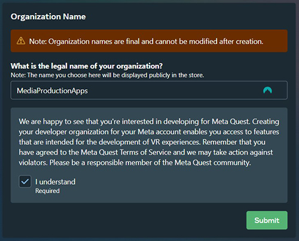
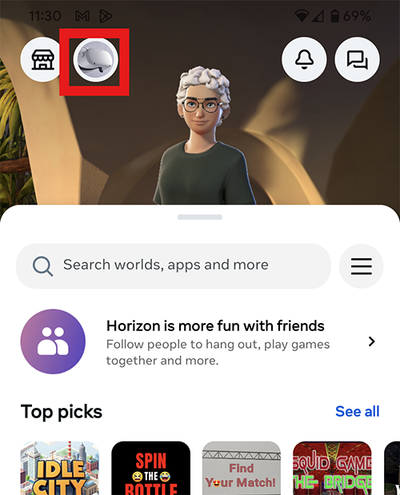

I will setup the headsets for the workshop sessions, but if you have your own headset or borrow one from the project room you will need to set it up yourself.

# Setup headset for developing

When you first use a Meta Quest headset you will need to log in and set it up before you can start to use it.

## Phone App

Start by downloading the Meta Horizons app on your phone.

[Android App](https://apps.apple.com/us/app/meta-horizon/id1366478176)

[Apple App](https://play.google.com/store/apps/details?id=com.oculus.twilight&hl=en_GB)

Create a personal Meta account and login.

## Headset

Turn on your VR headset and put it on.

Put the headset on and it will guide you through the setup, 

> [!NOTE]
> this will take about 15 minutes.

## Wi-Fi

During the setup you will be asked to connect to Wi-Fi, If you are on Campus most of the headsets will be able connect to "Guest Wifi". Otherwise you will need to create a hotspot on your phone or connect to your home Wi-Fi. You cannot connect to Eduroam through the headset, but if your phone is connected, open the Meta app and find your Headset, you can then go into settings and connect the headset to Eduroam from there.

## Developers

When you have finished the initial setup you can use the device as a normal consumer, downloading and running apps from the app store.

But, as creators we want to create and run our own apps. To do this we need to follow a few extra steps.

### Create an Organisation

Log in to the meta developer site.

[Meta Developers](https://developers.meta.com/horizon)

Select My apps in the top right corner

Now Create an organisation, name it whatever you like.

If may ask you to add extra authentication but you don't need to add a credit card or any payment information but may need to add two-factor authentication.

### Developer mode

Now that we have created a developer organisation,  Meta will allow us to turn on developer mode on the headset.

On your Meta phone app, find the device and in the settings turn on developer mode.

Scroll down to open **Headset settings**
Then turn on **Developer mode**

### Plug in

Now, when you plug your headset into a computer a box will pop up on the headset asking if you to **Allow USB debugging**

If this box does not pop up, make sure it is firmly plugged in, or try restarting the headset.

## Reference

[Meta developer documentation](https://developers.meta.com/horizon/documentation/unity/unity-env-device-setup/)
