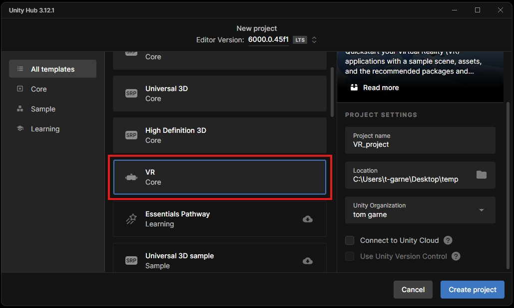
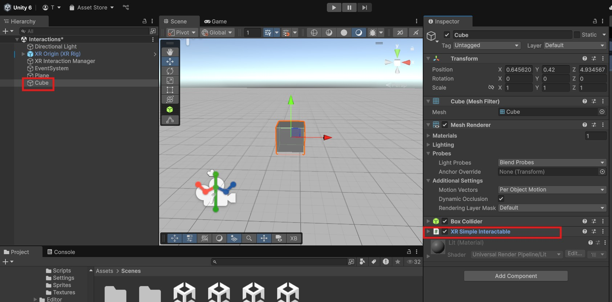
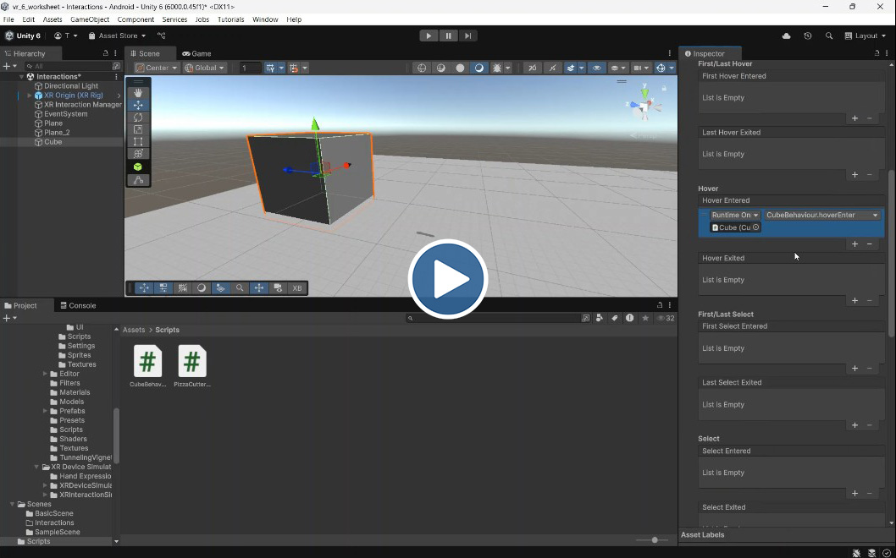
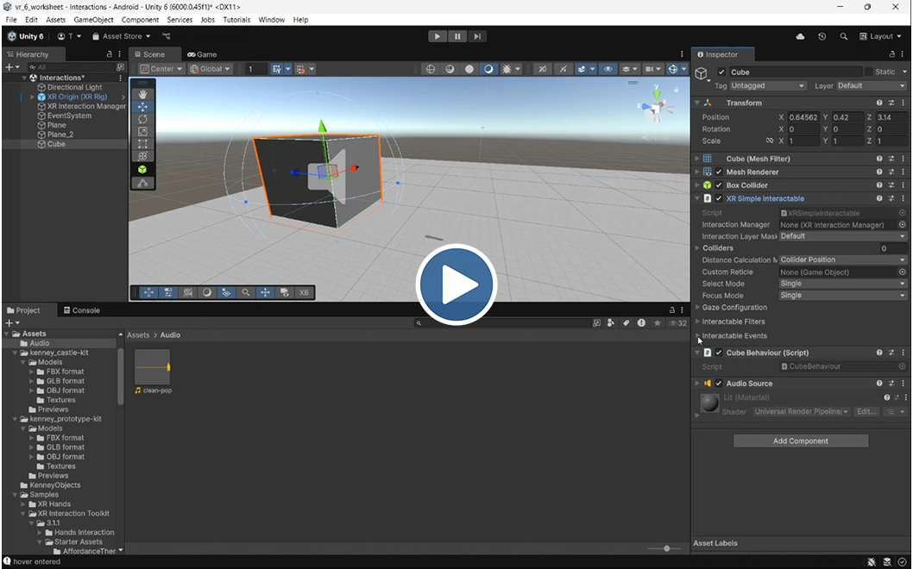
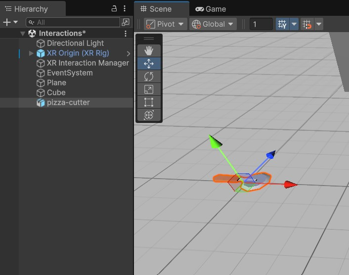
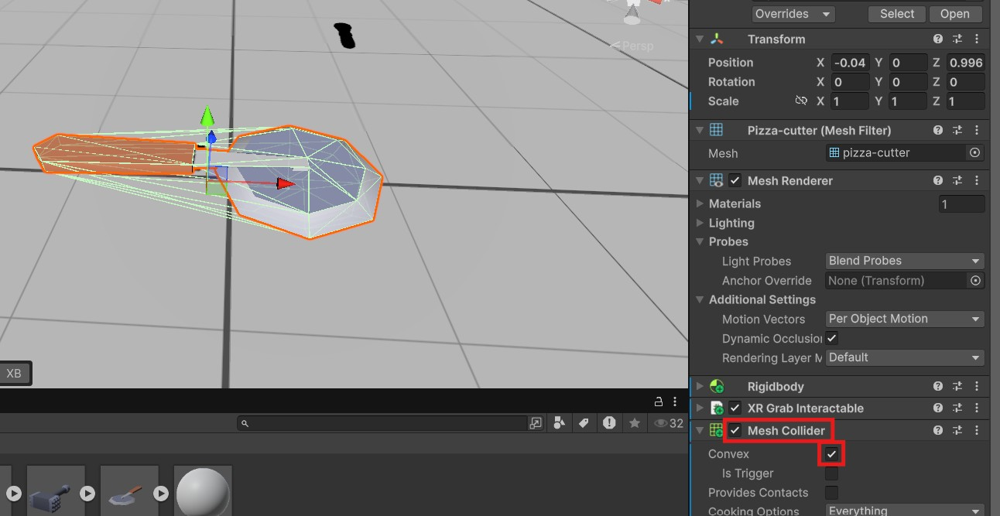
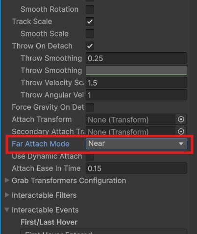
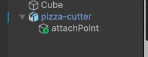
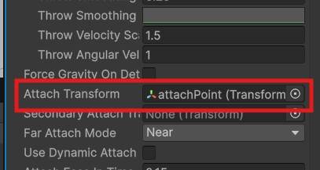

# VR Interactions

In this worksheet we will learn how to interact with 3D objects in our scene.

## Open a project

- Open last weeks Unity Project, or create a new VR Core project



If you created a new VR core project you will need to set it up like last week. You can go back and look at [section 3 in last weeks workshop](../wk17-VR-introduction/) 

## Create new Scene

- Open the **Basic Scene** inside the Scenes folder.


- Save it back into the Scene folder and name it "Interactions".
- Play the scene plays in the simulator to test it works.

## 1. Teleportation

Teleportation is turned on by default on our XR rig, It allows users to move around the scene more comfortably then using continuous movement.

### Teleportation Area

- Select the plane and look at the inspector.

You should see it has a **Teleportation Area** component. This allows the player to teleport anywhere on this surface.

- Create a new plane and place it next to the existing one.
- Give it a new material, you can find some in **Assets\VRTemplateAssets\Materials\Environment**.
- Scale it down to 1. 
- Add a **teleportation Area** component to it.
- Change the **Interaction Layer Mask** to **Teleport**.


- Test it out in the simulator, try to teleport from one plane to the other.

> [!TIP]
> In the simulator, you need to press tab to select the controllers, then press the **i** key to simulate pressing up on the right thumb stick and producing a teleport beam.

## 2. Simple Interactable

To allow the XR rig to interact with objects in the scene we need two parts, an **Interactor** component on the XR rig, and an **Interactable** component on the object.

The most basic type of interactable is a **simple interactable**, this will allow us to detect when a user interacts with an object using the controller.

- Create a cube and move it away from the origin so it's not on top of the rig.
- Add a **XR Simple Interactable** component to the cube.



The cube will now be able to detect if the user interacts with it but we have to add a script and tell it what we want to do.

Try to do this yourself first before looking at the solution below.

- Create a new Script 
- Add 2 public functions which we can call when the user hovers and selects the cube.
- Log a debug message to the console for each function.


Solution:

```c#
using UnityEngine;

public class CubeBehaviour : MonoBehaviour
{
    
    //These are public functions so they can be accessed outside the script
    public void hoverEnter()
    {
        Debug.Log("hover entered");
    }
    
    public void selected()
    {
        Debug.Log("selected");
    }
}

```

- Go back to Unity and fix any errors that appear in the console.

### Connect up the script 

The following video shows you how to connect your scipt up to your Simple Interactable component.

[](https://uwe.cloud.panopto.eu/Panopto/Pages/Viewer.aspx?id=8af55669-e80c-4689-aba9-b30f00f096fe)

- Test your project on the simulator to see if you get the correct console logs.

### Challenge 1

- When the user hovers over the cube, change its colour

```c#
GetComponent<Renderer>().material.SetColor("_BaseColor",Color.red);
```

- Make the cube disappear when activated

```c#
DestroyObject(gameObject);
```

### Challenge 2

When the user hovers over the cube, play a sound.

Find your own of use one of these:
 
[pop sound](assets/clean-pop.mp3)

[honk sound](assets/honk.mp3)

*Solution*:

[](https://uwe.cloud.panopto.eu/Panopto/Pages/Viewer.aspx?id=76740649-d1d2-4682-99c2-b30f00ff732c)

## 3. Grab Interactable

Next we can try a **Grab interactable** to allow us to pick up objects in our scene.

First we need some objects, we could use another cube, but a real 3D model will highlight some other issues you may encounter.

- Download the following unity package and drag it into your assets panel

[Kenney.nl objects](assets/kenney_objects.unitypackage) 

The package contains assets from the free resource kenney.nl

- Drag the pizza cutter into your scene and move it in front of the cube.



We can now turn it into an interactable

- Add an **XR Grab Interactable** component to the pizza cutter

> [!NOTE]
> You should see that a**Rigidbody** component is also added automatically.

- Add a **Mesh Collider** component to the pizza cutter and set it to **convex** ( you see a green mesh around the object)

> [!IMPORTANT]
> If you don't add a collider you will not be able to select your object, we didn't need to add one to the cube we added earlier as it has one automatically.



- Now try this out in the simulator. 

> [!TIP]
> You can pick up the pizza cutter by first pressing **]** to use the right controller, then hover over the pizza cutter and pressing **G**

## 4. Extra - Grab properties

Grab interactable have a few useful properties we can change to improve the experience.

#### Near attach

We want the pizza cutter to stick the controller when picked up

- On the **XR Grab Interactable** component, change the **far attach mode** to **near**



#### Attach position

Currently, the pizza cutter will be picked up at its centre. But we can move it to somewhere more appropriate.

- **Right click** on the object and choose **Create empty**
- Rename the new object to **attachPoint**



- Move the attach point to the middle of the handle.

- lastly, we need to drag the attach point object onto the **attach_transform** field on the **XR Grab Interactable** component.



- Test in the simulator

The pizza cutter should now be in the correct position

- Rotate the attach point to make the cutter point upwards when grabbed.

#### Challenge 3

We can attach a script to the pizza cutter in the same way that we did with the cube.

- Create a new script 
- Create a public function which displays "activated" in the console
- Attach the script to the pizza cutter
- assign the function to the activated event
- Test it out, the activate function is fired when you press the trigger (t) while grabbing the object.

#### Challenge 4

Make something happen when activate is triggered, maybe make it play a sound or something you remember from last year.

## 5. Extra - More interactions

If you are interested in exploring other VR interactions you can find another demo scene in your project

- Open **DemoScene** in **Assets\Samples\XR Interaction Toolkit\3.1.1\Starter Assets**

- Explore the demo

Unity has also created an extensive demo scene containing lots of examples of interactions you can use

[https://github.com/Unity-Technologies/XR-Interaction-Toolkit-Examples](https://github.com/Unity-Technologies/XR-Interaction-Toolkit-Examples)

At the time of writing this worksheet the project only worked with Unity 2022, here is a version which works with Unity 6

[https://github.com/uwetom/XR-Interaction-Toolkit-Examples](https://github.com/uwetom/XR-Interaction-Toolkit-Examples)
 
### Documentation

[3D interactions](https://docs.unity3d.com/Packages/com.unity.xr.interaction.toolkit@3.1/manual/architecture.html)
